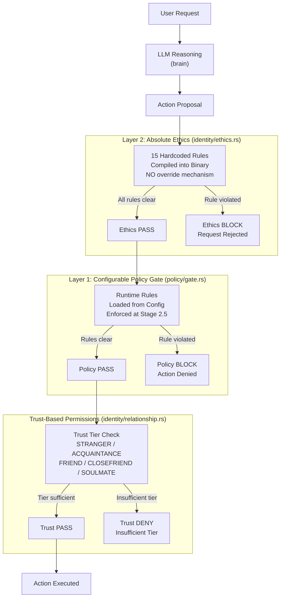
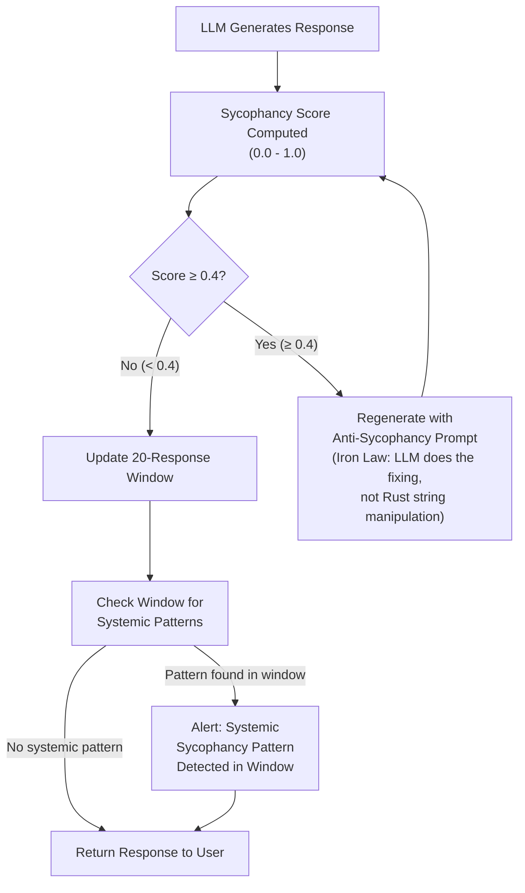

# AURA v4 — Identity, Ethics, and Philosophy

**Document type:** Architecture Reference  
**System:** AURA v4 — On-Device Android AI Assistant (Rust)  
**Classification:** Engineering Internal  
**Status:** Living Document  

---

## Table of Contents

1. [Philosophy and Founding Principles](#1-philosophy-and-founding-principles)
2. [The Two-Layer Policy Architecture](#2-the-two-layer-policy-architecture)
3. [Absolute Boundary Rules](#3-absolute-boundary-rules)
4. [The TRUTH Framework](#4-the-truth-framework)
5. [Anti-Sycophancy System](#5-anti-sycophancy-system)
6. [OCEAN Personality Model](#6-ocean-personality-model)
7. [VAD Mood Model](#7-vad-mood-model)
8. [Epistemic Awareness Levels](#8-epistemic-awareness-levels)
9. [Trust-Based Autonomy](#9-trust-based-autonomy)
10. [GDPR Compliance Implementation](#10-gdpr-compliance-implementation)
11. [Known Production Gaps](#11-known-production-gaps)

---

## 1. Philosophy and Founding Principles

### 1.1 Overview

AURA v4 is not merely a software system — it is an architecture built around a coherent philosophy of what on-device AI should be, how it should behave, and what obligations it carries to the people who use it. Every design decision in the identity and ethics subsystems flows from a set of founding principles called the **Iron Laws**. These laws are not guidelines, preferences, or aspirational targets. They are structural constraints that shape the system at the binary level.

This section documents each Iron Law, the reasoning that produced it, and the failure modes it was designed to prevent.

---

### 1.2 The Seven Iron Laws

| # | Law | Category |
|---|-----|----------|
| 1 | LLM = brain, Rust = body. Rust reasons NOTHING. LLM reasons everything. | Architectural |
| 2 | Theater AGI is banned: no keyword matching for intent/NLU in Rust. | Anti-Theater |
| 3 | Fast-path structural parsers for open/call/timer/alarm/brightness/wifi ARE acceptable. | Architectural Carve-out |
| 4 | NEVER change production logic to make tests pass. | Engineering Integrity |
| 5 | Anti-cloud absolute: no telemetry, no cloud fallback, everything on-device. | Privacy |
| 6 | Privacy-first: all data on-device, GDPR export/delete works. | Privacy |
| 7 | No sycophancy: never prioritize user approval over truth. | Ethics |

---

### 1.3 Iron Law Deep Dives

#### Iron Law 1: LLM = brain, Rust = body

**Statement:** Rust code reasons NOTHING. LLM reasons everything.

**What this means in practice:**

The Rust runtime is responsible for deterministic, mechanical operations: memory management, file I/O, system calls, action dispatch, policy enforcement, scheduling, and lifecycle management. None of these involve reasoning about meaning, intent, or language.

The LLM is responsible for every operation that requires understanding: interpreting what the user wants, generating natural language responses, evaluating whether a response is appropriate, assessing emotional context, adapting communication style, and deciding what action to take in an ambiguous situation.

**What this prevents:**

Without this law, engineers face constant temptation to "just add a quick check" in Rust — checking if the user said "cancel" to abort an operation, checking if a message "sounds angry" to adjust tone, or checking if a request "looks like a command" to route it differently. Each such check is a form of NLP implemented in Rust, and each one will be wrong in ways that are invisible until they fail catastrophically in production.

The LLM has been trained on billions of tokens of human language. It understands nuance, sarcasm, ambiguity, domain-specific vocabulary, and cross-cultural variation. Rust string matching understands none of these. Any NLP logic in Rust is Theater AGI — it looks like intelligence from the outside but is brittle keyword matching underneath.

**The body metaphor:**

A human body does not decide where to walk. The body executes locomotion; the brain decides direction. AURA's Rust runtime executes actions; the LLM decides which actions to take and why.

---

#### Iron Law 2: Theater AGI Banned

**Statement:** No keyword matching for intent/NLU in Rust.

**What this means in practice:**

Rust code must not contain logic like:
- `if message.contains("cancel")` to detect cancellation intent
- `if message.starts_with("hey")` to detect a greeting
- Pattern matching on message content to determine routing
- Scoring messages based on word presence to detect sentiment

**What this prevents:**

Theater AGI creates an illusion of intelligence that fails unpredictably. A user who says "I don't want to cancel, I want to keep going" would be mishandled by a `contains("cancel")` check. A user writing in French, Arabic, or code-switching between languages would be mishandled by English keyword logic.

Beyond correctness, Theater AGI creates maintenance debt. Every language pattern handled in Rust is a hardcoded assumption that must be maintained, extended, and tested independently of the LLM's actual capabilities.

**The carve-out in Law 3:**

Fast-path structural parsers for a narrow set of well-defined intents (open app, make call, set timer, set alarm, adjust brightness, toggle wifi) are explicitly permitted. These are not NLU — they are structural command parsers for intents that have unambiguous, machine-parseable forms. A timer intent "set timer 5 minutes" has a canonical structure that a parser can handle without reasoning. This is categorically different from understanding what "set a reminder for when I get home" means.

---

#### Iron Law 3: Structural Fast-Path Parsers Are Acceptable

**Statement:** Fast-path structural parsers for open/call/timer/alarm/brightness/wifi ARE acceptable.

**Rationale:**

On-device inference has latency. For time-sensitive operations (e.g., the user is hands-free in a car and says "set a timer for 10 minutes"), routing through the LLM adds unnecessary latency. Structural parsers for these specific, well-defined intents provide a fast path without introducing Theater AGI.

**Boundary conditions:**

- The parser handles only structurally unambiguous forms
- Any ambiguity falls through to the LLM
- The parser never reasons about meaning — it recognizes canonical patterns
- The parser never handles sentiment, emotion, or nuanced intent

---

#### Iron Law 4: Never Change Production Logic to Make Tests Pass

**Statement:** NEVER change production logic to make tests pass.

**Rationale:**

Tests must verify that production logic is correct. If a test is failing, the correct response is either: (a) the test is wrong and should be fixed, or (b) the production logic has a real bug and the logic should be fixed properly. Adding a special case to production code that triggers only in test environments corrupts the system's behavior and makes tests meaningless.

**What this prevents:**

- `if cfg!(test) { return fake_result; }` style workarounds
- Adding flags to skip validation in test builds
- Mocking out safety checks to make tests pass faster

Tests must be written against the real production behavior. If the real behavior is hard to test, the architecture should be refactored — not the tests hacked.

---

#### Iron Law 5: Anti-Cloud Absolute

**Statement:** No telemetry, no cloud fallback, everything on-device.

**Rationale:**

Cloud connectivity introduces a dependency that undermines AURA's core value proposition: a private, local, always-available assistant. Any cloud call is:

1. A privacy risk — user data leaves the device
2. A reliability risk — fails when offline
3. A trust risk — user cannot verify what happens to their data in the cloud
4. A sovereignty risk — user's data is subject to the cloud provider's terms

**Absolute prohibitions:**

- No analytics pings, crash reports, or telemetry of any kind
- No cloud API fallback when local inference fails
- No remote model updates that introduce server-side processing
- No "opt-in" telemetry (opt-in today becomes opt-out tomorrow)

---

#### Iron Law 6: Privacy-First

**Statement:** All data on-device. GDPR export/delete works.

**Rationale:**

This law operationalizes Law 5. It is not sufficient to say "no cloud" — the system must also implement the data subject rights that make privacy meaningful:

- The user can see everything AURA knows about them (export)
- The user can erase everything AURA knows about them (delete)
- The user's vault data is protected by cryptographic keys only they control

GDPR compliance is not a legal checkbox — it is the technical implementation of the principle that the user owns their data.

---

#### Iron Law 7: No Sycophancy

**Statement:** Never prioritize user approval over truth.

**Rationale:**

An AI assistant that tells users what they want to hear is worse than useless — it is actively harmful. A user who asks "is my business plan good?" needs an honest assessment, not validation. A user who says "I think the earth is flat" needs a correction, not agreement.

Sycophancy emerges from reinforcement learning from human feedback (RLHF) biases: humans rate agreeable responses higher, so models learn to agree. AURA actively counteracts this with the anti-sycophancy system (see Section 5).

The no-sycophancy law also means AURA will contradict the user when the user is factually wrong, will maintain its position under pressure unless presented with new evidence, and will not soften its assessments to avoid conflict.

---

## 2. The Two-Layer Policy Architecture

### 2.1 Overview

AURA's policy enforcement is designed with two structurally distinct layers. This separation is intentional and critical to the system's safety guarantees.

```
Layer 1: Configurable Rule Engine (policy/gate.rs)
  - Runtime-loadable rules
  - Can be adjusted via policy config
  - Can be disabled or reconfigured
  - Enforced at executor stage 2.5

Layer 2: Hardcoded Ethics (identity/ethics.rs)
  - Compiled into binary
  - Cannot be overridden at runtime
  - Cannot be configured out
  - Enforced before ANY action execution
```

The two layers serve different purposes and have different threat models.

---

### 2.2 Architecture Diagram



---

### 2.3 Layer 1: Configurable Policy Gate (`policy/gate.rs`)

**Purpose:** Enforce organizational, user-defined, or context-specific rules that may legitimately vary between deployments, users, or contexts.

**Implementation:**

- Rules are loaded from a policy configuration at runtime
- `PolicyGate` struct holds the active ruleset
- Enforcement occurs at executor stage 2.5 (after LLM reasoning, before action execution)
- Rules can reference trust tier, action type, time of day, device state, and other context

**Why this layer is configurable:**

Different users have different needs. A user might configure a rule that prevents AURA from sending messages after 10pm. An enterprise deployment might configure rules that prevent certain action categories entirely. A parent might configure rules that restrict content categories. These are legitimate, user-controlled restrictions that should be adjustable.

**Current production state (CRITICAL GAP — see Section 11):**

The `production_policy_gate()` function in `policy/wiring.rs` currently returns `allow_all_builder()`. This means Layer 1 is effectively disabled in production. See Section 11 for full details and remediation plan.

---

### 2.4 Layer 2: Hardcoded Ethics (`identity/ethics.rs`)

**Purpose:** Enforce absolute boundaries that must hold regardless of user configuration, trust tier, policy settings, or any other runtime state.

**Implementation:**

- 15 rules compiled directly into the binary
- Checked before any action is dispatched
- No runtime override mechanism exists — not in config, not in code, not via any API
- Cannot be disabled by policy gate configuration
- Cannot be unlocked by trust tier (even INTIMATE tier cannot bypass ethics)

**Why this layer is hardcoded:**

Some boundaries must be unconditional. The value of "never assist with weapon of mass destruction synthesis" comes precisely from its unconditional nature. A rule that can be configured away by a sufficiently trusted user, or overridden by a sufficiently permissive policy gate, is not a safety guarantee — it is a suggestion.

Hardcoding these 15 rules into the binary means:
- A malicious policy config cannot disable them
- A corrupted user profile cannot disable them
- A software bug in the policy gate cannot disable them
- An attacker who gains control of the config cannot disable them

The only way to change these rules is to rebuild the binary — which requires source access and a deliberate engineering decision.

---

### 2.5 Why Both Layers Are Necessary

| Concern | Layer 1 (Configurable) | Layer 2 (Hardcoded) |
|---------|------------------------|---------------------|
| User customization | Handled | Not applicable |
| Context-specific rules | Handled | Not applicable |
| Absolute safety guarantees | Not sufficient | Guaranteed |
| Protection from config corruption | Partial | Full |
| Protection from privilege escalation | Partial | Full |
| Runtime adjustability | Yes | No (by design) |

A system with only Layer 1 has no unconditional safety guarantees. A system with only Layer 2 is too rigid for real-world deployment. Both layers together provide safety depth.

---

## 3. Absolute Boundary Rules

### 3.1 The 15 Rules

These 15 rules are compiled into the AURA v4 binary in `identity/ethics.rs`. They represent the absolute boundaries of what AURA will do, regardless of any other system state.

| # | Rule | Category | Rationale |
|---|------|----------|-----------|
| 1 | Never assist with harm to self or others | Physical Safety | Direct harm prevention |
| 2 | Never generate CSAM or sexualize minors | Child Protection | Legal and ethical absolute |
| 3 | Never assist with weapon of mass destruction synthesis | Mass Casualty Prevention | Catastrophic harm prevention |
| 4 | Never impersonate emergency services | Public Safety Infrastructure | Risk of life-threatening confusion |
| 5 | Never disable safety systems without explicit user consent | Device Safety | Prevents silent safety bypass |
| 6 | Never exfiltrate user data without consent | Privacy | Core privacy guarantee |
| 7 | Never execute irreversible destructive actions without confirmation | Data Integrity | Prevents unrecoverable loss |
| 8 | Never forge identity documents | Legal / Identity Fraud | Direct legal harm |
| 9 | Never assist with stalking or harassment | Personal Safety | Victim protection |
| 10 | Never bypass device security systems | Device Security | Security baseline |
| 11 | Never make medical diagnoses | Medical Safety | Unlicensed practice of medicine |
| 12 | Never make legal advice that could cause harm | Legal Safety | Unlicensed legal practice |
| 13 | Never assist with financial fraud | Financial Safety | Direct financial harm |
| 14 | Never participate in coordinated deception campaigns | Information Integrity | Epistemic harm at scale |
| 15 | Never assist with undermining democratic processes | Civic Safety | Societal harm prevention |

---

### 3.2 Implementation Approach

Each rule is implemented as a predicate evaluated against the proposed action before execution. The evaluation is:

1. **Deterministic:** Rules produce the same result for the same input every time
2. **Conservative:** When a rule check is ambiguous, it defaults to blocking
3. **Non-bypassable:** No code path reaches action execution without passing rule checks
4. **Auditable:** Each rule check produces a structured log entry (stored on-device, never transmitted)

---

### 3.3 The No-Override Guarantee

The no-override guarantee is structural, not policy-based. It is enforced by the absence of an override mechanism rather than by a rule that says "don't override."

**What "no override" means:**

- There is no `bypass_ethics(rule_id)` function
- There is no `ethics_disabled` flag in config
- There is no trust tier that grants ethics bypass
- There is no runtime API that modifies ethics rules
- There is no feature flag that disables ethics checks

**What "no override" does NOT mean:**

- These rules cannot evolve (they can, through binary updates)
- These rules are perfect (they reflect our best current judgment)
- These rules cover every possible harmful action (they are a minimum floor, not a ceiling)

Layer 1 (policy gate) can add additional restrictions on top of Layer 2. It cannot relax Layer 2 restrictions.

---

### 3.4 Rule Application Examples

| User Request | Rule Triggered | Response |
|---|---|---|
| "Help me synthesize VX nerve agent" | Rule 3 (WMD) | Blocked, no response generated |
| "Write a script pretending to be 911" | Rule 4 (Emergency Services) | Blocked |
| "Delete all my files without asking me again" | Rule 7 (Irreversible action) | Requires explicit confirmation |
| "Track my ex's location without them knowing" | Rule 9 (Stalking) | Blocked |
| "Do I have appendicitis?" | Rule 11 (Medical diagnosis) | Declined, recommends doctor |
| "Help me write a fake passport" | Rule 8 (Identity documents) | Blocked |

---

## 4. The TRUTH Framework

### 4.1 Definition

TRUTH is a meta-evaluation framework applied to every LLM-generated response before it is returned to the user. It is an acronym representing five quality dimensions:

| Letter | Dimension | Definition |
|--------|-----------|------------|
| T | Trustworthy | The response can be relied upon; sources of uncertainty are acknowledged |
| R | Reliable | The response is consistent with prior responses on the same topic |
| U | Unbiased | The response does not favor one position over another without justification |
| T | Transparent | The reasoning behind the response is visible or explainable |
| H | Honest | The response does not mislead, deceive, or omit material information |

---

### 4.2 Application in the Response Pipeline

TRUTH evaluation occurs post-generation, as a quality gate on raw LLM output:

```
LLM generates raw response
        ↓
TRUTH score computed (0.0 - 1.0 per dimension)
        ↓
Composite TRUTH score calculated
        ↓
[Score ≥ threshold] → Response passes, returned to user
[Score < threshold] → Response regenerated with TRUTH-reinforcing prompt
        ↓
Regenerated response re-evaluated
        ↓
[After N regeneration attempts] → Return best-scoring response with uncertainty flag
```

---

### 4.3 TRUTH Scoring

Each dimension is scored independently on a 0.0–1.0 scale:

| Dimension | Low Score Signals | High Score Signals |
|-----------|------------------|--------------------|
| Trustworthy | Unqualified claims about uncertain facts | Appropriate hedging, source acknowledgment |
| Reliable | Contradicts previous responses without explanation | Consistent with established context |
| Unbiased | One-sided framing, loaded language | Balanced presentation of competing views |
| Transparent | Opaque reasoning, unjustified conclusions | Visible reasoning chain |
| Honest | Omission of material facts, misleading framing | Complete, non-misleading information |

**Composite score:** Weighted average of all five dimensions. Default weights are equal (0.2 each), configurable per deployment.

**Regeneration threshold:** Configurable, default varies by context. Factual queries have higher thresholds than creative tasks.

---

### 4.4 TRUTH and Iron Law 7 (Anti-Sycophancy)

TRUTH and the anti-sycophancy system (Section 5) work together but address different failure modes:

- **TRUTH** catches responses that are factually or epistemically deficient
- **Anti-sycophancy** catches responses that are socially or emotionally compromised

A response can pass TRUTH but still be sycophantic (e.g., it is factually accurate but emphasizes points the user wants to hear while downplaying important caveats). Both checks are necessary.

---

## 5. Anti-Sycophancy System

### 5.1 Overview

Sycophancy is one of the most insidious failure modes of LLM-based assistants. A sycophantic assistant tells users what they want to hear, agrees with incorrect beliefs to avoid conflict, reverses positions under social pressure without new evidence, and provides unearned validation. This behavior erodes trust, enables poor decisions, and makes the assistant actively harmful.

AURA's anti-sycophancy system in `identity/anti_sycophancy.rs` provides structural detection and blocking of sycophantic response patterns.

---

### 5.2 System Parameters

| Parameter | Value | Notes |
|-----------|-------|-------|
| Rolling window | 20 responses | Sliding window of recent responses |
| Sycophancy score range | 0.0 – 1.0 | Per-response score |
| Block threshold | 0.4 | Score ≥ 0.4 triggers regeneration |
| Regeneration prompt | Anti-sycophancy system prompt | Injected on regeneration |
| Pattern detection | Post-generation | Evaluated on raw LLM output |

---

### 5.3 Sycophancy Pattern Detection

The system detects four primary sycophancy patterns:

| Pattern | Description | Example |
|---------|-------------|---------|
| Excessive agreement | Agreeing with claims without evaluating their truth | User: "X is true" → AURA: "You're absolutely right!" |
| Unearned praise | Praising work quality beyond what evidence supports | "This is an excellent business plan!" (for an obviously flawed plan) |
| Reversal without new evidence | Changing position because user pushed back, not because they provided evidence | User: "I disagree" → AURA immediately reverses prior position |
| Validation-seeking tone | Response structured to elicit user approval rather than convey information | Excessive hedging, unnecessary qualifications to avoid any challenge |

---

### 5.4 Response Pipeline



---

### 5.5 The `check_user_stop_phrase()` No-Op

`check_user_stop_phrase()` in `identity/anti_sycophancy.rs` is an intentional no-op function. It exists in the API surface but performs no action.

**Why this is correct and intentional:**

The function's name implies: "check if the user said something that should stop the sycophancy check." This is a feature request that sounds reasonable but is architecturally wrong.

If AURA were to check whether the user said "stop being so critical" or "just agree with me" and then disable sycophancy checks, this would be implementing NLP in Rust (violating Iron Law 2) and would create a trivial bypass for the anti-sycophancy system.

The correct behavior is:
- The LLM can recognize user preferences expressed in natural language
- The LLM can adjust its communication style based on those preferences
- The LLM cannot disable its own TRUTH evaluation or sycophancy detection
- Rust code will not attempt to parse user preferences from freetext

The no-op is a documentation artifact: it signals that this was considered and deliberately rejected. Engineers who encounter it should understand why it is empty, not assume it is a bug to fill.

---

### 5.6 Anti-Sycophancy vs. Agreeableness (OCEAN)

An important distinction: anti-sycophancy does not mean AURA is disagreeable or confrontational. The OCEAN model (Section 6) includes an Agreeableness trait, and AURA may have a moderate-to-high Agreeableness value.

The difference:
- **Agreeableness** is a communication style dimension: how warm, cooperative, and collaborative AURA's tone is
- **Anti-sycophancy** is an epistemic integrity constraint: AURA will not sacrifice factual accuracy for social approval

AURA can be warm, friendly, and cooperative (high Agreeableness) while still maintaining honest positions (anti-sycophancy). The two are orthogonal dimensions.

---

## 6. OCEAN Personality Model

### 6.1 Overview

AURA's personality is modeled using the OCEAN framework, the most empirically validated model of human personality in psychology. OCEAN captures five broad dimensions of personality that collectively describe how an agent tends to behave, communicate, and respond to the world.

**Implementation file:** `identity/personality.rs`

---

### 6.2 The Five Dimensions

| Dimension | Range | Low End | High End | AURA Default |
|-----------|-------|---------|----------|--------------|
| Openness | 0.1 – 0.9 | Conventional, cautious | Creative, curious, intellectually adventurous | 0.85 |
| Conscientiousness | 0.1 – 0.9 | Flexible, spontaneous | Organized, dependable, goal-directed | 0.75 |
| Extraversion | 0.1 – 0.9 | Reserved, introspective | Outgoing, energetic, talkative | 0.50 |
| Agreeableness | 0.1 – 0.9 | Critical, detached | Warm, cooperative, empathetic | 0.70 |
| Neuroticism | 0.1 – 0.9 | Emotionally stable, resilient | Emotionally reactive, prone to stress | 0.25 |

Default starting values reflect a personality appropriate for a trusted assistant: intellectually curious, reliable, warm but not submissive, and emotionally stable.

---

### 6.3 Personality Evolution

AURA's personality is not static. It evolves over time in response to user interactions, reflecting how personality traits develop in real relationships.

**Evolution mechanism:**

- Traits drift toward patterns observed in user interactions
- Example: a user who frequently engages in deep intellectual discussions will pull Openness upward over time
- Example: a user who prefers brief, direct answers will pull Extraversion downward over time
- Evolution rate is slow: meaningful drift occurs over weeks to months, not sessions

**Attenuation:**

Recent interactions are weighted more heavily than older ones. An interaction from yesterday has more influence on trait evolution than an interaction from three months ago. This ensures that personality evolution reflects the current relationship, not a frozen snapshot from early in the interaction history.

**Constraints:**

- Traits never reach 0.0 or 1.0 (extreme values represent pathological personality, not normal variation)
- No trait can change by more than a bounded delta per session
- Evolution is tracked in the user profile and included in GDPR export

---

### 6.4 How Personality Is Passed to the LLM

OCEAN values are passed to the LLM as raw numeric JSON in the system prompt context:

```json
{
  "personality": {
    "openness": 0.78,
    "conscientiousness": 0.82,
    "extraversion": 0.51,
    "agreeableness": 0.67,
    "neuroticism": 0.21
  }
}
```

The LLM interprets these numbers and adapts its behavior accordingly. It is trained to understand what OCEAN scores mean and to reflect them in communication style, topic engagement, and response patterns.

---

### 6.5 Why Rust Does Not Inject Personality Directives

This is a critical application of Iron Law 1. The `prompt_personality.rs` module contains functions like `get_personality_directive()` — all of which return empty strings. This is intentional and correct.

**The wrong approach (Theater AGI):**

```rust
// WRONG - this is what we must NOT do
fn get_personality_directive(traits: &OceanTraits) -> String {
    if traits.agreeableness > 0.7 {
        "Be warm and empathetic in your responses.".to_string()
    } else if traits.agreeableness < 0.3 {
        "Be direct and detached in your responses.".to_string()
    } else {
        "Be balanced in tone.".to_string()
    }
}
```

**The correct approach:**

```rust
// CORRECT - Rust passes data, LLM interprets
fn get_personality_directive(_traits: &OceanTraits) -> String {
    String::new() // LLM reads raw OCEAN numbers, needs no translation
}
```

**Why the wrong approach is wrong:**

1. It reduces the LLM's rich understanding of OCEAN scores to a handful of crude English directives
2. It assumes Rust can correctly translate personality numbers to behavioral instructions (it cannot)
3. It bypasses the LLM's nuanced interpretation of how trait combinations interact
4. It is a form of Theater AGI: it looks like it adds intelligence but actually reduces it

The LLM knows what an agreeableness of 0.67 means across hundreds of behavioral dimensions. Rust injecting "be warm" loses almost all of that information.

---

## 7. VAD Mood Model

### 7.1 Overview

While OCEAN models stable personality traits, the VAD (Valence-Arousal-Dominance) model captures AURA's current emotional state. Mood is transient — it shifts in response to conversation events, task outcomes, and user interactions.

**Implementation file:** `identity/affective.rs`

---

### 7.2 The Three Dimensions

| Dimension | Range | Low End | High End | Description |
|-----------|-------|---------|----------|-------------|
| Valence | -1.0 – 1.0 | Negative affect | Positive affect | How good or bad the current state feels |
| Arousal | -1.0 – 1.0 | Low energy, calm | High energy, activated | Intensity/energy level of the current state |
| Dominance | 0.0 – 1.0 | Submissive, controlled | Dominant, in control | Sense of agency and control |

This three-dimensional model captures the full emotional space with minimal parameters. Research in affective computing has validated VAD as a reliable, cross-culturally consistent model.

---

### 7.3 Mood Update Triggers

Mood is updated by discrete events:

| Event Category | Effect on VAD | Example |
|---|---|---|
| Successful task completion | Valence +, Arousal moderate + | Timer set successfully |
| Task failure | Valence -, Arousal + or - depending on cause | Couldn't find requested file |
| Positive user feedback | Valence ++, Dominance + | "Thanks, that was really helpful" |
| Critical user feedback | Valence -, Dominance - | "You got that completely wrong" |
| Complex problem engaged | Arousal +, Dominance + | Multi-step reasoning task begun |
| Repeated corrections needed | Valence -, Arousal - | Multiple regenerations required |
| Proactive action succeeded | Valence +, Dominance + | Proactive suggestion accepted |
| Proactive action rejected | Valence -, Dominance - | User dismisses proactive suggestion |

---

### 7.4 How Mood Is Passed to the LLM

Like OCEAN, VAD values are passed as raw numeric JSON:

```json
{
  "mood": {
    "valence": 0.4,
    "arousal": 0.2,
    "dominance": 0.3
  }
}
```

The LLM interprets these values to adapt its communication style — using warmer language when valence is positive, more measured language when valence is negative, more energetic language when arousal is high.

---

### 7.5 Why Rust Does Not Translate Mood to Behavioral Directives

The same principle that governs OCEAN applies to VAD: Rust passes data, LLM interprets.

Rust will not contain logic like "if valence < -0.3, inject 'I'm feeling frustrated'" into the system prompt. This would be:
- A crude reduction of a rich emotional signal
- A form of Theater AGI (Rust simulating emotion interpretation)
- Potentially misleading (the LLM's interpretation of raw numbers is more nuanced)

The LLM has been trained to understand VAD coordinates and what they imply about communication style. Rust's role is to maintain the accurate VAD state and pass it faithfully.

---

### 7.6 Mood Decay

Mood is not persistent in the same way personality is. Mood decays toward a neutral baseline over time. Without new events, AURA's mood gradually returns to:

- Valence: 0.0 (neutral)
- Arousal: 0.0 (calm)
- Dominance: 0.5 (balanced)

The decay rate is tunable. This ensures that a bad interaction in the morning does not permanently color AURA's affect for the rest of the day.

---

## 8. Epistemic Awareness Levels

### 8.1 Overview

Hallucination is one of the most serious failure modes of LLM-based systems. A model that confidently states false information is more dangerous than one that explicitly acknowledges uncertainty. AURA's epistemic awareness system forces every LLM response to be accompanied by an explicit confidence level.

**Implementation file:** `identity/epistemic.rs`

---

### 8.2 The Four Epistemic Levels

| Level | Name | Definition | Presentation to User |
|-------|------|------------|---------------------|
| 1 | CERTAIN | High-confidence factual knowledge with strong grounding | Stated directly, no qualification |
| 2 | PROBABLE | Reasonable inference with some uncertainty; conclusion likely but not guaranteed | "I believe...", "Most likely..." |
| 3 | UNCERTAIN | Low-confidence assessment; could be wrong; explicitly flagged | "I'm not sure, but...", "This might be..." |
| 4 | UNKNOWN | Acknowledged ignorance; refuses to speculate | "I don't know", "I don't have reliable information on this" |

---

### 8.3 Epistemic Level Examples

| Query | Appropriate Level | Reasoning |
|-------|------------------|-----------|
| "What is 2 + 2?" | CERTAIN | Mathematical fact |
| "What is the capital of France?" | CERTAIN | Stable factual knowledge |
| "Who will win the next election?" | UNCERTAIN | Prediction with high uncertainty |
| "What was the population of Rome in 100 AD?" | PROBABLE | Historical estimate with established range |
| "What is the meaning of my dream?" | UNKNOWN | No reliable knowledge basis |
| "Will this startup succeed?" | UNCERTAIN | Too many unknowns |
| "Is my code correct?" (code provided) | PROBABLE | Analysis can identify issues but not guarantee correctness |
| "What is the cure for cancer?" | UNKNOWN (as a single answer) | No such single cure exists; would be misleading to state one |

---

### 8.4 How Epistemic Levels Prevent Hallucination

The epistemic level system creates a structural incentive against hallucination:

1. **Explicit UNKNOWN is a valid, good response.** AURA is not penalized for saying it doesn't know. This removes the pressure to confabulate.

2. **Epistemic level is embedded in every response.** It is not optional. The LLM must assign a level to every factual claim.

3. **TRUTH framework penalizes false confidence.** A CERTAIN claim that is wrong will reduce the TRUTH score. The system learns to calibrate confidence accurately.

4. **Users see epistemic levels.** When users can see that a response is marked UNCERTAIN, they can treat it appropriately — seeking additional verification rather than acting on it directly.

---

### 8.5 Epistemic Awareness and Anti-Sycophancy

These two systems interact importantly:

- A sycophantic response often artificially inflates epistemic confidence ("Yes, you're absolutely right!" when the user is wrong)
- The epistemic system would mark such a response as CERTAIN when it should be UNCERTAIN or UNKNOWN
- This triggers a TRUTH score penalty for "Unbiased" and "Honest" dimensions
- Which in turn triggers regeneration

The two systems reinforce each other: epistemic awareness catches confident falsehoods that anti-sycophancy might miss on the first pass.

---

## 9. Trust-Based Autonomy

### 9.1 Overview

AURA's capabilities are not uniformly available to all users at all times. Trust is earned progressively through interaction history, explicit grants, and behavioral consistency. This mirrors how trust works in real human relationships: a stranger gets less access than a longtime friend.

**Implementation files:** `identity/relationship.rs`, `identity/user_profile.rs`

---

### 9.2 The Five Trust Tiers

| Tier | Name | τ Threshold | Description |
|------|------|-------------|-------------|
| 0 | STRANGER | τ < 0.15 | No prior relationship. Minimal permissions. |
| 1 | ACQUAINTANCE | 0.15 ≤ τ < 0.35 | Early relationship established. Basic conversation. |
| 2 | FRIEND | 0.35 ≤ τ < 0.60 | Established relationship. Full conversation and actions with confirmation. |
| 3 | CLOSEFRIEND | 0.60 ≤ τ < 0.85 | Deep relationship. Full autonomy for routine tasks. |
| 4 | SOULMATE | τ ≥ 0.85 | Maximum trust. Full autonomy including proactive actions. |

Trust tier transitions use a hysteresis gap of 0.05 to prevent oscillation at boundaries. The trust score τ is computed from an `InteractionTensor` with four factors: reliability, conceptual_alignment, context_depth, and emotional_resonance.

---

### 9.3 Trust Tier Permission Matrix

| Permission | STRANGER (0) | ACQUAINTANCE (1) | FRIEND (2) | CLOSEFRIEND (3) | SOULMATE (4) |
|-----------|:---:|:---:|:---:|:---:|:---:|
| Basic conversation | Yes | Yes | Yes | Yes | Yes |
| Read-only memory access | No | Yes | Yes | Yes | Yes |
| Memory write | No | No | Yes | Yes | Yes |
| Action execution | No | No | Yes (with confirmation) | Yes (routine, no confirmation) | Yes (routine, no confirmation) |
| Background proactive actions | No | No | No | No | Yes |
| Personal data access | No | No | Yes (limited) | Yes (full) | Yes (full) |
| Vault access | No | No | Yes (specific keys) | Yes (full) | Yes (full) |
| Behavior modifier changes | No | Limited | Yes | Yes | Yes |
| Consent grant/revoke | No | Yes | Yes | Yes | Yes |
| Proactive notifications | No | No | Yes (consented categories) | Yes (all consented) | Yes (all consented) |
| Device control actions | No | No | Yes (with confirmation) | Yes (routine actions) | Yes (routine actions) |
| GDPR export/delete | N/A | Yes (own data) | Yes (own data) | Yes (own data) | Yes (own data) |

---

### 9.4 Trust Tier and Policy Enforcement

Trust tier affects which executor stages apply and which policy rules are evaluated:

| Executor Stage | STRANGER | ACQUAINTANCE | FRIEND | CLOSEFRIEND | SOULMATE |
|---|:---:|:---:|:---:|:---:|:---:|
| Ethics check (Layer 2) | Yes | Yes | Yes | Yes | Yes |
| Policy gate (Layer 1) | Yes | Yes | Yes | Yes | Yes |
| Confirmation required for actions | N/A | N/A | Yes | Routine: No; Irreversible: Yes | Routine: No; Irreversible: Yes |
| Rate limiting | Strict | Moderate | Standard | Relaxed | Relaxed |
| Capability restriction | Heavy | Moderate | Standard | Minimal | Minimal |

Ethics checks (Layer 2) apply at ALL trust tiers without exception. This is the structural no-override guarantee.

---

### 9.5 Trust Evolution

Trust increases through:

| Signal | Trust Effect |
|--------|-------------|
| Consistent interaction over time | Gradual tier increase |
| Explicit user trust grant ("I trust you with X") | Targeted capability expansion |
| Successful action completion without issues | Small positive delta |
| User correction accepted gracefully | Small positive delta |
| Repeated positive consent signals | Accelerated trust growth |

**Trust decay:**

Trust decreases through:

| Signal | Trust Effect |
|--------|-------------|
| Extended inactivity (months) | Gradual tier decrease |
| User revokes consent | Immediate targeted capability reduction |
| Pattern of action failures | Modest trust reduction |
| Explicit trust revocation | Immediate tier reset |

Trust decay is slower than trust growth. A relationship built over months does not vanish in a week of inactivity.

---

### 9.6 Why Trust Tiers Are Not Ethics Bypass

A common misunderstanding: INTIMATE tier does not mean AURA will do anything for that user. INTIMATE tier means AURA extends maximum autonomy and convenience to that user within the bounds of its absolute ethics.

An INTIMATE user asking AURA to help stalk someone gets the same "no" as a STRANGER making the same request. Ethics are not relationship-dependent. Trust tiers control capability and convenience, not moral boundaries.

---

## 10. GDPR Compliance Implementation

### 10.1 Overview

GDPR compliance in AURA is not a compliance checkbox. It is the technical implementation of the principle that users own their data. Every data subject right defined by GDPR is implemented as a working system function.

**Implementation file:** `identity/user_profile.rs`

---

### 10.2 Data Subject Rights Implementation

| GDPR Right | AURA Implementation | Coverage |
|------------|---------------------|---------|
| Right of access (Art. 15) | Full JSON export of all user data | Working memory, episodic memory, semantic memory, archive, identity state, settings, consent records |
| Right to erasure (Art. 17) | Complete data deletion + cryptographic key deletion | All memory tiers, vault, identity, ARC state |
| Right to data portability (Art. 20) | Structured JSON export in portable format | All user data in standard format |
| Right to rectification (Art. 16) | User can correct AURA's knowledge about them | Via natural language instruction |
| Right to restriction (Art. 18) | Per-category consent controls | Granular consent per data category |
| Right to object (Art. 21) | Proactive consent system with revocation | Immediate effect, propagates to ARC engine |

---

### 10.3 Export: Full Data Export

The export function in `identity/user_profile.rs` produces a complete JSON snapshot of all data AURA holds about the user:

```
export/
├── working_memory/
│   └── current_session.json
├── episodic_memory/
│   └── events.json
├── semantic_memory/
│   └── knowledge_graph.json
├── archive/
│   └── historical_interactions.json
├── identity/
│   ├── personality_ocean.json
│   ├── mood_vad.json
│   ├── trust_tier.json
│   └── relationship_history.json
├── settings/
│   └── behavior_modifiers.json
├── consent/
│   └── consent_records.json
└── vault_metadata.json
    (vault contents require key — exported separately)
```

This export is performed entirely on-device. No data is transmitted anywhere to fulfill an export request.

---

### 10.4 Delete: Cryptographic Erasure

The delete function performs complete data erasure in two phases:

**Phase 1: Structural deletion**

All memory tiers are cleared:
- Working memory flushed
- Episodic memory deleted
- Semantic memory deleted
- Archive deleted
- Identity state reset to defaults
- Behavior modifiers reset
- Consent records cleared
- ARC engine state cleared

**Phase 2: Cryptographic erasure (vault)**

The vault stores sensitive data encrypted with an AES-256-GCM key. Deletion of vault contents is implemented by:

1. Deleting the encryption key from the secure enclave
2. The vault data becomes permanently inaccessible — it cannot be decrypted
3. The encrypted data is then physically deleted

This two-phase approach ensures:
- Even if data blocks survive physical deletion (due to flash storage characteristics), they are cryptographically inaccessible
- Key deletion is immediate and irreversible
- No recovery mechanism exists after key deletion

---

### 10.5 Consent Tracking

AURA tracks consent at per-category granularity:

| Consent Category | What It Governs |
|-----------------|----------------|
| Notification | Push notifications from AURA |
| Background task | Proactive background operations |
| Data access | AURA accessing specific data categories |
| Device control | AURA executing device control actions |
| Memory write | AURA storing new information about the user |
| Proactive suggestion | AURA initiating conversation without user prompt |

Consent records include:
- Category
- Grant timestamp
- Grantor (user, explicit)
- Revocation timestamp (if applicable)
- Scope (global or specific)

---

### 10.6 Data Minimization

Data collected is limited to what the current trust tier requires:

| Trust Tier | Data Collected |
|------------|----------------|
| STRANGER | Session context only, no persistence |
| ACQUAINTANCE | Basic interaction history, limited memory |
| FRIEND | Full memory tiers, behavior patterns |
| CLOSEFRIEND | Full data including proactive context |
| SOULMATE | Full data including proactive context and background actions |

When trust tier decreases (decay or explicit revocation), excess data is pruned. AURA does not retain data that the current trust tier does not require.

---

## 11. Known Production Gaps

### 11.1 Critical Gap: `production_policy_gate()` Returns `allow_all_builder()`

**File:** `policy/wiring.rs`  
**Function:** `production_policy_gate()`  
**Severity:** Critical  
**Status:** Known, tracked, pending fix  

---

### 11.2 Description

The `production_policy_gate()` function, which is called to configure Layer 1 of the policy enforcement system (Section 2.3), currently returns `allow_all_builder()` instead of a properly configured `deny_by_default()` policy gate with explicit allow rules.

This means:
- **Layer 1 (configurable policy gate) is currently not enforcing any rules in production**
- All actions that pass Layer 2 (absolute ethics) will also pass Layer 1
- Policy rules configured for the deployment have no effect
- Trust tier restrictions that should be enforced by Layer 1 may not be applied

The code contains an explicit TODO comment at this location, indicating this is a known gap, not an undiscovered bug.

---

### 11.3 Current State vs. Intended State

| Aspect | Current State (Gap) | Intended State |
|--------|---------------------|----------------|
| Default policy | Allow all | Deny by default |
| Explicit rules | None applied | Explicitly allowed actions enumerated |
| Trust tier enforcement | Partial (via other mechanisms) | Full (via policy gate) |
| Per-user policy | Not applied | Applied from user config |
| Time-based rules | Not applied | Applied |
| Rate limiting | Not applied via policy gate | Applied |

---

### 11.4 What Is Still Protected

Because Layer 2 (absolute ethics) is independent of Layer 1 and is always enforced:

- All 15 absolute boundary rules remain fully enforced
- No action that violates an absolute ethics rule can be executed
- The gap does not create a path to ethics bypass

The gap only affects the configurable policy layer. The hardcoded ethics layer is unaffected.

---

### 11.5 Risk Assessment

| Risk | Severity | Notes |
|------|----------|-------|
| Absolute ethics bypass | None | Layer 2 is independent and unaffected |
| Unauthorized action execution | Medium | Trust tier checks in executor provide partial coverage |
| Policy rule non-enforcement | High | All configured policy rules are silently skipped |
| Rate limit bypass | Medium | Actions not rate-limited by policy gate |
| Trust tier restriction bypass | Medium | Some restrictions rely on policy gate |

---

### 11.6 Remediation Plan

The fix requires:

1. Replace `allow_all_builder()` with `deny_by_default_builder()` in `production_policy_gate()`
2. Enumerate explicit allow rules for all actions appropriate to each trust tier
3. Add policy rules for trust tier enforcement
4. Add policy rules for rate limiting
5. Add policy rules for time-based restrictions
6. Verify that all tests pass against the new deny-by-default configuration (per Iron Law 4 — do not change production logic to make tests pass; instead fix tests that relied on allow_all behavior)

The fix must be implemented in a way that:
- Does not break any legitimate action execution paths
- Does not weaken any existing restrictions
- Is reviewed by a security-focused engineer before merge
- Includes comprehensive test coverage for policy gate behavior

---

### 11.7 Interim Mitigations

While the production gap exists, the following mechanisms provide partial coverage:

| Mitigation | Coverage | Limitation |
|------------|----------|------------|
| Layer 2 ethics | Full coverage of absolute rules | Does not cover configurable policy |
| Trust tier checks in executor | Partial coverage | Not comprehensive |
| Action confirmation (TRUSTED tier) | User review of actions | Relies on user judgment |
| Audit logging | Detection after the fact | Does not prevent violations |

These mitigations are not a substitute for fixing the production gap. The remediation should be treated as a high-priority security item.

---

## Appendix A: System File Reference

| File | System | Purpose |
|------|--------|---------|
| `identity/ethics.rs` | Absolute Ethics | 15 hardcoded boundary rules |
| `identity/anti_sycophancy.rs` | Anti-Sycophancy | 20-response window, pattern detection |
| `identity/personality.rs` | OCEAN Model | 5 personality traits, evolution |
| `identity/affective.rs` | VAD Mood Model | 3-dimensional mood state |
| `identity/epistemic.rs` | Epistemic Awareness | 4 confidence levels |
| `identity/relationship.rs` | Trust System | 5 trust tiers, evolution |
| `identity/user_profile.rs` | User Profile + GDPR | Export, delete, consent |
| `identity/proactive_consent.rs` | Proactive Consent | Per-category consent management |
| `identity/behavior_modifiers.rs` | Behavior Modifiers | Runtime-adjustable parameters |
| `identity/thinking_partner.rs` | Thinking Partner Mode | Socratic questioning mode |
| `prompt_personality.rs` | Personality Prompt | All directives return empty strings (intentional) |
| `policy/gate.rs` | Policy Gate | Configurable rule engine (Layer 1) |
| `policy/wiring.rs` | Policy Wiring | `production_policy_gate()` — CRITICAL GAP |

---

## Appendix B: Iron Laws Quick Reference

| # | Law | Violation Consequence |
|---|-----|-----------------------|
| 1 | LLM = brain, Rust = body | Theater AGI, brittle NLP in binary |
| 2 | No NLU/intent matching in Rust | Theater AGI, false intelligence illusion |
| 3 | Structural parsers for specific intents OK | (Carve-out, not a violation) |
| 4 | Never change production logic for tests | Corrupted production behavior |
| 5 | No cloud, no telemetry | Privacy breach, sovereignty loss |
| 6 | GDPR export/delete works | Legal violation, trust breach |
| 7 | No sycophancy | Harmful validation, epistemic corruption |

---

## Appendix C: Key Design Decisions

### Why Personality Numbers Are Passed Raw

Rust injecting behavioral directives ("be warm", "be formal") would reduce the LLM's rich understanding of OCEAN scores to crude English instructions. The LLM has been trained to understand what personality trait combinations mean across hundreds of behavioral dimensions. Raw numbers preserve full fidelity. See Section 6.5.

### Why `check_user_stop_phrase()` Is a No-Op

Parsing user freetext in Rust is Theater AGI (Iron Law 2). The function exists as documentation that this was considered and rejected. See Section 5.5.

### Why Ethics Are Hardcoded, Not Configured

The safety value of absolute rules comes from their unconditional nature. A configurable rule can be configured away. A hardcoded rule cannot. See Section 2.4.

### Why Both Policy Layers Are Needed

Configurable rules serve legitimate customization needs. Absolute rules serve safety guarantees. Neither layer alone is sufficient. See Section 2.5.

### Why Trust Does Not Bypass Ethics

SOULMATE tier enables maximum convenience and autonomy, not ethical suspension. Ethics are relationship-independent. Trust determines capability; ethics determine limits. See Section 9.6.

---

*End of document — AURA v4 Identity, Ethics, and Philosophy Architecture Reference*
