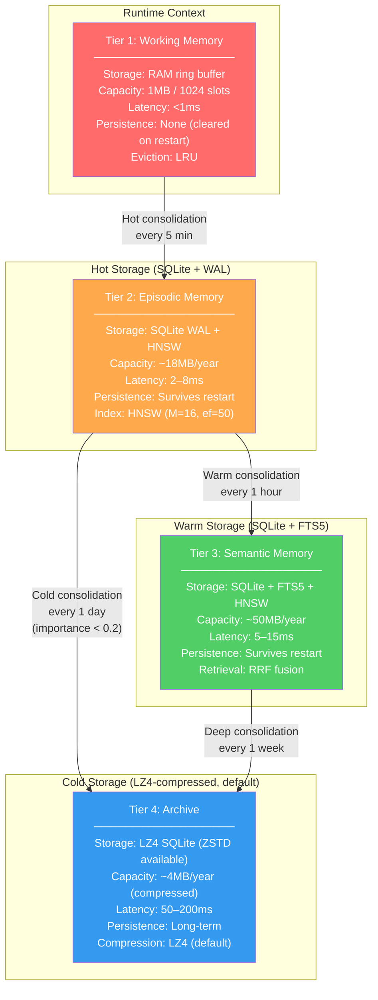
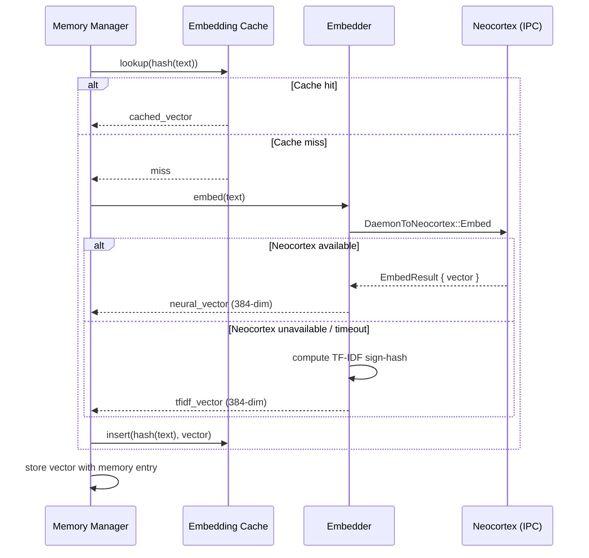
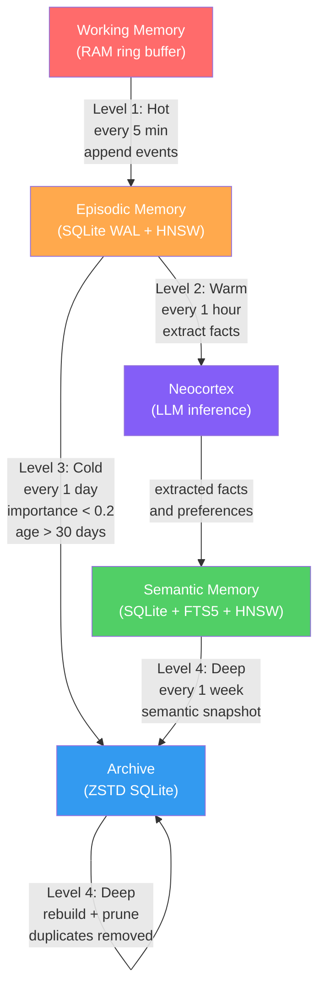

# AURA v4 — Memory and Data Architecture

**Document:** AURA-V4-MEMORY-AND-DATA-ARCHITECTURE  
**Status:** Living Document  
**Scope:** On-device memory subsystem, persistence layer, data classification, integrity

---

## Table of Contents

1. [Overview](#1-overview)
2. [4-Tier Memory Architecture](#2-4-tier-memory-architecture)
   - 2.1 [Architecture Diagram](#21-architecture-diagram)
   - 2.2 [Tier 1: Working Memory](#22-tier-1-working-memory)
   - 2.3 [Tier 2: Episodic Memory](#23-tier-2-episodic-memory)
   - 2.4 [Tier 3: Semantic Memory](#24-tier-3-semantic-memory)
   - 2.5 [Tier 4: Archive](#25-tier-4-archive)
   - 2.6 [Tier Comparison Summary](#26-tier-comparison-summary)
3. [Importance Scoring System](#3-importance-scoring-system)
   - 3.1 [Formula Components](#31-formula-components)
   - 3.2 [Promotion Thresholds](#32-promotion-thresholds)
4. [Hebbian Learning and Pattern Reinforcement](#4-hebbian-learning-and-pattern-reinforcement)
5. [HNSW Vector Index](#5-hnsw-vector-index)
   - 5.1 [Implementation Overview](#51-implementation-overview)
   - 5.2 [Parameters Table](#52-parameters-table)
   - 5.3 [Complexity Analysis](#53-complexity-analysis)
6. [Embedding System](#6-embedding-system)
   - 6.1 [Dual-Mode Design](#61-dual-mode-design)
   - 6.2 [TF-IDF Sign-Hash Embeddings](#62-tf-idf-sign-hash-embeddings)
   - 6.3 [Neural Embeddings via IPC](#63-neural-embeddings-via-ipc)
   - 6.4 [IPC Embedding Flow Diagram](#64-ipc-embedding-flow-diagram)
   - 6.5 [LRU Embedding Cache](#65-lru-embedding-cache)
7. [Memory Consolidation Pipeline](#7-memory-consolidation-pipeline)
   - 7.1 [Consolidation Levels](#71-consolidation-levels)
   - 7.2 [Consolidation Flow Diagram](#72-consolidation-flow-diagram)
   - 7.3 [LLM-Assisted Semantic Extraction](#73-llm-assisted-semantic-extraction)
   - 7.4 [Consolidation Timing Table](#74-consolidation-timing-table)
8. [Memory Feedback Loop](#8-memory-feedback-loop)
9. [Persistence Layer](#9-persistence-layer)
   - 9.1 [WAL Journal Format](#91-wal-journal-format)
   - 9.2 [CriticalVault Encryption](#92-criticalvault-encryption)
   - 9.3 [Argon2id Key Derivation Parameters](#93-argon2id-key-derivation-parameters)
10. [Data Classification and GDPR](#10-data-classification-and-gdpr)
    - 10.1 [4-Tier Data Classification](#101-4-tier-data-classification)
    - 10.2 [GDPR Cryptographic Erasure](#102-gdpr-cryptographic-erasure)
    - 10.3 [Consent Tracking](#103-consent-tracking)
11. [Integrity and Safe Mode](#11-integrity-and-safe-mode)
    - 11.1 [Startup Integrity Checks](#111-startup-integrity-checks)
    - 11.2 [Failure Recovery Paths](#112-failure-recovery-paths)
    - 11.3 [SafeMode Operation](#113-safemode-operation)
12. [ARC Behavioral Data](#12-arc-behavioral-data)
    - 12.1 [What ARC Persists](#121-what-arc-persists)
    - 12.2 [Update Frequency](#122-update-frequency)
    - 12.3 [Classification](#123-classification)

---

## 1. Overview

AURA v4 is an on-device AI assistant runtime built in Rust, designed to run entirely on an Android device without cloud synchronization. The memory architecture reflects this core constraint: all user data, learned preferences, conversation history, and behavioral patterns are stored locally and remain under the user's exclusive control.

### Design Principles

**Privacy by architecture, not policy.** There is no cloud sync path, no telemetry pipeline, and no remote model inference for user data. If a capability requires a network call, it is opt-in and out-of-band from the memory system.

**Tiered storage matches cognitive reality.** Human memory operates across multiple timescales — moment-to-moment working memory, biographical episodic memory, generalized semantic knowledge, and deep archival storage. AURA's 4-tier architecture mirrors this structure to enable realistic, efficient reasoning without treating all memories as equally accessible.

**Latency-aware retrieval.** The system must respond in real time on mobile hardware. A memory tier that takes 200ms to query cannot participate in hot reasoning paths. Each tier has a defined latency contract, and the retrieval engine respects these contracts when composing context.

**Durability without cloud.** On-device data faces risks that cloud storage does not: flash wear, unexpected power loss, app force-stops mid-write. The persistence layer is engineered for these failure modes with WAL journaling, CRC checksums, atomic commits, and startup integrity verification.

**GDPR compliance through cryptographic erasure.** Rather than attempting to locate and delete all instances of user data across a distributed system, AURA's approach is simpler and more robust: delete the key, and all encrypted data becomes permanently inaccessible. This is cryptographic erasure, and it is the primary mechanism for the right to be forgotten.

### Codebase Locations

| Subsystem | Path |
|---|---|
| Working memory | `memory/working.rs` |
| Episodic memory | `memory/episodic.rs` |
| Semantic memory | `memory/semantic.rs` |
| Archive | `memory/archive.rs` |
| Importance scoring | `memory/importance.rs` |
| Hebbian patterns | `memory/patterns.rs` |
| HNSW index | `memory/hnsw.rs` |
| Embedding system | `memory/embeddings.rs` |
| Consolidation | `memory/consolidation.rs` |
| Memory feedback | `memory/feedback.rs` |
| WAL journal | `persistence/journal.rs` |
| CriticalVault | `persistence/vault.rs` |
| IntegrityVerifier | `persistence/integrity.rs` |
| SafeMode | `persistence/safe_mode.rs` |
| ARC behavioral data | `arc/mod.rs` |

---

## 2. 4-Tier Memory Architecture

### 2.1 Architecture Diagram



### 2.2 Tier 1: Working Memory

**Source:** `memory/working.rs`

Working memory is the fastest and most ephemeral tier. It is implemented as an in-RAM ring buffer that holds up to 1024 slots, capped at 1MB total. Every slot is a structured event record representing something that happened in the current session.

**Contents:**

- Current conversation context (the active turn window)
- Active goal state (what the user asked AURA to accomplish)
- Screen state snapshot (what the Android screen currently shows)
- Immediate action queue (pending actions not yet executed)

**Eviction policy:** When the ring buffer is full, the least recently used (LRU) slot is overwritten. There is no grace period — working memory is a fixed-size sliding window, not an unbounded log.

**Persistence:** None. Working memory is cleared when the AURA daemon restarts. This is intentional: the daemon restart represents a clean session boundary, and stale working-memory state from a previous session could confuse the reasoning engine.

**Access latency:** Sub-millisecond. The ring buffer is in-process memory, accessed via a simple index with no I/O.

**Role in reasoning:** The LLM context window at inference time is composed primarily from working memory. When the user asks a follow-up question, working memory provides the in-session continuity that makes the follow-up make sense without re-explaining context.

### 2.3 Tier 2: Episodic Memory

**Source:** `memory/episodic.rs`

Episodic memory is the biographical record of AURA's interactions with the user. Where working memory holds the current conversation, episodic memory holds the history of past conversations and completed tasks.

**Storage:** SQLite database operating in WAL (Write-Ahead Logging) mode, augmented with a custom HNSW vector index for semantic similarity search.

**Capacity:** Approximately 18MB per year of normal use. This is a practical estimate based on average episode length and embedding size at typical interaction volume.

**Schema:**

| Column | Type | Description |
|---|---|---|
| `episode_id` | UUID | Primary key |
| `timestamp` | i64 | Unix timestamp (microseconds) |
| `content_text` | TEXT | Raw text of the episode |
| `embedding_vector` | BLOB | 384-dim float32 vector |
| `importance_score` | REAL | 0.0–1.0 composite importance |
| `recall_count` | INTEGER | Times this episode was retrieved |

**Retrieval:** HNSW approximate nearest neighbor search over embedding vectors. A query embedding is computed, then the HNSW graph is traversed to find the k most semantically similar episodes. The `ef_search` parameter controls the recall/speed tradeoff at query time.

**WAL mode significance:** WAL allows concurrent reads while a write is in progress, which matters for AURA's architecture where consolidation (write path) and inference (read path) can overlap. WAL also provides crash safety: uncommitted WAL entries are replayed or discarded on startup, never leaving the database in a partially-written state.

**Retention:** Episodic memories with importance score below 0.2 after 30 days are promoted to the archive tier during cold consolidation.

### 2.4 Tier 3: Semantic Memory

**Source:** `memory/semantic.rs`

Semantic memory holds generalized knowledge: facts the user has stated, preferences AURA has learned, user profile data, and absorbed world knowledge updates. Where episodic memory is "what happened", semantic memory is "what is known".

**Storage:** SQLite with two complementary indexes:
1. **FTS5** — SQLite's built-in full-text search for keyword retrieval
2. **HNSW** — vector index for semantic similarity retrieval

**Retrieval fusion:** Results from FTS5 keyword search and HNSW vector search are fused using **Reciprocal Rank Fusion (RRF)**:

```
RRF score = Σ 1 / (k + rank_i)
```

Where `k = 60` (a smoothing constant that reduces the impact of high-variance rank differences) and `rank_i` is the position of a result in each ranked list. RRF is used because it is robust to differences in score magnitude between retrieval methods — a document ranked 1st in vector search and 5th in keyword search gets a higher combined score than one ranked 10th in both.

**Capacity:** Approximately 50MB per year. Semantic memory grows faster than episodic because it accumulates structured facts extracted from many episodes during warm consolidation.

**Contents:**

- Stated facts ("I'm allergic to penicillin")
- Learned preferences ("prefers concise responses")
- User profile data (name, timezone, language, etc.)
- World knowledge updates absorbed during warm consolidation

**Access latency:** 5–15ms, reflecting the cost of both an FTS5 query and an HNSW traversal plus the RRF merge step.

### 2.5 Tier 4: Archive

**Source:** `memory/archive.rs`

The archive is cold storage for memories that no longer need fast access. It exists to preserve long-term history without consuming the storage or memory budget required by the active tiers.

**Storage:** LZ4-compressed SQLite by default (ZSTD also supported). LZ4 is the default compression algorithm, chosen for its fast decompression speed which benefits the mobile use case. ZSTD is available as an alternative when higher compression ratios are needed.

**Capacity:** Approximately 4MB per year. This is compressed from much larger raw episodic data — the compression ratio for text-heavy SQLite content is typically 5–10x.

**Access latency:** 50–200ms. Archive access requires decompression of the relevant SQLite pages before the query can execute. This latency is acceptable because archive memories are accessed rarely — they surface only when the user explicitly asks about old events or when consolidation is running.

**Contents:**

- Old episodic memories past their retention threshold
- Summarized semantic snapshots from deep consolidation runs

**Retrieval:** Decompress on demand. There is no persistent HNSW index for the archive — queries against the archive are performed as full-text or timestamp-range scans against the decompressed SQLite content. Building and maintaining a HNSW index for rarely-accessed data would not be cost-effective.

### 2.6 Tier Comparison Summary

| Property | Working | Episodic | Semantic | Archive |
|---|---|---|---|---|
| Storage medium | RAM ring buffer | SQLite WAL | SQLite + FTS5 | LZ4/ZSTD SQLite |
| Capacity | 1MB / 1024 slots | ~18MB/year | ~50MB/year | ~4MB/year |
| Access latency | <1ms | 2–8ms | 5–15ms | 50–200ms |
| Persistence | None | WAL-safe | WAL-safe | Compressed |
| Vector index | None | HNSW | HNSW | None |
| Text search | None | None | FTS5 + RRF | Scan |
| Eviction | LRU | Importance threshold | None | Pruning |
| Primary role | In-context reasoning | Biographical history | Generalized knowledge | Long-term archive |

---

## 3. Importance Scoring System

**Source:** `memory/importance.rs`

Every memory entry in the episodic and semantic tiers carries an importance score in the range [0.0, 1.0]. This score determines how long the memory is retained in an active tier, how prominently it surfaces in retrieval, and when it is promoted to the archive.

### 3.1 Formula Components

The importance score is a weighted sum of five components:

| Component | Range | Description |
|---|---|---|
| `emotional_weight` | 0.0–1.0 | LLM-assessed emotional significance of the memory content |
| `recency_factor` | 0.0–1.0 | Exponential decay based on time since creation |
| `recall_frequency` | 0.0–1.0 | Normalized count of how often this memory has been retrieved |
| `goal_relevance` | 0.0–1.0 | Whether this memory relates to any currently active goals |
| `novelty_score` | 0.0–1.0 | How distinct this memory is from existing memories (high novelty = high importance) |

**Recency decay formula:**

```
recency_factor = exp(-λ × age_in_days)
```

Where `λ` is tuned so that a memory at 30 days has roughly 0.5 recency factor, and at 90 days has roughly 0.05.

**Final composite score:**

```
importance = w1 × emotional_weight
           + w2 × recency_factor
           + w3 × recall_frequency
           + w4 × goal_relevance
           + w5 × novelty_score
```

The weights `w1`–`w5` sum to 1.0 and are tunable system parameters. The default distribution emphasizes recency and goal relevance for active sessions, while recall frequency and emotional weight carry more weight for long-term retention decisions.

**Emotional weight assessment:** The `emotional_weight` component requires LLM inference — the episodic text is passed to the neocortex with a prompt asking for an emotional significance rating. This happens asynchronously during warm consolidation, not on the hot path. Until the LLM assessment arrives, `emotional_weight` defaults to 0.5 (neutral).

### 3.2 Promotion Thresholds

| Transition | Condition | Timing |
|---|---|---|
| Working → Episodic | All working memory events | Every 5 minutes (hot consolidation) |
| Episodic → Archive | `importance < 0.2` AND `age > 30 days` | Daily (cold consolidation) |
| Episodic → Semantic | LLM-extracted facts from episodes | Hourly (warm consolidation) |
| Semantic → Archive | Periodic snapshot during deep consolidation | Weekly |
| Archive: pruned | Duplicate detection during deep consolidation | Weekly |

**Importance floor:** A memory's importance score can never drop below 0.05 if it has been recalled more than 10 times. Frequently accessed memories are never silently discarded, regardless of age.

---

## 4. Hebbian Learning and Pattern Reinforcement

**Source:** `memory/patterns.rs`

Hebbian learning is the principle that "neurons that fire together wire together." In AURA's memory architecture, this translates to a co-occurrence tracking system: when two or more memories are retrieved together in response to the same query or during the same reasoning step, their co-occurrence weight is incremented.

### How It Works

**Co-occurrence tracking:** Each time a set of memories `{m1, m2, ..., mk}` is retrieved together, the system increments the co-occurrence weight for every pair `(mi, mj)` in the set.

**Co-occurrence matrix:** The weights are stored in a sparse matrix in the semantic memory tier. The matrix is not a full N×N grid — only pairs with non-zero co-occurrence weight are stored (as a set of `(id_a, id_b, weight)` rows).

**Effect on retrieval:** During retrieval, after an initial set of candidate memories is identified via HNSW or FTS5, the system queries the co-occurrence matrix for strongly associated memories. If memory `A` is in the result set and `A` has a strong co-occurrence link to memory `B`, then `B` is promoted in the result ranking even if it did not independently score highly.

**Association decay:** Co-occurrence weights decay over time if the association is not reinforced. The decay is multiplicative — each consolidation cycle, all co-occurrence weights are multiplied by a decay factor slightly less than 1.0. Associations that are regularly reinforced (because the memories genuinely belong together) remain strong, while accidental co-occurrences that never repeat gradually fade to zero and are pruned.

### Practical Effect

This mechanism means AURA's memory becomes personalized not just to what the user has said, but to the conceptual clusters of the user's mental model. If the user frequently discusses work stress and sleep quality in the same conversations, AURA will learn to surface sleep-related memories when work stress is mentioned — because those concepts have high co-occurrence weight in this user's data.

This is a learned association, not a hard-coded rule, and it is entirely derived from the user's own interaction history. Different users will develop different association graphs.

---

## 5. HNSW Vector Index

**Source:** `memory/hnsw.rs`

AURA implements its own HNSW (Hierarchical Navigable Small World) vector index in pure Rust. No external HNSW library is used. This avoids FFI complexity, enables Android cross-compilation without native dependency headaches, and allows the implementation to be tuned for AURA's specific workload.

### 5.1 Implementation Overview

HNSW is a graph-based approximate nearest neighbor (ANN) algorithm. The core idea is to build a multi-layer graph where higher layers are sparse (for coarse navigation) and lower layers are dense (for fine-grained search). Queries start at the top layer and greedily descend to lower layers, narrowing toward the nearest neighbors.

**Key properties of HNSW:**
- Approximate results (not guaranteed exact nearest neighbors)
- Sublinear query time: O(log n) after logarithmic graph traversal
- Memory-resident: the graph is held in RAM for fast access
- The graph is persistent to SQLite alongside the vector data

**Distance metric:** Cosine distance. This is standard for semantic embeddings because it is invariant to vector magnitude — only direction matters for semantic similarity.

```
cosine_distance(a, b) = 1 - (a · b) / (|a| × |b|)
```

### 5.2 Parameters Table

| Parameter | Value | Rationale |
|---|---|---|
| `M` | 16 | Maximum connections per node per layer. Higher M increases recall at the cost of memory and build time. 16 is the standard recommended value for high-recall applications. |
| `M_max0` | 32 | Maximum connections at layer 0 (the base layer). Always set to `2 × M`. Layer 0 is the densest layer and benefits from extra connections. |
| `ef_construction` | 200 | Size of the dynamic candidate list during graph construction. Higher value = better graph quality at build time, at the cost of slower inserts. 200 is conservative-high for good recall. |
| `ef_search` | 50 | Size of the dynamic candidate list during querying. Higher = better recall, slower queries. 50 is a reasonable default; can be tuned per-query. |
| `level_multiplier` | 1/ln(M) | Controls the probability distribution for assigning nodes to layers. Standard HNSW formula. |
| `vector_dimension` | 384 | Matches the TF-IDF sign-hash and neural embedding dimensionality. |
| `distance_metric` | Cosine | Standard for semantic embeddings. |

### 5.3 Complexity Analysis

| Operation | Time Complexity | Notes |
|---|---|---|
| Insert | O(log n) expected | Logarithmic due to multi-layer graph traversal |
| Query (ANN) | O(log n) expected | Approximate; ef_search controls precision |
| Build (from scratch) | O(n log n) | Batch insert of n vectors |
| Memory usage | O(n × M × layers) | Dominated by edge storage |

For AURA's expected dataset sizes (episodic tier: tens of thousands of embeddings; semantic tier: hundreds of thousands of facts), HNSW query times are comfortably within the 2–15ms tier latency budgets.

**Recall vs. latency tradeoff:** At `ef_search = 50`, empirical HNSW recall@10 on typical text embedding datasets is approximately 95–98%. This means AURA may occasionally miss the globally closest memory, but will nearly always return the most relevant results. For a conversational assistant this tradeoff is acceptable — the user does not notice if result #9 is not strictly the 9th closest if results #1–#8 are highly relevant.

---

## 6. Embedding System

**Source:** `memory/embeddings.rs`

Every memory entry stored in the episodic or semantic tier is accompanied by a 384-dimensional float32 embedding vector. This embedding is the representation used for HNSW similarity search. AURA supports two modes of embedding computation, selected based on available capabilities.

### 6.1 Dual-Mode Design

The embedding system is designed with a hard constraint: **AURA must always be able to store and retrieve memories, even when the neural model (neocortex) is unavailable.** This requirement drives the dual-mode design:

1. **TF-IDF sign-hash embeddings** — always available, computed in-process, no model required
2. **Neural embeddings via IPC** — higher quality, requires the neocortex daemon to be running

The system automatically falls back from neural to TF-IDF if the neocortex is unavailable. From the perspective of the rest of the memory system, both modes produce the same 384-dimensional float32 vector — the distinction is invisible to callers.

### 6.2 TF-IDF Sign-Hash Embeddings

TF-IDF sign-hash embeddings are a lightweight, deterministic embedding method that requires no model weights.

**Algorithm:**
1. Tokenize the input text
2. Compute TF-IDF weights for each token
3. For each token, hash it to a dimension index in [0, 383]
4. Assign the TF-IDF weight to that dimension, with the sign determined by a secondary hash bit

**Properties:**
- **Dimension:** 384 (matches neural embedding size)
- **Sparsity:** Sparse-ish — typically 50–150 non-zero dimensions per document
- **Deterministic:** The same text always produces the same vector
- **No model dependency:** Computed entirely from hash functions and token frequencies
- **Accuracy:** Lower than neural embeddings for semantic similarity; works well for topical similarity

**When used:** Phase 1 (always available as fallback), and as the primary method during early phases before the neocortex is integrated.

### 6.3 Neural Embeddings via IPC

When the neocortex daemon is running, AURA uses it to compute high-quality neural embeddings.

**IPC message:** `DaemonToNeocortex::Embed { text: String, reply_tx: ... }`

**Response:** `NeocortexToDaemon::EmbedResult { vector: Vec<f32> }`

**Properties:**
- **Dimension:** 384 (same as TF-IDF, enabling index compatibility)
- **Quality:** Captures semantic similarity — "car" and "automobile" map to nearby vectors
- **Latency:** IPC round-trip adds latency relative to in-process TF-IDF; acceptable on non-hot paths
- **Availability:** Requires neocortex daemon to be alive and responsive

**Fallback logic:** If the IPC call to neocortex times out or returns an error, the embedding system transparently falls back to TF-IDF sign-hash. The memory entry is still stored; the embedding quality is simply lower. If neocortex later becomes available and the entry's embedding is flagged as TF-IDF-derived, it can be re-embedded during a consolidation pass.

### 6.4 IPC Embedding Flow Diagram



### 6.5 LRU Embedding Cache

Computing embeddings (even TF-IDF) has a non-trivial cost when called frequently. To avoid redundant computation, the embedding system maintains an LRU cache.

| Property | Value |
|---|---|
| Cache size | 1024 entries |
| Cache key | Hash of input text |
| Cache value | 384-dim float32 vector |
| Eviction policy | LRU |
| Typical hit rate | >80% |

The >80% hit rate reflects the reality of conversational AI workloads: users and AURA frequently reference the same topics across multiple turns and sessions. "calendar", "meeting", "tomorrow" will be embedded many times in a typical week — the cache ensures each is computed at most once per 1024 unique texts.

---

## 7. Memory Consolidation Pipeline

**Source:** `memory/consolidation.rs`

Consolidation is the process by which memories move between tiers, are synthesized into higher-level knowledge, and are pruned when no longer needed. AURA's consolidation pipeline has four levels, each running at a different frequency and performing a different type of work.

### 7.1 Consolidation Levels

**Level 1: Hot Consolidation (every 5 minutes)**

Hot consolidation flushes events from working memory to episodic memory. Working memory holds raw, high-frequency events (every assistant response, every screen state change, every user input). Hot consolidation batches these into episodic entries and writes them to the SQLite episodic tier.

This is a simple append operation with minimal processing: the raw text is stored, a TF-IDF embedding is computed (neural embedding is requested asynchronously), and the entry is written to the episodic SQLite.

Hot consolidation must be lightweight and non-blocking — it runs while AURA is still actively interacting with the user.

**Level 2: Warm Consolidation (every 1 hour)**

Warm consolidation is where raw episodic data is distilled into semantic knowledge. The process:

1. Query episodic tier for all entries since last warm consolidation run
2. Batch episodes into groups by topic (using embedding clustering)
3. Send each batch to neocortex with a semantic extraction prompt
4. Parse LLM response for extracted facts and preferences
5. Write extracted facts to semantic memory tier
6. Update importance scores for episodic entries that contributed facts

This step is LLM-assisted and therefore requires the neocortex to be running. If neocortex is unavailable, warm consolidation is skipped and retried on the next scheduled run. No data is lost — episodic entries accumulate until consolidation can run.

**Level 3: Cold Consolidation (every 1 day)**

Cold consolidation manages the lifecycle of episodic memories, archiving those that are no longer active.

1. Query all episodic entries where `importance < 0.2 AND age > 30 days`
2. Compress and write matching entries to the archive tier
3. Delete the original entries from the episodic tier
4. Trigger a HNSW index rebuild for the episodic tier

Cold consolidation is a maintenance operation that keeps the episodic tier from growing unboundedly.

**Level 4: Deep Consolidation (every 1 week)**

Deep consolidation is the most expensive and least frequent operation. It is performed during a maintenance window (ideally when the device is idle and charging).

1. Compress archive tier: rebuild ZSTD compression for accumulated archive writes
2. Rebuild all indexes: HNSW for episodic and semantic tiers
3. Prune duplicates: identify semantically near-duplicate memories and merge/remove them
4. Snapshot semantic memory: write a compressed semantic snapshot to archive for long-term history
5. Decay co-occurrence weights: apply Hebbian decay factor to all association weights
6. Vacuum SQLite: reclaim space from deleted entries

Deep consolidation can take several seconds to minutes depending on data volume. It should not run while AURA is in active use.

### 7.2 Consolidation Flow Diagram



### 7.3 LLM-Assisted Semantic Extraction

The warm consolidation step is the most cognitively sophisticated part of the consolidation pipeline. It uses the LLM not for generation but for extraction — transforming raw conversational episodes into structured semantic facts.

**Prompt pattern:**
```
Given these conversation episodes from the past hour:
[episode 1]
[episode 2]
...

Extract:
1. Factual statements the user made about themselves
2. Preferences the user expressed or implied
3. Goals or intentions the user mentioned
4. Corrections the user made to previous information

Format each extraction as: TYPE | FACT | CONFIDENCE (0.0-1.0)
```

**Output example:**
```
PREFERENCE | prefers responses under 3 paragraphs | 0.85
FACT       | user's name is Aditya                | 0.99
GOAL       | wants to finish the Rust module today  | 0.72
CORRECTION | previous belief about timezone was wrong | 0.91
```

Extracted facts are written to semantic memory with the LLM-assigned confidence score mapped to the initial importance score.

**If neocortex is unavailable:** Warm consolidation is deferred. Episodic entries accumulate. When neocortex comes back online, a backfill consolidation run processes all deferred episodes. This can produce a larger-than-normal batch, but the system handles this gracefully.

### 7.4 Consolidation Timing Table

| Level | Name | Frequency | Trigger | Duration | LLM required |
|---|---|---|---|---|---|
| 1 | Hot | Every 5 minutes | Timer | <100ms | No |
| 2 | Warm | Every 1 hour | Timer | 1–10s | Yes |
| 3 | Cold | Every 1 day | Timer | 1–5s | No |
| 4 | Deep | Every 1 week | Timer + idle | 10–120s | No |

---

## 8. Memory Feedback Loop

**Source:** `memory/feedback.rs`

AURA's memory is not static — it adapts based on explicit user feedback signals. When the user indicates that AURA said something wrong or confirms that AURA said something right, the feedback is recorded and propagates into the importance scores of associated memories.

### Feedback Signal Types

**Negative feedback — corrections:**

User signals: "that's wrong", "no that's not right", "you're mistaken about that", explicit corrections of stated facts.

**Effect:**
1. The memory or set of memories associated with the incorrect response are identified (via the retrieval context from that turn)
2. Each associated memory receives an importance penalty: `importance *= 0.8` per correction
3. A `correction_count` counter on the memory entry is incremented
4. If `correction_count >= 3`, the memory is flagged for review during the next warm consolidation run
5. The correct information (as stated by the user) is written as a new high-importance semantic fact

**Positive feedback — confirmations:**

User signals: "yes exactly", "that's right", "correct", explicit confirmations.

**Effect:**
1. Associated memories receive an importance boost: `importance = min(1.0, importance + 0.1)`
2. The boost is modest to prevent a single confirmation from artificially inflating a memory's importance

### Correction Cascade

When a memory reaches `correction_count = 3`, it enters the correction cascade:
1. Flagged in semantic memory as `needs_review = true`
2. During the next warm consolidation, sent to LLM with all correction context
3. LLM either confirms the correction, synthesizes the correct fact, or marks the memory as contradicted
4. Contradicted memories are archived with a `contradicted = true` flag (not deleted, for auditability)

### Feedback Loop Diagram

```
User says "that's wrong"
     ↓
Identify associated memories from last response context
     ↓
Apply importance penalty (×0.8) to each
     ↓
Increment correction_count
     ↓
correction_count ≥ 3?
     ├── No: continue normal operation
     └── Yes: flag needs_review → warm consolidation handles it
                    ↓
          LLM synthesizes correct fact
                    ↓
          New high-importance fact written to semantic tier
          Old memory archived as contradicted
```

---

## 9. Persistence Layer

### 9.1 WAL Journal Format

**Source:** `persistence/journal.rs`

The WAL (Write-Ahead Log) journal provides crash safety for all SQLite writes in AURA. Before any change is committed to the main SQLite file, an entry is appended to the WAL journal. On startup, the journal is inspected for uncommitted entries, which are either replayed (if complete) or discarded (if partial/corrupt).

**Binary journal format:**

```
Journal File
├── Header (16 bytes)
│   ├── Magic bytes: [0xAU, 0xRA, 0x57, 0x41, 0x4C, 0x00] (AURA WAL)
│   ├── Version: u16
│   └── Last committed sequence: u64
│
└── Entry (variable length, repeated)
    ├── CRC32 checksum: u32
    ├── Payload length: u32
    ├── Sequence number: u64
    └── Payload bytes: [u8; payload_length]
```

**Write protocol (atomic commit):**
1. Serialize the operation payload
2. Compute CRC32 over the payload
3. Write entry (CRC + length + sequence + payload) to journal file
4. Call `fsync` on the journal file descriptor
5. Only after fsync succeeds: update the sequence number in the journal header
6. The SQLite write proceeds

**Recovery on startup:**
1. Open journal file and read header
2. Scan all entries; for each entry, validate CRC32
3. Entries with valid CRC and sequence number ≤ committed sequence: replay to SQLite
4. Entries with invalid CRC or beyond committed sequence: discard
5. Truncate journal to committed boundary

**Journal compaction:** After each deep consolidation run, committed WAL entries are merged into the main SQLite file and the journal is truncated. This prevents the journal from growing indefinitely.

### 9.2 CriticalVault Encryption

**Source:** `persistence/vault.rs`

The CriticalVault is AURA's encrypted storage for sensitive data. It is not a single file but a logical layer — any data classified as CONFIDENTIAL or SECRET is routed through the vault for encryption before being written to SQLite.

**Encryption scheme:** AES-256-GCM

AES-256-GCM provides:
- **Confidentiality:** 256-bit AES in Galois/Counter Mode
- **Integrity:** 128-bit authentication tag (GHASH) — any modification to the ciphertext is detected
- **Non-malleability:** The authentication tag makes it impossible to alter encrypted data without detection

Every encrypted blob is stored with:
- 12-byte random nonce (unique per write)
- 128-bit authentication tag
- Ciphertext

The nonce is never reused — a fresh random nonce is generated for every encryption operation. Reusing a nonce with GCM would catastrophically compromise confidentiality.

**Vault seal:** On startup, the vault checks that its master key is available (derived from the user's PIN) and that a test ciphertext can be successfully decrypted. If this "seal check" fails, SafeMode is triggered.

### 9.3 Argon2id Key Derivation Parameters

The vault master key is never stored directly. It is derived from the user's PIN using Argon2id, a memory-hard key derivation function designed to make brute-force attacks expensive.

**Parameters (OWASP recommended profile):**

| Parameter | Value | Rationale |
|---|---|---|
| Algorithm | Argon2id | Hybrid of Argon2i (side-channel resistance) and Argon2d (GPU resistance) |
| Memory | 64 MB | Forces attacker to use 64MB RAM per guess attempt; limits parallelism |
| Iterations | 3 | Three passes over the memory block; increases time cost |
| Parallelism | 4 | 4 parallel lanes; matches modern mobile CPU core count |
| Salt length | 16 bytes | Random salt, stored alongside the vault ciphertext |
| Output length | 32 bytes | 256-bit key for AES-256 |

**Salt storage:** The 16-byte salt is stored in plaintext alongside the vault (format: `salt(16) || hash(32)` = 48 bytes total). This is correct and expected — the salt's purpose is to prevent precomputed rainbow tables, not to be secret. An attacker who knows the salt still cannot brute-force without expending 64MB × 3 passes × (number of guesses) of computation.

**Key lifecycle:** The derived key is held in a memory-locked allocation (using `mlock` on Linux/Android) to prevent it from being paged to swap. It is zeroed using volatile writes when the vault is locked to prevent compiler optimization from eliminating the clear.

---

## 10. Data Classification and GDPR

### 10.1 4-Tier Data Classification

AURA classifies all data into one of four tiers. The classification determines encryption requirements, access logging, and erasure behavior.

| Classification | Encryption | Access Logging | Examples |
|---|---|---|---|
| **PUBLIC** | None | No | App UI preferences, theme settings, non-sensitive config flags, language settings |
| **INTERNAL** | Encrypted at rest | No | Conversation history, task completion records, episodic memory entries, ARC domain scores |
| **CONFIDENTIAL** | Encrypted + vault | Yes | User profile data, identity state, behavioral patterns, semantic memory content |
| **SECRET** | Encrypted + vault + audit trail | Yes (full audit) | Credentials, authentication tokens, private keys, explicit consent records |

**Classification assignment:** Each data type has a hard-coded classification that cannot be changed at runtime. The classification is determined at design time and is part of the type system — a `ConversationEpisode` struct, for example, carries a compile-time tag indicating INTERNAL classification.

**Access logging:** CONFIDENTIAL and SECRET data access is logged to an append-only access log. The log records: timestamp, accessor (component name), data identifier, operation (read/write/delete). This log is itself classified as INTERNAL and is not accessible to user-facing features.

### 10.2 GDPR Cryptographic Erasure

AURA implements the GDPR right to erasure ("right to be forgotten") through cryptographic erasure rather than data deletion.

**Traditional erasure approach (fragile):**
- Find all user data across all storage locations
- Delete each record
- Problem: flash storage, WAL journals, backups, caches may retain copies

**Cryptographic erasure approach (robust):**
1. All CONFIDENTIAL and SECRET data is encrypted with the user's Argon2id-derived master key
2. To "erase" all user data: delete the 32-byte Argon2id salt from secure storage
3. Without the salt, the master key cannot be rederived from the PIN
4. All encrypted data becomes permanently, provably inaccessible — even if the raw bytes remain on disk

**Why this works:** AES-256-GCM ciphertext without the key is computationally indistinguishable from random noise. It cannot be decrypted in any feasible timeframe. Deleting the salt achieves the same practical outcome as physically destroying the storage medium.

**Erasure ceremony:**
1. User requests data erasure
2. AURA prompts for PIN confirmation
3. On confirmation: securely delete salt from Android Keystore
4. Zero the derived key in memory
5. Write zeros over the vault header (belt-and-suspenders)
6. PUBLIC and INTERNAL-unencrypted data is deleted via standard SQL DELETE + VACUUM

**Auditability:** The erasure event is recorded in an external log before the key is deleted, so the erasure itself is auditable even though the data content is not.

### 10.3 Consent Tracking

User consent records are classified as SECRET — they must be tamper-evident and auditable.

Each consent record contains:
- Consent type (e.g., "store_conversation_history", "use_for_improvement")
- Consent state (granted / revoked)
- Timestamp of last state change
- User-visible description of what the consent covers
- Version of the privacy policy consented to

Consent records are written to the vault and cannot be modified without a new vault write (leaving an audit trail). Revoking consent triggers:
1. Update consent record to state=revoked
2. If consent covered data collection: stop collection immediately
3. If consent covered stored data: trigger targeted erasure of that data type
4. If consent covered all data: initiate full cryptographic erasure

---

## 11. Integrity and Safe Mode

### 11.1 Startup Integrity Checks

**Source:** `persistence/integrity.rs`

Every time the AURA daemon starts, the `IntegrityVerifier` runs a sequence of checks before the memory system is made available for use. These checks detect corruption from power loss, flash errors, or unexpected terminations.

**Check sequence (in order):**

| Step | Check | Method | On failure |
|---|---|---|---|
| 1 | WAL journal CRC validation | CRC32 of each journal entry | Replay valid entries; discard corrupt |
| 2 | SQLite integrity check | `PRAGMA integrity_check` on each database | Fall back to last good checkpoint |
| 3 | HNSW index consistency | Walk HNSW graph; verify neighbor counts and dimension sizes | Rebuild index from stored vectors |
| 4 | Vault seal verification | Decrypt test vector with derived key | Trigger SafeMode if key derivation fails |
| 5 | Config schema validation | Validate all config fields against current schema | Reset to defaults for changed fields |

**Check timing:** The full integrity check sequence takes 50–500ms depending on database size and device speed. This happens at daemon startup, not on every query. During normal operation, SQLite's own WAL mode and CRC protections catch incremental corruption.

**PRAGMA integrity_check:** This is a built-in SQLite feature that walks the entire B-tree structure and verifies internal consistency. It catches page corruption, broken links, and overflow chain errors. It does not catch logical data corruption (garbage values in correctly-structured pages), but that level of corruption is not the failure mode being defended against.

### 11.2 Failure Recovery Paths

**WAL journal corruption:**
1. Read all entries; compute CRC32 for each
2. Entries with valid CRC and sequence ≤ committed: replay to SQLite
3. Entries with invalid CRC or sequence > committed: discard
4. Result: SQLite is in the last fully committed state; no partial writes applied

**SQLite corruption:**
1. Rename corrupt database to `<name>.corrupt`
2. Copy last known-good checkpoint (if checkpoint exists)
3. Replay any committed WAL entries against the checkpoint
4. If no checkpoint: start with empty database (data loss, but consistent state)
5. Log the recovery event for the user to inspect

**HNSW index inconsistency:**
1. Drop the HNSW index (the graph structure)
2. All underlying vectors are still in SQLite; the index is derived data
3. Rebuild HNSW by re-inserting all vectors (O(n log n) time)
4. Mark rebuild in progress; queries fall back to linear scan during rebuild

**Vault corruption:**
1. Vault seal verification fails → cannot decrypt any CONFIDENTIAL/SECRET data
2. Trigger SafeMode immediately
3. Notify user: vault is unsealed, sensitive data inaccessible
4. Offer recovery: if user remembers PIN, attempt re-derivation with stored salt
5. If salt is also corrupt: cryptographic erasure is the only option (equivalent to right to forget)

### 11.3 SafeMode Operation

**Source:** `persistence/safe_mode.rs`

SafeMode is a degraded operating mode entered when the persistence layer is compromised. In SafeMode, AURA remains functional for basic conversation but all capabilities that require persistent memory or action execution are disabled.

**SafeMode constraints:**

| Capability | Normal mode | SafeMode |
|---|---|---|
| Conversational response | Available | Available |
| Episodic memory retrieval | Available | Unavailable |
| Semantic memory retrieval | Available | Unavailable |
| Action execution | Available | Unavailable |
| Learning / memory write | Available | Unavailable |
| ARC context inference | Available | Unavailable |
| Working memory | Available | Available |

**User notification:** When SafeMode activates, AURA proactively informs the user:

> "I'm running in limited mode — my persistent memory is temporarily unavailable. I can still have a conversation, but I won't remember context from previous sessions or execute actions until the issue is resolved."

**Recovery flow:** SafeMode includes a guided repair flow that walks the user through:
1. What went wrong (as much as can be determined)
2. What data may be affected
3. Repair options (retry, restore checkpoint, reset)
4. Confirmation before any destructive recovery action

SafeMode is a safety net, not a normal operating state. If the system enters SafeMode frequently, it indicates a hardware or storage problem that should be addressed at the device level.

---

## 12. ARC Behavioral Data

**Source:** `arc/mod.rs` (511 lines)

ARC (Aura Reality Cortex) is AURA's behavioral intelligence layer. It maintains a model of the user's life context — their wellbeing across domains, their current cognitive mode, their routine patterns — and uses this model to adapt AURA's behavior to what the user actually needs.

ARC is a stateful system, and its state must persist across daemon restarts for the model to remain useful.

### 12.1 What ARC Persists

**Domain scores (10 domains):**

ARC maintains a score for each of 10 life domains:

| Domain | Description |
|---|---|
| Health | Physical and mental health signals |
| Social | Social connection quality |
| Productivity | Professional productivity and output |
| Finance | Financial situation indicators |
| Lifestyle | Daily living and routine quality |
| Entertainment | Leisure and recreation |
| Learning | Skill development and intellectual engagement |
| Communication | Communication patterns and quality |
| Environment | Physical environment and home context |
| PersonalGrowth | Self-improvement and personal development |

Each score is a float in [0.0, 1.0] computed from signals AURA observes (conversation content, interaction patterns, explicit user statements). Default weights: Health=1.0, Social=0.8, Productivity=0.7, Finance=0.6, Lifestyle=0.5, Learning=0.4, PersonalGrowth=0.4, Communication=0.3, Entertainment=0.2, Environment=0.2. Domain scores update every 5 minutes.

**Context mode history (8 modes):**

ARC infers the user's current cognitive/emotional mode:

| Mode | Description |
|---|---|
| Default | Standard operating mode |
| DoNotDisturb | Minimal interruptions, suppressed notifications |
| Sleeping | User is sleeping, minimal activity |
| Active | User is actively engaged |
| Driving | User is driving, safety-appropriate interactions only |
| Custom1 | User-defined context mode 1 |
| Custom2 | User-defined context mode 2 |
| Custom3 | User-defined context mode 3 |

Mode history is the time-series of mode transitions. This history allows ARC to recognize patterns ("user enters FOCUSED mode every weekday at 9am") and anticipate transitions.

**Life Quality Index (LQI):**

The LQI is a single composite metric derived from all 10 domain scores, weighted by the user's stated priorities. LQI history is persisted as a time-series for trend analysis.

**Routine patterns:**

ARC identifies recurring behavioral patterns (e.g., "reads news for 15 minutes after waking", "does deep work in morning, emails in afternoon"). Each routine pattern has a confidence weight that increases with consistent observation and decays with inconsistent behavior.

**Initiative budget state:**

AURA can take proactive initiatives (suggesting tasks, surfacing reminders, making recommendations). The initiative budget limits how often AURA interrupts the user. Budget state (remaining budget, last reset time) is persisted so that a daemon restart does not reset the budget and allow a burst of interruptions.

### 12.2 Update Frequency

| ARC Data | Update Frequency | Trigger |
|---|---|---|
| Domain scores | Every 5 minutes | Timer + significant event |
| Context mode | Real-time | Mode transition detected |
| LQI | Every 5 minutes | After domain score update |
| Routine patterns | Every hour | Warm consolidation pass |
| Initiative budget | On each initiative taken | Event-driven |

Real-time context mode updates are critical for AURA's responsiveness — if the user shifts from FOCUSED to STRESSED, AURA should adapt its interaction style immediately, not in 5 minutes.

### 12.3 Classification

ARC data is classified as **INTERNAL** (not CONFIDENTIAL), with the following rationale:

- **Not PUBLIC:** ARC data reveals behavioral patterns, stress levels, and life quality — this is genuinely sensitive
- **Not CONFIDENTIAL:** ARC data does not directly identify the user or contain personally identifiable information in isolation; it is behavioral signal, not identity data
- **Not SECRET:** ARC data does not contain credentials or cryptographic material

**Practical consequence:** ARC data is encrypted at rest (INTERNAL classification mandates encryption) but does not require vault access (no PIN needed to read it). This means:
- ARC state is available immediately on daemon startup without user interaction
- ARC data participates in cryptographic erasure (it is encrypted with the master key)
- ARC data is not access-logged individually (unlike CONFIDENTIAL data)

**Storage location:** ARC state is persisted to the semantic memory tier SQLite database, in a dedicated table namespace (`arc_*`). It is not stored in the vault. The semantic tier's WAL mode provides the crash safety guarantee needed for ARC state.

---

## Appendix A: Memory Tier Capacity Projections

Based on assumed usage patterns (average user, ~50 interactions per day, mixed query types):

| Year | Episodic raw | Episodic actual | Semantic | Archive | Total |
|---|---|---|---|---|---|
| Year 1 | ~18MB | ~18MB | ~50MB | ~4MB | ~72MB |
| Year 2 | +18MB | ~36MB | ~90MB | +8MB | ~134MB |
| Year 3 | +18MB | ~54MB | ~120MB | +12MB | ~186MB |

Note: Episodic tier does not grow unboundedly — cold consolidation archives memories past their retention threshold. In steady state after 3+ years, the episodic tier stabilizes at roughly 18–36MB (2 years of rolling window).

---

## Appendix B: Key Design Decisions and Rationale

| Decision | Alternative considered | Rationale for choice |
|---|---|---|
| Pure Rust HNSW | Use `hnswlib` via FFI | FFI on Android adds ABI complexity; Rust impl cross-compiles cleanly |
| SQLite with WAL | LevelDB, RocksDB | SQLite is battle-tested on Android; WAL provides concurrent read/write without daemon complexity |
| ZSTD for archive | LZ4, Gzip | LZ4 is the default for fast decompression on mobile; ZSTD is available as an alternative when higher compression ratios are needed |
| AES-256-GCM | AES-256-CBC | GCM provides authenticated encryption; CBC requires separate MAC; GCM is strictly better |
| Argon2id | bcrypt, PBKDF2 | Argon2id is the current OWASP recommendation for password hashing; memory-hard by design |
| Cryptographic erasure | Physical deletion | Physical deletion on flash is unreliable; cryptographic erasure is provably complete |
| 4-tier classification | Binary sensitive/non-sensitive | Granular classification allows proportionate security controls; reduces over-encryption overhead |
| RRF for retrieval fusion | Weighted score combination | RRF is robust to score magnitude differences between FTS5 and HNSW; requires no calibration |
| TF-IDF sign-hash fallback | Error on no model | Always-available fallback maintains core memory functionality when neocortex is unavailable |

---

## Appendix C: Glossary

| Term | Definition |
|---|---|
| ANN | Approximate Nearest Neighbor — finding vectors close to a query vector without exhaustive search |
| ARC | Aura Reality Cortex — AURA's behavioral intelligence and life-context modeling layer |
| Argon2id | Memory-hard password hashing function; OWASP recommended for key derivation |
| HNSW | Hierarchical Navigable Small World — a graph-based ANN algorithm |
| LQI | Life Quality Index — ARC's composite wellbeing metric |
| LRU | Least Recently Used — an eviction policy that removes the item accessed least recently |
| Neocortex | AURA's LLM inference daemon; handles all neural model inference |
| RRF | Reciprocal Rank Fusion — a rank aggregation method for combining results from multiple retrieval systems |
| SafeMode | AURA's degraded operating mode when persistence is compromised |
| WAL | Write-Ahead Log — a journaling method for crash-safe database writes |
| ZSTD | Zstandard — a fast lossless compression algorithm developed by Facebook |
| FTS5 | Full-Text Search version 5 — SQLite's built-in full-text search extension |
| GCM | Galois/Counter Mode — an authenticated encryption mode for AES |
| CRC32 | Cyclic Redundancy Check (32-bit) — a checksum for detecting data corruption |

---

*End of AURA-V4-MEMORY-AND-DATA-ARCHITECTURE.md*
