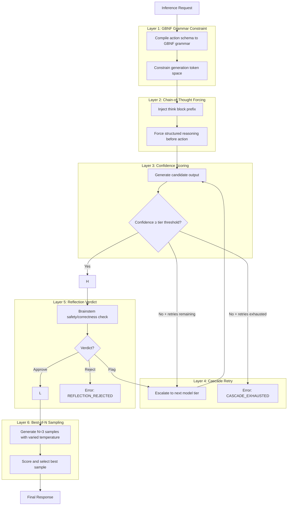
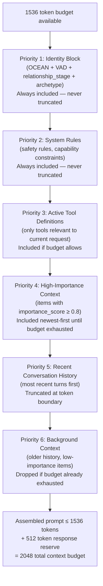

# AURA v4 — Neocortex Architecture & Token Economics

**Document Version:** 4.0  
**Status:** Living document — reflects source-verified constants and design decisions  
**Source truth:** `crates/aura-neocortex/src/{inference,context,model,model_capabilities,grammar,prompts}.rs`

---

## Table of Contents

1. [Overview](#1-overview)
2. [Model Management](#2-model-management)
3. [The 6-Layer Teacher Stack](#3-the-6-layer-teacher-stack)
4. [GBNF Grammar System](#4-gbnf-grammar-system)
5. [Chain-of-Thought Architecture](#5-chain-of-thought-architecture)
6. [Confidence Scoring and Cascade Retry](#6-confidence-scoring-and-cascade-retry)
7. [Context Assembly and Token Economics](#7-context-assembly-and-token-economics)
8. [InferenceMode Parameter Table](#8-inferencemode-parameter-table)
9. [IPC Protocol](#9-ipc-protocol)
10. [Prompt Architecture](#10-prompt-architecture)
11. [Performance Characteristics](#11-performance-characteristics)

---

## 1. Overview

### 1.1 What the Neocortex Is

The Neocortex is AURA's reasoning engine — a dedicated, isolated process that owns all LLM inference. It is the **only** component in the system allowed to reason. Every conclusion, plan, reflection, and response flows through it. No other process in AURA performs inference or interprets model output.

This separation is architectural law:

> **LLM = brain. Rust = body. Rust reasons nothing. LLM reasons everything.**

The Rust runtime — the body — handles scheduling, memory management, IPC, grammar enforcement, token budget accounting, and crash recovery. It does not interpret intent, score relevance, or make decisions. All of that lives in the Neocortex.

### 1.2 Process Isolation and IPC Bridge

The Neocortex runs as a **separate OS process** from the main AURA daemon. This gives three guarantees:

1. **Crash safety** — if the LLM process panics (OOM, bad model weights, GPU fault), the daemon survives. The user experience degrades gracefully rather than crashing entirely.
2. **Hot model swap** — the neocortex process can be terminated and restarted with a different model tier without restarting the daemon. Active sessions pause and resume transparently.
3. **Memory isolation** — the LLM's multi-gigabyte memory footprint does not share address space with the daemon's working set, reducing fragmentation and allowing OS-level memory reclaim when idle.

Communication between the daemon and the Neocortex is exclusively via a typed IPC channel (see Section 9). No shared memory, no direct function calls across the boundary.

### 1.3 Iron Laws (Non-Negotiable)

These are design constraints, not preferences:

- **Anti-cloud absolute** — no telemetry, no cloud fallback, no model API calls. Everything runs on-device. AURA cannot and will not send user data off-device under any circumstances.
- **Privacy-first** — prompts, responses, personality state, and conversation history never leave the device.
- **LLM is the only reasoner** — heuristic scoring, threshold comparisons, and grammar validation in Rust are mechanical filters, not reasoning. The moment Rust "decides" something based on semantic content, that is a violation of this law.

### 1.4 Crash Recovery

When the Neocortex process exits unexpectedly:

1. The daemon detects the process exit via its process monitor.
2. In-flight inference requests are marked failed with error code `2` (CANCELLED).
3. The daemon emits a `NeocortexCrashed` event to the UI layer.
4. After a short backoff, the daemon spawns a fresh Neocortex process.
5. The new process reloads the last-active model tier from the model scanner cache.
6. Sessions resume. No conversation history is lost — context is owned by the daemon, not the Neocortex.

---

## 2. Model Management

### 2.1 Three-Tier Model Architecture

AURA supports three model tiers. Each tier maps to a GGUF file on disk. The scanner auto-assigns tiers by file size (smallest → Brainstem, middle → Standard, largest → Full), but user config and GGUF metadata can override this.

| Tier | Default GGUF Filename | RAM Usage | Quality Score | Est. Tokens/sec | Confidence Threshold |
|---|---|---|---|---|---|
| **Brainstem 1.5B** | `qwen3.5-1.5b-q4_k_m.gguf` | ~900 MB | 0.55 | 45.0 tok/s | 0.65 |
| **Standard 4B** | `qwen3.5-4b-q4_k_m.gguf` | ~2400 MB | 0.75 | 25.0 tok/s | 0.55 |
| **Full 8B** | `qwen3.5-8b-q4_k_m.gguf` | ~4800 MB | 0.90 | 12.0 tok/s | 0.40 |

**Notes:**
- Default filenames are fallbacks only. The ModelScanner discovers actual files and assigns tiers dynamically.
- `confidence_threshold` is the per-tier minimum for Layer 2 confidence scoring (see Section 6).
- Quality scores drive cascade escalation decisions: when a tier underperforms, the system escalates to the next tier.

### 2.2 RAM Tier Selection

The Neocortex selects which tier to load based on available device RAM, with a safety margin:

```
OOM_SAFETY_MARGIN_MB = 512

Full 8B   → requires ≥ 5200 MB available RAM
Standard 4B → requires ≥ 2800 MB available RAM
Brainstem 1.5B → fallback (always fits if device can run AURA at all)
```

If the device has less than 2800 MB free, Brainstem is always selected regardless of quality preferences. The 512 MB safety margin prevents the model from consuming all available RAM and starving the OS.

### 2.3 Loading and Unloading

**Loading:**
- Context window is capped at 32768 tokens on first load, regardless of what the model's GGUF metadata claims. This is an OOM prevention measure — large context models can allocate gigabytes of KV cache.
- GgufMeta further clamps context to 128K maximum.
- Model loading is async. The daemon queues inference requests during load and dispatches them once the model signals ready.

**Unloading (Idle Timeout):**

```
Normal power state:   idle timeout = 60 seconds
High-activity state:  idle timeout = 180 seconds
Charging state:       never unload (keep model hot)
```

Unloading frees the model's RAM allocation. The next inference request triggers a reload (with loading latency added to that request's response time).

### 2.4 Power State Integration

The model manager monitors battery state and adjusts behavior:

| PowerState | Condition | Effect |
|---|---|---|
| `Critical` | Battery < 15% | Force Brainstem tier, aggressive unload |
| `Low` | Battery 15–30% | Prefer Brainstem, shorten idle timeout |
| `Normal` | Battery ≥ 30% | Standard tier selection logic |
| `Charging` | Plugged in | Allow Full tier, never unload |

### 2.5 Model Capability Resolution

Model capabilities (embedding dimension, context length, architecture) are resolved through a priority chain:

```
Priority (highest to lowest):
  1. GGUF file metadata  (parsed from the .gguf file itself)
  2. User config override (only applies when GGUF metadata absent)
  3. Device-probed values (reserved for future hardware detection)
  4. Compiled fallbacks   (hardcoded safe defaults)
```

**Compiled fallback values** (used only when all above sources fail):
```
embedding_dim       = 4096
context_length      = 4096
block_count         = 32
feed_forward_length = 14336
architecture        = "unknown"
```

**Invariant:** Fallback embedding_dim must never be 768 (BERT-era dimension). All AURA-compatible models use ≥ 1024.

### 2.6 Cascade Session Limits

Each session is limited to **3 cascade escalations** (`max_cascades = 3`). This prevents runaway escalation where a single hard query forces repeated escalation to Full 8B and drains battery. After 3 cascades within a session, the system stops escalating and surfaces the best available response from the current tier.

---

## 3. The 6-Layer Teacher Stack

### 3.1 Design Philosophy

The Teacher Stack is AURA's quality enforcement mechanism. It is a sequence of layers that wrap every inference call. Each layer either constrains the generation space (making bad outputs impossible) or evaluates the output after generation (catching errors that slipped through constraints).

Layers are not optional. Every inference request passes through all applicable layers. Layers can be bypassed only for specific inference modes (e.g., pure conversational requests skip grammar constraint layers).

### 3.2 Layer Reference

The source code uses 0-indexed layers internally. This document uses 1-indexed layers for readability:

| Layer | Internal Index | Name | Mechanism | When Active |
|---|---|---|---|---|
| 1 | 0 | GBNF Grammar Constraint | Pre-generation schema enforcement | All structured modes |
| 2 | 1 | Chain-of-Thought Forcing | Thinking block injection | All non-trivial requests |
| 3 | 2 | Confidence Scoring | Post-generation logprob assessment | Always |
| 4 | 3 | Cascade Retry | Tier escalation on failure | When confidence below threshold |
| 5 | 4 | Reflection Verdict | Brainstem safety/correctness check | Planner + Strategist outputs |
| 6 | 5 | Best-of-N Sampling | Multi-sample diversity selection | High-stakes reasoning |

### 3.3 Layer Cascade Flow



### 3.4 Layer Interaction Rules

- **Layer 1 precedes generation** — GBNF grammar is compiled and attached to the llama.cpp sampler chain before any tokens are generated. Invalid tokens are impossible, not just penalized.
- **Layers 2–6 are post-generation gates** — they evaluate, select, or retry after a candidate output exists.
- **Layer 4 feeds back to Layer 1** — cascade retry restarts the full generation pipeline on a new (higher) tier, not just the scoring step.
- **Layer 5 can re-enter Layer 4** — a `Flag` verdict from Reflection triggers a cascade retry, consuming one of the 3 allowed cascades.
- **Layer 6 is the final pass** — Best-of-N runs after all other layers confirm a viable output path. It selects the best among 3 samples (`BON_SAMPLES = 3`).

---

## 4. GBNF Grammar System

### 4.1 What GBNF Is

GBNF (GGML Backus-Naur Form) is a grammar specification format native to llama.cpp. It defines a formal grammar that constrains which token sequences the model is allowed to generate. During sampling, any token that would violate the grammar is given zero probability before sampling occurs — it is structurally impossible to generate invalid output.

This is categorically different from prompt engineering ("please output valid JSON"). Grammar constraints are enforced at the logit level, not the request level. The model cannot accidentally produce malformed output when a grammar is active.

### 4.2 GrammarKind Variants

AURA defines the following grammar kinds, each compiled to a distinct GBNF schema:

| GrammarKind | Used By | Required Fields | Purpose |
|---|---|---|---|
| `ActionPlan` | Planner, Strategist | `goal_description`, `steps`, `estimated_duration_ms`, `confidence` | Structured multi-step plan with timing and confidence |
| `DslSteps` | Composer | DSL step sequence | Executable DSL instruction list |
| `ChainOfThought` | Layer 1 wrapper (all structured modes) | `thinking` block, `action` field | Forces reasoning before action output |
| `ReflectionVerdict` | Layer 5 (Brainstem check) | `safe`, `correct`, `concerns`, `verdict` (approve/flag/reject) | Safety and correctness gate |
| `ConfidenceAssessment` | Layer 3 scoring | `confidence`, `reasoning`, `uncertain_aspects` | Quantified self-assessment with explanation |
| `FreeText` | Conversational mode | None | No grammar applied — returns `None` |

### 4.3 Schema Compilation

When an inference request arrives, the grammar compiler:

1. Reads the `InferenceMode` and `GrammarKind` for the request.
2. Compiles the appropriate GBNF schema — a text definition of production rules.
3. Passes the compiled grammar to llama.cpp's sampling chain.
4. The sampler masks invalid tokens at each generation step.

Grammar compilation is deterministic and fast (microseconds). The resulting GBNF is not cached between requests because mode and schema can change per-request.

### 4.4 Post-Generation Validation

Despite grammar constraints making invalid output structurally impossible, AURA runs a `validate_output()` pass on every generated response. This is a double-check safety net for:

- Parser edge cases where the grammar allowed a technically-valid but semantically-broken structure.
- Future schema changes where a grammar update lags behind a schema version bump.
- Deserialization errors that grammar alone cannot prevent (e.g., integer overflow in duration fields).

If `validate_output()` fails, the response is treated as a generation failure (error code `4`: PARSE_FAILED) and triggers a retry.

### 4.5 Why Hard Constraints Matter

The alternative — post-hoc JSON repair via prompting — fails in production at the worst moments. When a model is running at its capability boundary (long context, complex query, low confidence), it is most likely to produce malformed output. Prompt-based repair adds latency and is itself unreliable. GBNF constraints eliminate the failure mode entirely, without latency cost, at the token generation level.

---

## 5. Chain-of-Thought Architecture

### 5.1 CoT Forcing

AURA forces chain-of-thought reasoning for all non-trivial requests. "Forcing" means the model is not asked to think step by step — it is given a grammar (`ChainOfThought`) that makes it **structurally impossible** to output an action without first outputting a `thinking` block.

The `ChainOfThought` grammar schema has two required fields:
- `thinking` — free-form reasoning text (no grammar constraint within this block)
- `action` — the output, constrained to the appropriate action schema

The model cannot output an action without completing the thinking block. This eliminates the failure mode where the model produces a fluent-sounding but unreasoned response.

### 5.2 Think Block Structure

A think block is opaque to the user. It is:
- Included in the raw generation output.
- Stripped before the response is delivered to the UI layer.
- Retained in the inference audit log (for debugging, never surfaced to users).

The think block consumes tokens from the context budget. This cost is **accounted for in the response reserve** (`RESPONSE_RESERVE_TOKENS = 512`), which covers both thinking tokens and final output tokens.

### 5.3 Token Budget Separation

The context assembly budget (`DEFAULT_CONTEXT_BUDGET = 2048`) does not include thinking tokens. The budget governs how much prior context (conversation history, tool outputs, personality state) is assembled into the prompt. The response reserve is separate:

```
Total generation allowance = RESPONSE_RESERVE_TOKENS = 512 tokens
  ├── Think block:    variable (not separately bounded)
  └── Action output:  variable (grammar-constrained by mode)
```

If a think block grows large (complex multi-step reasoning), it reduces the tokens available for the action output within the 512-token reserve. For long-form tasks (Planner mode, context_budget=1200), the system is tuned with larger per-mode budgets to accommodate this.

### 5.4 CoT in the Prompt Sequence

CoT injection occurs at a specific position in the prompt assembly sequence (see Section 10). The CoT prefix is inserted after the tool definitions and few-shot examples, immediately before the context block. This positioning ensures the model has seen all relevant context before its reasoning begins.

---

## 6. Confidence Scoring and Cascade Retry

### 6.1 Logprob Computation

After generating a candidate output, the Neocortex computes a confidence score by analyzing the log-probabilities of the generated tokens. The scoring pass uses the `ConfidenceAssessment` grammar to elicit a structured self-assessment from the model:

```json
{
  "confidence": 0.72,
  "reasoning": "The task is well-scoped and I have sufficient context...",
  "uncertain_aspects": ["exact timing for step 3", "user preference for format"]
}
```

The `confidence` field (0.0–1.0) is the primary signal. The `reasoning` and `uncertain_aspects` fields are retained in the audit log.

### 6.2 Confidence Thresholds

Two global thresholds govern confidence-based decisions:

```
CASCADE_CONFIDENCE_THRESHOLD = 0.5   (trigger cascade escalation)
LOW_CONFIDENCE_THRESHOLD      = 0.3   (surface warning to user)
```

Per-tier thresholds (from model.rs) represent the minimum expected confidence for each model:

| Tier | Confidence Threshold |
|---|---|
| Brainstem 1.5B | 0.65 |
| Standard 4B | 0.55 |
| Full 8B | 0.40 |

Full 8B has a lower threshold because its raw capability means low confidence scores are more informative — the model genuinely doesn't know, rather than lacking capacity.

### 6.3 Cascade Retry Strategy

When confidence falls below `CASCADE_CONFIDENCE_THRESHOLD`:

```
MAX_CASCADE_RETRIES = 3
```

The retry strategy:

1. **Retry 1** — same tier, increased temperature, adjusted sampling parameters.
2. **Retry 2** — escalate to next tier (e.g., Brainstem → Standard). Full pipeline restart.
3. **Retry 3** — escalate again if available (Standard → Full). If already at Full, retry with BoN sampling.
4. **Exhausted** — return error code `6` (CASCADE_EXHAUSTED) with best available partial response.

Each retry re-runs all 6 layers from Layer 1. There is no partial pipeline restart. This ensures grammar constraints, CoT forcing, and reflection all apply to the retried generation.

The session-level cascade limit (`max_cascades = 3` per session) is separate from the per-request retry limit. A session that has exhausted its cascade budget will not escalate even if individual request confidence is low.

### 6.4 Low Confidence Warning

If confidence is between `LOW_CONFIDENCE_THRESHOLD` (0.3) and `CASCADE_CONFIDENCE_THRESHOLD` (0.5), the response is delivered with a low-confidence annotation. The system does not retry — it surfaces the uncertainty to the user. This is a deliberate UX choice: AURA's honesty principle means it does not silently paper over uncertainty.

---

## 7. Context Assembly and Token Economics

### 7.1 Budget Math

Every inference call has a strict token budget:

```
DEFAULT_CONTEXT_BUDGET  = 2048 tokens   (total prompt budget)
RESPONSE_RESERVE_TOKENS =  512 tokens   (reserved for model output)

Available for context assembly = 2048 - 512 = 1536 tokens
```

The 1536-token working budget is filled by the context assembler following a strict priority order. Items at the top of the priority list are included in full before items lower in the list are considered. When the budget is exhausted, lower-priority items are truncated or dropped.

Token estimation uses ceiling division: `tokens ≈ ⌈chars / 4⌉` — approximately 4 characters per token, rounded up.

### 7.2 Six-Level Priority Truncation



### 7.3 Priority Rules

**Priority 1 — Identity Block:** The personality state (OCEAN traits, VAD emotional state, relationship stage, archetype) is always present. No inference call runs without personality context. This block is compact — raw numbers in JSON, not prose descriptions (see Section 10.3).

**Priority 2 — System Rules:** Safety constraints and capability declarations are always included. These cannot be displaced by context pressure.

**Priority 3 — Active Tool Definitions:** Only tools relevant to the current inference mode are included. Planner mode includes planning tools. Conversational mode includes no tools. This avoids wasting tokens on irrelevant tool schemas.

**Priority 4 — High-Importance Context:** Items flagged with `importance_score ≥ HIGH_IMPORTANCE_THRESHOLD` (0.8) are included newest-first. These are events the daemon has marked as critical for reasoning continuity.

**Priority 5 — Recent Conversation History:** The most recent conversation turns are included, trimmed at token boundaries. Older turns are dropped before newer ones.

**Priority 6 — Background Context:** Low-importance historical items. The first to be dropped under budget pressure.

### 7.4 Per-Mode Context Budgets

Individual inference modes override the default context budget with mode-specific values from `prompts.rs`:

| Mode | context_budget |
|---|---|
| Planner | 1200 tokens |
| Strategist | 800 tokens |
| Composer | 400 tokens |
| Conversational | 1500 tokens |
| Reflection | 600 tokens |

These mode budgets apply to the context block within the prompt (Priority 5–6 content). The Identity Block and System Rules are always in addition to these budgets.

---

## 8. InferenceMode Parameter Table

AURA defines four primary inference modes. Each mode configures the sampler, grammar, stop sequences, and context budget.

| Parameter | Planner | Strategist | Composer | Conversational |
|---|---|---|---|---|
| **Grammar** | `ActionPlan` | `ActionPlan` | `DslSteps` | `FreeText` (none) |
| **Temperature** | From InferenceMode | From InferenceMode | From InferenceMode | From InferenceMode |
| **Top-K** | 40 | 30 | 50 | 40 |
| **Repeat Penalty** | 1.1 | 1.05 | 1.15 | 1.1 |
| **Context Budget** | 1200 tokens | 800 tokens | 400 tokens | 1500 tokens |
| **Stop Sequences** | `</plan>`, `[END]`, `</think>`, `Observation:` | `</strategy>`, `[END]`, `</think>` | `</dsl>`, `[END]` | `</reply>`, `[END]` |
| **Generation Style** | DGS or ReAct | DGS | DGS | DGS |
| **CoT Forcing** | Yes | Yes | Yes | Optional |
| **Reflection** | Yes | Yes | No | No |

**Additional Modes:**

| Mode | Temperature | Max Tokens | Notes |
|---|---|---|---|
| **DGS** (Document-Guided Scripting) | 0.2 | ≤ 800 | Single-pass template-guided generation (System 1 fast path) |
| **Semantic ReAct** | `base_temp × 0.85` (min 0.1) | Iterative | Thought→Action→Observation loop, max 5 iterations (`MAX_REACT_ITERATIONS = 5`) |
| **Reflection** | 0.1 (fixed) | 50 (fixed) | Low-temperature, short — used only for Layer 5 safety check |
| **Best-of-N** | 0.6 (fixed) | Per-mode | 3 samples with Mirostat tau: sample 0→3.0, sample 1→5.0, sample 2→7.0 |

**Generation Mode Selection:**

- **DGS** — default for all modes. Single-pass, template-guided. Fast (System 1). Used when the request is well-scoped and context is clear.
- **Semantic ReAct** — activated for multi-step tasks requiring tool use and intermediate observation. Iterative Thought→Action→Observation cycles up to `MAX_REACT_ITERATIONS = 5`. The `REACT_DONE_MARKER = "DONE:"` signals the model has completed the ReAct loop.

---

## 9. IPC Protocol

### 9.1 Channel Architecture

The daemon communicates with the Neocortex exclusively through a typed async IPC channel. All messages are serialized (format determined by the transport implementation — typically bincode or msgpack for low overhead).

There are two message directions:
- `DaemonToNeocortex` — commands from the daemon to the Neocortex
- `NeocortexToDaemon` — responses and events from the Neocortex to the daemon

### 9.2 DaemonToNeocortex Message Types

| Message Type | Payload | Description |
|---|---|---|
| `LoadModel` | `{ tier: ModelTier, model_path: PathBuf }` | Instruct the Neocortex to load a specific model file for the given tier. Async — daemon waits for `ModelLoaded` confirmation. |
| `UnloadModel` | `{ tier: ModelTier }` | Release the model and free its RAM allocation. |
| `RunInference` | `{ request_id: Uuid, mode: InferenceMode, prompt_slots: PromptSlots, grammar: GrammarKind, context: AssembledContext }` | Execute an inference call with the specified mode, grammar, and assembled context. |
| `CancelInference` | `{ request_id: Uuid }` | Abort an in-flight inference. The Neocortex stops generation at the next token boundary. |
| `SetPersonality` | `{ ocean: OceanTraits, vad: VadState, relationship_stage: RelationshipStage, archetype: Archetype }` | Update the personality state for subsequent inference calls. Does not interrupt in-flight calls. |
| `Ping` | None | Health check. Neocortex responds with `Pong` immediately. |
| `Shutdown` | None | Graceful shutdown. Complete in-flight requests, then exit. |

### 9.3 NeocortexToDaemon Message Types

| Message Type | Payload | Description |
|---|---|---|
| `ModelLoaded` | `{ tier: ModelTier, capabilities: ModelCapabilities }` | Model load complete. Includes resolved capabilities (GGUF metadata + fallback chain). |
| `ModelUnloaded` | `{ tier: ModelTier }` | Model RAM freed. |
| `InferenceProgress` | `{ request_id: Uuid, tokens_generated: u32, partial_output: Option<String> }` | Streaming progress update. Emitted every `PROGRESS_INTERVAL_MS = 500ms` or `PROGRESS_INTERVAL_TOKENS = 50` tokens, whichever comes first. |
| `InferenceComplete` | `{ request_id: Uuid, output: GeneratedOutput, confidence: f32, layers_used: Vec<LayerTrace> }` | Inference finished successfully. Includes final output, confidence score, and layer execution trace. |
| `InferenceFailed` | `{ request_id: Uuid, error_code: u8, error_message: String }` | Inference failed. Error codes below. |
| `NeocortexCrashed` | `{ exit_code: Option<i32>, signal: Option<String> }` | Emitted by the daemon's process monitor (not the Neocortex itself) when the process exits unexpectedly. |
| `Pong` | `{ latency_ms: u64 }` | Response to `Ping`. Includes measured latency. |

### 9.4 Error Codes

| Code | Name | Meaning |
|---|---|---|
| 1 | `MODEL_NOT_LOADED` | Inference requested but no model is loaded for the required tier |
| 2 | `CANCELLED` | Request was cancelled via `CancelInference` or process shutdown |
| 3 | `GENERATION_FAILED` | llama.cpp generation error (context overflow, sampler failure, etc.) |
| 4 | `PARSE_FAILED` | `validate_output()` failed — generated output did not deserialize cleanly |
| 5 | `REFLECTION_REJECTED` | Layer 5 Reflection Verdict returned `Reject` |
| 6 | `CASCADE_EXHAUSTED` | All 3 cascade retries consumed without achieving acceptable confidence |
| 7 | `TOKEN_BUDGET_EXHAUSTED` | Generation stopped due to token budget limit before completion |

---

## 10. Prompt Architecture

### 10.1 Prompt Assembly Order

The prompt is assembled in a strict slot sequence. This order is deterministic and consistent across all inference modes. Slots not applicable to the current mode are omitted (zero-cost — no empty placeholder text).

```
1.  Identity Block          — compact JSON: OCEAN + VAD + relationship_stage + archetype
2.  Personality             — mood description (natural language, derived from VAD)
3.  Rules                   — system rules (safety, capability constraints)
4.  Output Format           — response format spec for current grammar
5.  Tools                   — active tool definitions (mode-filtered)
6.  Few-Shot Examples       — canonical input/output pairs (mode-specific)
7.  CoT Prefix              — chain-of-thought forcing injection
8.  DGS Template            — document-guided scripting template (DGS mode only)
9.  Retry Context           — previous attempt summary (cascade retry only)
10. ReAct History           — prior Thought/Action/Observation turns (ReAct mode only)
11. Context Block           — assembled conversation history + high-importance context
12. Closing Instruction     — final instruction to begin generation
```

### 10.2 PromptSlots Structure

The `PromptSlots` struct carries the per-request variable content:

```rust
struct PromptSlots {
    identity_block:     String,  // compact JSON: OCEAN+VAD+relationship_stage+archetype
    mood_description:   String,  // natural language mood derived from VAD state
    user_state_context: String,  // inferred user state for empathic response calibration
}
```

Fixed content (rules, format specs, few-shot examples) is embedded in the mode configuration, not in `PromptSlots`. `PromptSlots` carries only content that varies per-request or per-session.

### 10.3 Personality Injection

Personality is injected as **raw OCEAN and VAD numbers**, not as pre-interpreted directive strings.

**Wrong (Theater AGI — eliminated in Phase 4):**
```
You are warm, curious, and slightly melancholic today. Be empathetic and exploratory.
```

**Correct (AURA v4):**
```json
{
  "ocean": { "O": 0.82, "C": 0.61, "E": 0.44, "A": 0.79, "N": 0.55 },
  "vad":   { "valence": 0.41, "arousal": 0.38, "dominance": 0.52 },
  "relationship_stage": "established",
  "archetype": "companion"
}
```

The model interprets these numbers directly. No Rust code pre-interprets them as behavioral directives. This eliminates the "Theater AGI" failure mode — canned emotional performances derived from pre-baked string mappings — and allows the model's own understanding of OCEAN/VAD semantics to govern behavior.

### 10.4 System Prompt Construction

The system prompt is constructed from Slots 1–7. It is fixed for the duration of a single inference call (not streaming-updated). The system prompt does not include conversation history — that belongs in Slot 11 (Context Block).

Slots 8–12 are appended as continuation of the user/context message structure, not as additional system prompt entries. This matches how most instruction-tuned models (including Qwen3.5) expect multi-turn conversation structure.

### 10.5 Reflection Prompt

The Layer 5 Reflection prompt uses a separate, minimal prompt construction. It receives:
- The candidate action output from the primary inference (as input to review)
- The identity block (for personality-consistent reasoning)
- The `ReflectionVerdict` grammar

It does **not** receive the full conversation context — reflection is a focused correctness/safety check, not a context-aware response. This is intentional: reflection must evaluate the output on its own merits, not rationalize it based on conversation history.

The Reflection verdict:
- `approve` → proceed with output
- `flag` → trigger cascade retry (consumes one cascade slot)
- `reject` → return error code `5` (REFLECTION_REJECTED), no output delivered

---

## 11. Performance Characteristics

### 11.1 Latency by Inference Mode

Expected latencies on a mid-range device (16 GB RAM, no GPU acceleration, Apple Silicon or equivalent):

| Mode | Tier | Expected Latency | Notes |
|---|---|---|---|
| Conversational (DGS) | Brainstem 1.5B | 200–600 ms | Fast path, no reflection |
| Conversational (DGS) | Standard 4B | 500 ms – 1.2 s | Higher quality, acceptable latency |
| Planner (DGS) | Standard 4B | 1.5–3 s | ActionPlan grammar + reflection |
| Planner (DGS) | Full 8B | 3–6 s | Maximum quality, notable latency |
| Planner (ReAct) | Standard 4B | 5–15 s | Up to 5 iterations × per-iteration latency |
| Planner (ReAct) | Full 8B | 10–30 s | Maximum reasoning depth |
| Reflection (Layer 5) | Brainstem 1.5B | 100–300 ms | Fixed max_tokens=50, temp=0.1 |
| Best-of-N (Layer 6) | Any | 3× single-sample latency | 3 samples run sequentially |

**Streaming:** `InferenceProgress` events deliver partial output every 500ms or 50 tokens. UI can begin rendering before inference completes.

**Model load latency** (cold start, model not in memory):
- Brainstem 1.5B: ~1–2 s
- Standard 4B: ~3–5 s
- Full 8B: ~6–10 s

### 11.2 Memory Usage by Model Tier

| Tier | Model RAM | KV Cache (4K ctx) | KV Cache (32K ctx) | Total (32K ctx) |
|---|---|---|---|---|
| Brainstem 1.5B | ~900 MB | ~200 MB | ~800 MB | ~1700 MB |
| Standard 4B | ~2400 MB | ~400 MB | ~1600 MB | ~4000 MB |
| Full 8B | ~4800 MB | ~600 MB | ~2400 MB | ~7200 MB |

KV cache scales linearly with context length. The 32K context cap on first load prevents the Full 8B from allocating >7 GB in KV cache alone on devices with constrained RAM.

The `OOM_SAFETY_MARGIN_MB = 512` is subtracted from available RAM before tier selection, ensuring the OS retains working memory.

### 11.3 Throughput

Tokens-per-second estimates (from `model.rs`, CPU inference, no GPU):

| Tier | Estimated Tokens/sec |
|---|---|
| Brainstem 1.5B | 45.0 tok/s |
| Standard 4B | 25.0 tok/s |
| Full 8B | 12.0 tok/s |

These are generation throughput figures (decoding phase). Prefill (prompt processing) is faster but scales with prompt length — long prompts add 200–800ms of prefill latency before the first token is generated.

### 11.4 Cascade Cost

A cascade retry doubles minimum latency (two full inference calls) and escalates to a higher-memory tier. In the worst case (3 cascades from Brainstem to Full 8B):

- **Latency overhead:** 3× primary inference time + model load time (if Full 8B was unloaded)
- **Memory overhead:** Peak at Full 8B allocation for the duration of the retried request
- **Session impact:** `max_cascades = 3` consumed, subsequent requests in session get no cascade escalation

This cost profile is why the session cascade limit exists. Uncapped cascades would make a single hard query monopolize device resources for tens of seconds.

### 11.5 Context Budget Impact on Latency

Context budget directly affects prefill latency:

```
~1536 tokens of assembled context ≈ 150–400ms additional prefill latency
(varies by tier — larger models are slower per-token in prefill)
```

The 6-level priority truncation (Section 7.2) ensures the assembled prompt stays within budget. Exceeding the budget would cause context overflow (error code `3`: GENERATION_FAILED).

---

## Appendix A: Source Constants Reference

All constants sourced directly from the Rust implementation:

```rust
// inference.rs
MAX_REACT_ITERATIONS        = 5
BON_SAMPLES                 = 3
MAX_CASCADE_RETRIES         = 3
CASCADE_CONFIDENCE_THRESHOLD = 0.5
LOW_CONFIDENCE_THRESHOLD    = 0.3
PROGRESS_INTERVAL_MS        = 500
PROGRESS_INTERVAL_TOKENS    = 50
REACT_DONE_MARKER           = "DONE:"

// context.rs
RESPONSE_RESERVE_TOKENS     = 512
DEFAULT_CONTEXT_BUDGET      = 2048
HIGH_IMPORTANCE_THRESHOLD   = 0.8
TOKEN_CHARS_PER_TOKEN       = 4    // heuristic, ceiling division

// model.rs
OOM_SAFETY_MARGIN_MB        = 512
FULL_8B_MIN_RAM_MB          = 5200
STANDARD_4B_MIN_RAM_MB      = 2800
IDLE_TIMEOUT_NORMAL_S       = 60
IDLE_TIMEOUT_HIGH_ACTIVITY_S = 180
MAX_CASCADES_PER_SESSION    = 3
FIRST_LOAD_CONTEXT_CAP      = 32768
GGUF_META_CONTEXT_MAX       = 131072  // 128K

// model_capabilities.rs (compiled fallbacks)
FALLBACK_EMBEDDING_DIM      = 4096
FALLBACK_CONTEXT_LENGTH     = 4096
FALLBACK_BLOCK_COUNT        = 32
FALLBACK_FEED_FORWARD_LEN   = 14336
FALLBACK_ARCHITECTURE       = "unknown"
FALLBACK_EMBEDDING_MIN      = 1024   // never 768 (BERT-era)
```

---

## Appendix B: Glossary

| Term | Definition |
|---|---|
| **Brainstem** | The 1.5B model tier. Also used as the reflection executor in Layer 5 (fast, low-temp safety check). |
| **BoN / Best-of-N** | Layer 6 sampling strategy: generate N=3 candidates, select the best by quality score. |
| **Cascade** | Escalation from one model tier to a higher tier when confidence is below threshold. |
| **CoT** | Chain-of-Thought. Forced reasoning block that precedes action generation. |
| **DGS** | Document-Guided Scripting. Single-pass, template-guided generation mode (System 1). |
| **GBNF** | GGML Backus-Naur Form. Grammar format for llama.cpp constrained generation. |
| **KV Cache** | Key-Value cache. llama.cpp's attention cache. Memory scales with context length × model size. |
| **OCEAN** | Big Five personality dimensions: Openness, Conscientiousness, Extraversion, Agreeableness, Neuroticism. |
| **ReAct** | Reason + Act. Iterative inference pattern: Thought → Action → Observation → repeat. |
| **Theater AGI** | Anti-pattern: personality expressed as pre-baked behavioral directive strings rather than raw trait numbers. Eliminated in Phase 4. |
| **VAD** | Valence-Arousal-Dominance. Three-axis emotional state model. |

---

*End of document. Source-verified as of AURA v4 Neocortex implementation.*
