# AURA v4 — Operational Flow Architecture

> **Status:** Living document. Authoritative reference for runtime behavior.
> **Scope:** On-device Android AI assistant built in Rust with embedded LLM inference.

---

## Table of Contents

1. [Overview & Iron Laws](#1-overview--iron-laws)
2. [Bi-Cameral Processing Model](#2-bi-cameral-processing-model)
3. [The ReAct Execution Loop](#3-the-react-execution-loop)
4. [The 11-Stage Executor Pipeline](#4-the-11-stage-executor-pipeline)
5. [The 3-Tier Planning Cascade](#5-the-3-tier-planning-cascade)
6. [Inference Layer — 6-Layer Teacher Stack](#6-inference-layer--6-layer-teacher-stack)
7. [Context Assembly & Token Budget](#7-context-assembly--token-budget)
8. [IPC Communication Protocol](#8-ipc-communication-protocol)
9. [Goal Lifecycle and BDI Model](#9-goal-lifecycle-and-bdi-model)
10. [ARC Proactive Layer](#10-arc-proactive-layer)
11. [Fast-Path Structural Parsers](#11-fast-path-structural-parsers)
12. [End-to-End Request Flow](#12-end-to-end-request-flow)

---

## 1. Overview & Iron Laws

AURA v4 is a fully on-device Android AI assistant. All reasoning, planning, and execution happens locally. No cloud fallback. No telemetry. No external API calls. The user's data never leaves the device.

### 1.1 Iron Laws

These laws govern every architectural and implementation decision in AURA v4. They are not guidelines — violations are defects.

| # | Law | Rationale |
|---|-----|-----------|
| **IL-1** | **LLM = brain, Rust = body. Rust reasons NOTHING. LLM reasons everything.** | Rust is a systems language for safe, fast execution. It has no semantic understanding. All intent classification, feasibility assessment, and strategic reasoning belong exclusively to the LLM. |
| **IL-2** | **Theater AGI is BANNED.** No keyword matching for intent/NLU in Rust. | Keyword matching pretends to understand meaning without actually understanding it. This produces brittle, deceptive behavior that fails at edge cases and erodes user trust. |
| **IL-3** | **Fast-path structural parsers for fixed command syntax ARE acceptable.** | Matching `^open\s+(\w+)$` is structural, not semantic. It does not infer meaning — it matches a known fixed form. This is regex, not NLU. |
| **IL-4** | **NEVER change production logic to make tests pass.** | Tests must reflect reality. Inverting this corrupts both the tests and the system. |
| **IL-5** | **Anti-cloud absolute.** No telemetry, no cloud fallback, everything on-device. | Privacy guarantee. The user must be able to operate completely offline and trust that no data is transmitted. |
| **IL-6** | **Privacy-first.** All data on-device. GDPR export/delete must work. | Legal compliance and ethical obligation. |
| **IL-7** | **Deny-by-default policy gate.** `production_policy_gate()` is used — not `allow_all_builder()`. All capability requests denied unless on compile-time allow-list. | Prompt injection cannot grant new capabilities. Defense-in-depth aligns with least-privilege principle. |

### 1.2 System Purpose

AURA v4 operates as an autonomous AI agent on the user's Android device. It:

- Accepts natural language requests via voice or text
- Reasons about intent using an embedded LLM (llama.cpp backend)
- Plans multi-step action sequences
- Executes Android system actions (app launch, notifications, settings, calls, timers)
- Maintains episodic memory and learns from interaction history
- Operates proactively via the ARC (Autonomous Reasoning Core) layer

---

## 2. Bi-Cameral Processing Model

AURA v4 implements a dual-process cognitive architecture inspired by Kahneman's System 1 / System 2 model.

### 2.1 System Overview

| System | Name | Mechanism | Speed | Use Case |
|--------|------|-----------|-------|----------|
| **System 1** | DGS — Directed Goal System | Template-driven execution | Fast | ~80% of tasks (theoretical ceiling) |
| **System 2** | SemanticReact | Full LLM-driven ReAct loop | Deliberate | All tasks currently (by Iron Law) |

### 2.2 `classify_task()` — The Intentional Stub

```
daemon_core/react.rs
```

The function `classify_task()` is a stub that **always returns `SemanticReact`**. This is not an oversight — it is the correct behavior as mandated by Iron Law IL-1 and IL-2.

**Why classify_task() always returns SemanticReact:**

Classifying a task as "simple enough for System 1" requires semantic understanding of user intent. Performing that classification in Rust would be Theater AGI — keyword matching dressed up as intent detection. The only entity capable of correctly classifying task complexity is the LLM itself.

The intended future architecture: the LLM, during its ReAct loop, may determine that a task maps cleanly to a DGS template and invoke it. The classification decision lives in LLM-space, not Rust-space.

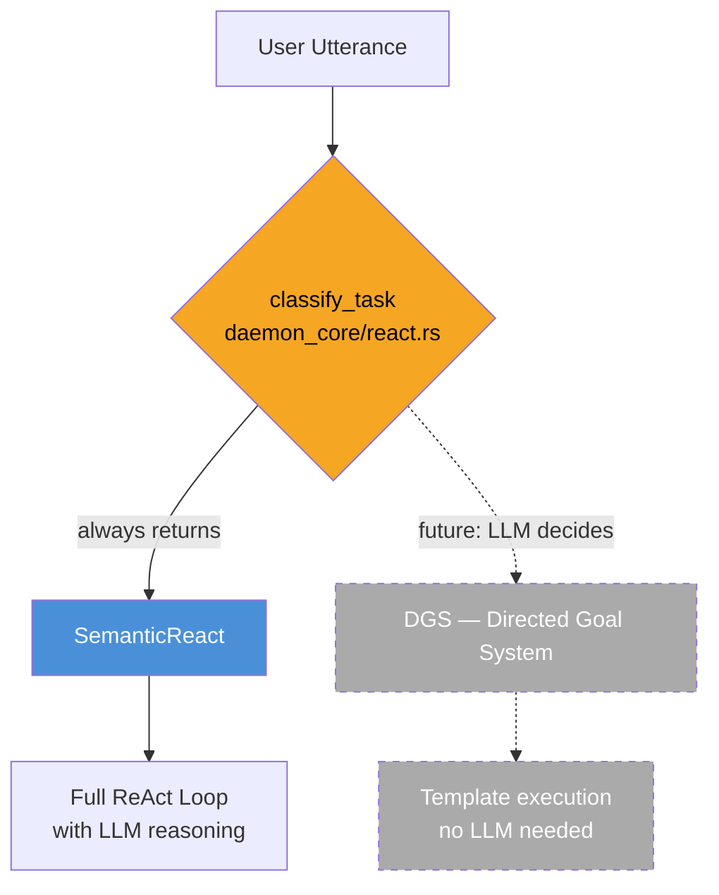

**The DGS path (System 1) exists as infrastructure but is dormant by design.** Activating it requires the LLM to make the routing decision from within its own reasoning — Rust never makes that call.

---

## 3. The ReAct Execution Loop

The ReAct (Reason + Act) loop is the core cognitive cycle of AURA v4. It lives in `daemon_core/react.rs` (2821 lines).

### 3.1 ReAct Constants

| Constant | Value | Purpose |
|----------|-------|---------|
| `MAX_ITERATIONS` | 10 | Maximum reasoning steps before forced reflection |
| `MAX_CONSECUTIVE_FAILURES` | 5 | Abort threshold — triggers task failure |
| `DEFAULT_TOKEN_BUDGET` | 2048 | Token budget per ReAct session |
| `REFLECTION_SUCCESS_THRESHOLD` | 0.6 | Minimum reflection score to log as success |

### 3.2 The Six Phases

**Phase 1 — Observation (Context Gathering)**

Before the LLM reasons, the system assembles a rich context snapshot:
- Current screen state (accessibility tree snapshot)
- Relevant memory snippets (retrieved by embedding similarity)
- Active goals and their current state
- Recent conversation history (within token budget)

**Phase 2 — Thought (LLM Chain-of-Thought)**

The LLM receives the assembled context and produces a `<think>...</think>` block. This is enforced by the inference layer's CoT-forcing mechanism. The thought block contains:
- Interpretation of the current situation
- Identification of the next action to take
- Anticipated outcome of that action

CoT tokens are not counted against the response budget.

**Phase 3 — Action (LLM Action Selection)**

After the thought block, the LLM emits a JSON action object constrained by GBNF grammar. The action specifies:
- Tool/handler to invoke
- Parameters for that invocation
- Expected post-condition

**Phase 4 — Observation (Action Result)**

The selected action is dispatched through the 11-stage Executor pipeline. The result (success/failure, output data, side effects) is serialized and fed back into the next iteration's context.

**Phase 5 — Reflection (Post-Loop Assessment)**

Triggered when either `MAX_ITERATIONS` is reached or the goal is determined to be achieved. The LLM performs a holistic assessment:
- Was the goal achieved?
- What worked? What didn't?
- Confidence score for the outcome

If reflection score ≥ `REFLECTION_SUCCESS_THRESHOLD` (0.6), the session is logged as successful.

**Phase 6 — Learning (ETG Cache Update)**

Successful patterns are written to the ETG (Executable Task Graph) cache via planner feedback. This enables future similar tasks to hit Tier 1 of the planning cascade without LLM involvement.

### 3.3 ReAct Loop Diagram

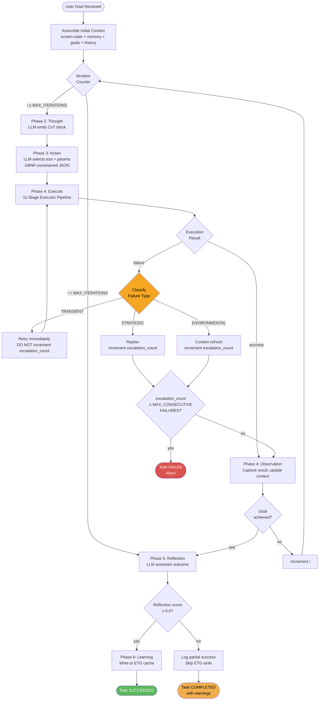

### 3.4 Failure Taxonomy

| Failure Type | Description | Increments escalation_count? | Recovery Action |
|-------------|-------------|------------------------------|-----------------|
| **TRANSIENT** | Network timeout, model load delay, transient I/O error | **NO** | Retry immediately |
| **STRATEGIC** | Wrong plan, incorrect action sequence, logic error | **YES** | Escalate to replanning |
| **ENVIRONMENTAL** | Device state mismatch, app not installed, permission denied at runtime | **YES** | Trigger context refresh |

**Critical:** Only STRATEGIC and ENVIRONMENTAL failures increment `escalation_count`. Transient failures are invisible to the abort counter — they represent noise, not agent dysfunction.

---

## 4. The 11-Stage Executor Pipeline

The Executor (`execution/executor.rs`, 1519 lines) is the execution boundary between LLM reasoning and actual Android system interaction. Every action selected by the LLM passes through all 11 stages.

### 4.1 Pipeline Overview

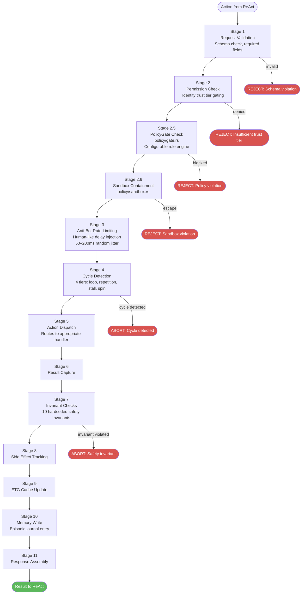

### 4.2 Stage-by-Stage Description

**Stage 1 — Request Validation**

Schema validation against the action's expected parameter structure. Checks required fields are present, types are correct, and values are within acceptable bounds. Malformed requests are rejected before any permission logic runs.

**Stage 2 — Permission Check**

Every action is gated by the requesting identity's trust tier. AURA supports multiple trust levels (user, system, automation, background). High-privilege actions (e.g., deleting data, sending messages) require elevated trust tiers.

**Stage 2.5 — PolicyGate Check** (`policy/gate.rs`)

A configurable rule engine that applies user-defined and system-defined policies to the action. Unlike the hardcoded invariants in Stage 7, PolicyGate rules are data-driven and can be modified at runtime. Examples: "never send messages after 10pm", "never open social media apps during focus mode".

**Stage 2.6 — Sandbox Containment** (`policy/sandbox.rs`)

Enforces execution boundaries. Ensures that actions are confined to their declared scope and cannot escape into unrelated system areas. A task planning a calendar event should not be able to read SMS messages.

**Stage 3 — Anti-Bot Rate Limiting**

Injects a random human-like delay of 50–200ms before executing any UI-interacting action. This prevents AURA from triggering bot-detection heuristics in Android apps that monitor for superhuman interaction speeds. The jitter is genuinely random per action.

**Stage 4 — Cycle Detection (4 Tiers)**

Detects pathological execution patterns before they cause damage:

| Tier | Type | Detection Method |
|------|------|-----------------|
| 1 | **Exact Loop** | Same action sequence executed ≥2 times |
| 2 | **Approximate Repetition** | Similar (not identical) actions in close succession |
| 3 | **Stall Detection** | Actions taken but no observable progress toward goal |
| 4 | **Spin Detection** | Rapid oscillation between two or more states |

**Stage 5 — Action Dispatch**

Routes the validated, permitted, policy-cleared, cycle-checked action to the appropriate handler (SystemApi, accessibility bridge, media controller, etc.).

**Stage 6 — Result Capture**

Captures the raw result from the handler: success/failure status, output data, any exceptions, and observed state changes.

**Stage 7 — Invariant Checks**

10 hardcoded safety invariants that cannot be disabled by policy or user configuration. These represent absolute behavioral guarantees. Examples include: never exfiltrate data off-device, never make purchases without explicit confirmation, never modify security settings without authentication.

**Stage 8 — Side Effect Tracking**

Records all side effects produced by the action (files written, settings changed, messages sent). This enables rollback on goal failure and produces the audit trail for memory.

**Stage 9 — ETG Cache Update**

If this action was part of a successfully executing plan, updates the ETG (Executable Task Graph) node with execution metrics: latency, success/failure, observed outcomes. Feeds into future planning confidence scoring.

**Stage 10 — Memory Write**

Writes an episodic journal entry describing what happened, what the outcome was, and any notable observations. This entry is retrievable by the memory subsystem for future context assembly.

**Stage 11 — Response Assembly**

Packages the result, side effects, and any output data into the standardized response format returned to the ReAct loop.

---

## 5. The 3-Tier Planning Cascade

The Planner (`execution/planner.rs`, 1796 lines) determines how to achieve a goal before any execution begins. It follows a strict cascade: check cache first, then templates, then ask the LLM.

### 5.1 Cascade Flow

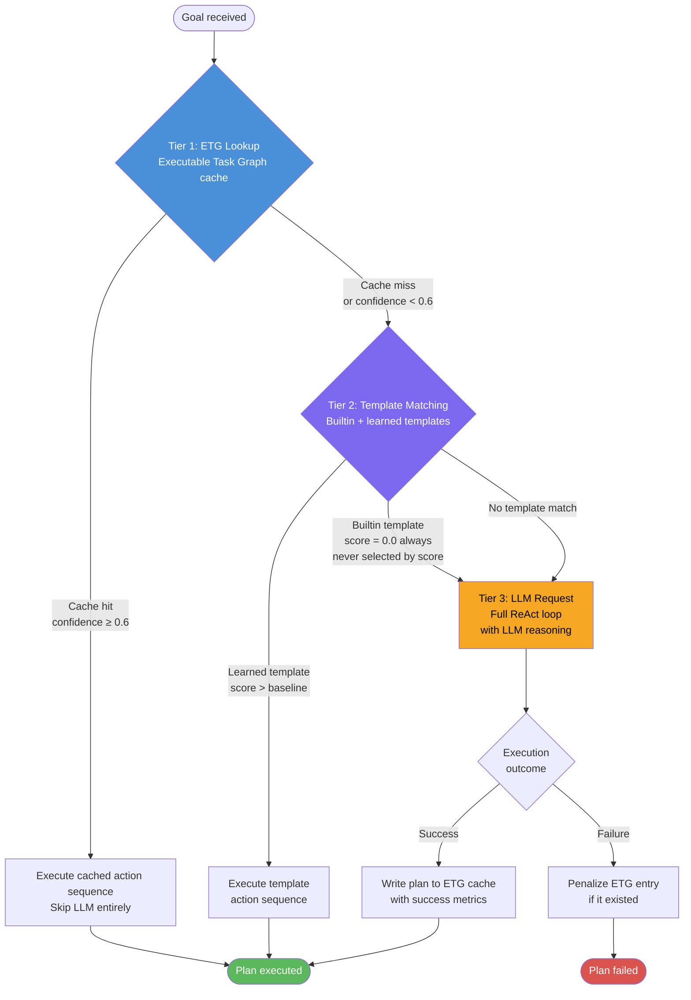

### 5.2 ETG (Executable Task Graph) Node Structure

Each ETG cache entry contains:

| Field | Description |
|-------|-------------|
| `goal_signature` | Hashed representation of goal type + key parameters |
| `action_sequence` | Ordered list of actions to execute |
| `pre_conditions` | Required state before execution begins |
| `post_conditions` | Expected state after successful execution |
| `success_rate` | Rolling success rate (exponential moving average) |
| `execution_count` | Total times this plan has been executed |
| `confidence` | Current confidence score (must be ≥ 0.6 to use) |
| `last_updated` | Timestamp of most recent update |

### 5.3 Template Scoring Logic

- **Builtin templates** always score **0.0** — they are never selected by the score comparison alone. This prevents Rust from making semantic judgments about which template "matches" freetext input (IL-2 compliance).
- **Learned templates** score by keyword match against the goal description. If the score exceeds the learned baseline threshold, the template is used.
- The threshold comparison is between learned templates only — builtins never compete in the score ranking.

### 5.4 Cache Write-Back

On successful Tier 3 (LLM) execution:
1. The action sequence that succeeded is extracted from the ReAct trace
2. Pre/post conditions are inferred from observed state changes
3. Initial confidence is set to 1.0 with execution_count = 1
4. Subsequent executions decay confidence on failure, increase on success

On failure of a previously cached plan:
1. The ETG entry's confidence is penalized
2. If confidence drops below 0.6, the entry is demoted (will no longer be used)
3. The failure is logged for the LLM to potentially learn from during reflection

---

## 6. Inference Layer — 6-Layer Teacher Stack

The inference layer (`aura-neocortex/src/inference.rs`, 2281 lines) wraps llama.cpp and applies six quality-enforcement layers to every LLM call.

### 6.1 Layer Stack

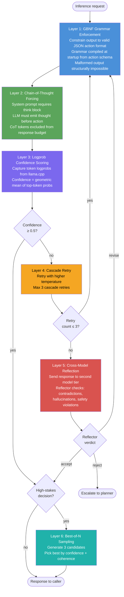

### 6.2 Layer Descriptions

**Layer 1 — GBNF Grammar Enforcement**

The LLM's output is constrained by a GBNF (Generalized BNF) grammar compiled from the action schema at startup. It is structurally impossible for the model to emit malformed JSON. This eliminates an entire class of parsing errors and prevents prompt injection via malformed output.

**Layer 2 — Chain-of-Thought Forcing**

The system prompt includes an explicit instruction requiring the model to emit a `<think>...</think>` block before any action. CoT tokens are not counted against the response budget. This makes the model's reasoning transparent and auditable, and empirically improves action quality.

**Layer 3 — Logprob Confidence Scoring**

After generation, token-level log-probabilities from llama.cpp are captured. The confidence score is computed as the geometric mean of the top-token probability at each position in the action JSON. Low confidence indicates the model was uncertain — a signal for escalation.

**Layer 4 — Cascade Retry**

If confidence < `CASCADE_CONFIDENCE_THRESHOLD` (0.5), the request is retried with slightly higher temperature to explore different completions. Maximum 3 cascade retries. After 3 failures, escalates to Layer 5.

**Layer 5 — Cross-Model Reflection**

A second, smaller model acts as a reflector/critic. It receives the primary model's response and evaluates it for contradictions, hallucinations, and safety violations. The reflector's verdict is one of: accept, revise (send back for regeneration), or reject (escalate to planner).

**Layer 6 — Best-of-N Sampling**

For high-stakes decisions (planning, ethics-adjacent actions), generate `BON_SAMPLES = 3` independent completions and select the best by combined confidence + coherence score. This is not applied to every inference — only when the cost of an error is high.

### 6.3 InferenceMode Parameters

| Mode | Temperature | Max Tokens | Use Case |
|------|------------|------------|----------|
| `Planner` | 0.1 | 2048 | Deterministic planning — minimize variance |
| `Strategist` | 0.4 | 4096 | Strategic reasoning — allow exploration |
| `Composer` | 0.2 | 1024 | Structured output — near-deterministic |
| `Conversational` | 0.7 | 512 | Natural dialogue — allow creativity |

---

## 7. Context Assembly & Token Budget

The context assembler (`aura-neocortex/src/context.rs`, 1389 lines) constructs the prompt for every LLM call within a strict token budget.

### 7.1 Token Budget

| Constant | Value | Description |
|----------|-------|-------------|
| `DEFAULT_CONTEXT_BUDGET` | 2048 tokens | Total available tokens for context + response |
| `RESPONSE_RESERVE` | 512 tokens | Always protected — never truncated into |
| **Available for context** | **1536 tokens** | 2048 − 512 |

### 7.2 Priority-Based Truncation

When context exceeds 1536 tokens, content is truncated starting from the lowest priority:

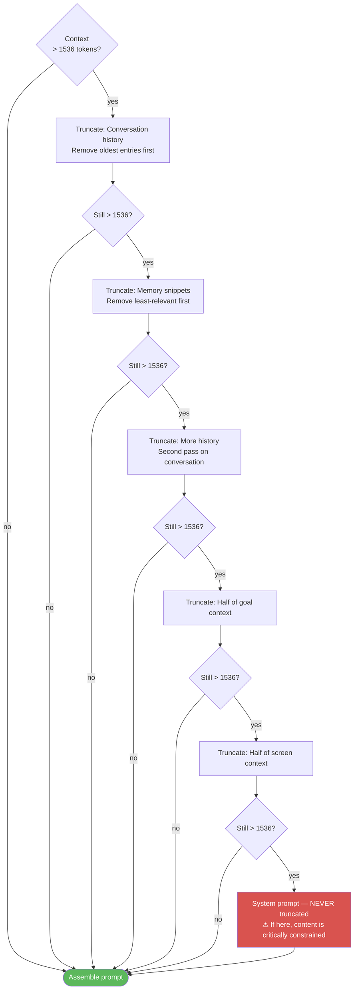

**Priority order (highest = never truncated, lowest = truncated first):**

| Priority | Content | Truncation Strategy |
|----------|---------|---------------------|
| 1 (lowest) | Conversation history | Remove oldest entries first |
| 2 | Memory snippets | Remove least-relevant first |
| 3 | Additional history | Second pass on conversation |
| 4 | Goal context | Reduce to half |
| 5 | Screen context | Reduce to half |
| 6 (highest) | System prompt | **NEVER TRUNCATED** |

The system prompt is inviolable. If the system prompt alone would exceed the budget, this represents a configuration error, not a truncation scenario.

---

## 8. IPC Communication Protocol

AURA v4 uses a typed IPC protocol for all communication between the daemon core and the neocortex inference process (`aura-types/src/ipc.rs`, 674 lines).

### 8.1 DaemonToNeocortex Message Types

| Message Type | Direction | Description |
|-------------|-----------|-------------|
| `Load` | Daemon → Neocortex | Load a model into memory |
| `Unload` | Daemon → Neocortex | Unload a model, free memory |
| `Plan` | Daemon → Neocortex | Generate an action plan for a goal |
| `Replan` | Daemon → Neocortex | Regenerate plan after failure |
| `Converse` | Daemon → Neocortex | Conversational turn (dialogue mode) |
| `Compose` | Daemon → Neocortex | Structured output generation |
| `Cancel` | Daemon → Neocortex | Cancel an in-flight inference |
| `Ping` | Daemon → Neocortex | Health check / liveness probe |
| `Embed` | Daemon → Neocortex | Generate embedding vector for memory retrieval |
| `ReActStep` | Daemon → Neocortex | Single ReAct iteration (thought + action) |
| `ProactiveContext` | Daemon → Neocortex | ARC-initiated background reasoning |
| `Summarize` | Daemon → Neocortex | Summarize context window for compression |

### 8.2 IPC Message Flow Diagram

```mermaid
sequenceDiagram
    participant D as Daemon Core
    participant IPC as IPC Channel
    participant N as Neocortex (llama.cpp)

    Note over D,N: Model lifecycle
    D->>IPC: Load(model_id, quantization)
    IPC->>N: Load
    N-->>IPC: ModelLoaded(model_id, memory_used)
    IPC-->>D: ModelLoaded

    Note over D,N: ReAct loop (per iteration)
    D->>IPC: ReActStep(context, iteration, token_budget)
    IPC->>N: ReActStep
    N-->>IPC: ReActResponse(thought, action, confidence, logprobs)
    IPC-->>D: ReActResponse

    Note over D,N: Memory operations
    D->>IPC: Embed(text, model_tier)
    IPC->>N: Embed
    N-->>IPC: Embedding(vector[f32; 384])
    IPC-->>D: Embedding

    Note over D,N: Planning
    D->>IPC: Plan(goal, context, constraints)
    IPC->>N: Plan
    N-->>IPC: PlanResponse(action_sequence, confidence)
    IPC-->>D: PlanResponse

    Note over D,N: Context compression
    D->>IPC: Summarize(context_window, target_tokens)
    IPC->>N: Summarize
    N-->>IPC: Summary(compressed_text, tokens_saved)
    IPC-->>D: Summary

    Note over D,N: ARC proactive reasoning
    D->>IPC: ProactiveContext(domain, life_context, budget)
    IPC->>N: ProactiveContext
    N-->>IPC: ProactiveIntent(suggestion, confidence, urgency)
    IPC-->>D: ProactiveIntent
```

### 8.3 Message Delivery Guarantees

- All IPC messages are typed — no stringly-typed protocol
- `Cancel` is the only message that can interrupt an in-flight response
- `Ping` / health check must respond within 100ms or the neocortex process is considered dead
- The IPC channel is local Unix socket — no network involved

---

## 9. Goal Lifecycle and BDI Model

The goal system (`goals/` — 5 files) implements a BDI (Belief-Desire-Intention) cognitive architecture for managing what AURA is trying to accomplish.

### 9.1 Goal State Machine

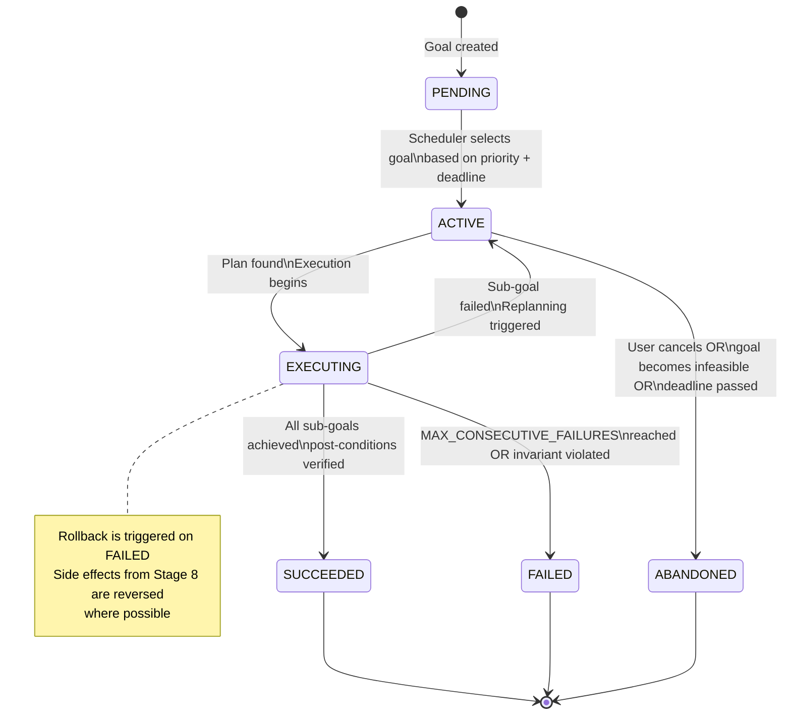

### 9.2 BDI Model Components

**Beliefs — World Model**

AURA maintains a belief state representing what it knows about the world:
- Current device state (screen, running apps, connectivity)
- User's context (location, time, recent behavior)
- Environmental state (battery, storage, permissions)
- Memory of past interactions and outcomes

Beliefs are updated after every action via Stage 6 (Result Capture) and Stage 8 (Side Effect Tracking) of the executor.

**Desires — Goal Representation**

Goals are structured as:
```
Goal {
    id:              GoalId
    description:     String          // natural language description
    priority:        f32             // 0.0 to 1.0
    deadline:        Option<DateTime>
    sub_goals:       Vec<GoalId>
    constraints:     Vec<Constraint>
    feasibility:     bool            // stub: always true (Iron Law: LLM assesses this)
}
```

**Intentions — Committed Plans**

Once a goal moves to ACTIVE state, the planner generates an intention: a committed sequence of actions the agent will pursue. The agent does not re-evaluate the goal during execution unless forced by failure.

### 9.3 Goal Decomposition

High-level user intent is decomposed into a tree:

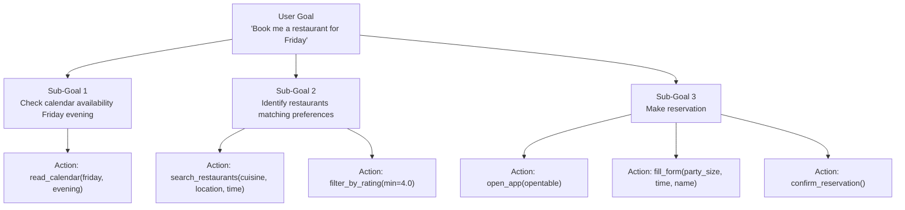

Decomposition is performed by the LLM during the planning phase. Rust never decides how to decompose a goal.

### 9.4 Conflict Detection

The goal scheduler detects conflicts via:
- **Temporal overlap**: two goals requiring the same time window
- **Resource overlap**: two goals requiring the same device resource simultaneously
- **Logical contradiction**: goals whose post-conditions are mutually exclusive

On conflict detection, the scheduler presents the conflict to the LLM for resolution (priority adjustment, temporal rescheduling, or user clarification request).

### 9.5 Feasibility Assessment

The feasibility check is currently a stub that returns `true` for all goals. Per Iron Law IL-1, feasibility assessment is a semantic judgment that belongs to the LLM. The correct implementation: before committing to a goal, the planner asks the LLM "given current beliefs, is this goal achievable?" and uses the LLM's response to set feasibility.

---

## 10. ARC Proactive Layer

The ARC (Autonomous Reasoning Core) layer (`arc/mod.rs`, 511 lines) enables AURA to take initiative — suggesting actions, flagging patterns, and protecting user attention without being asked.

### 10.1 Initiative Budget

```
max_budget:    1.0
regen_rate:    0.001 per second  (full regeneration in ~17 minutes)
cost_per_act:  varies by action type
```

When `initiative_budget == 0.0`, AURA takes no proactive actions regardless of what patterns it detects. This prevents AURA from becoming overwhelming during high-activity periods.

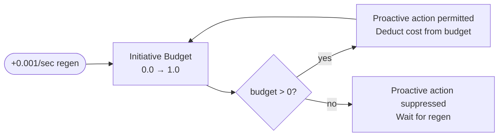

### 10.2 10 Life Domains

ARC tracks the user's life across 10 domains, contributing to a composite Life Quality Index (LQI) updated every 5 minutes:

| Domain | What It Tracks |
|--------|---------------|
| `health` | Sleep patterns, exercise reminders, medication |
| `work` | Task completion, focus time, deadline proximity |
| `relationships` | Communication patterns, important dates |
| `learning` | Study sessions, knowledge goals, skill building |
| `creativity` | Creative work time, project progress |
| `finance` | Bill reminders, spending patterns (on-device only) |
| `environment` | Physical space, ambient conditions |
| `social` | Social connection quality, isolation detection |
| `physical` | Movement, sedentary time, ergonomics |
| `spiritual` | Mindfulness, reflection time, values alignment |

### 10.3 Context Modes

ARC operates differently depending on which of 8 context modes is active:

| Mode | Description | ARC Behavior |
|------|-------------|--------------|
| `focused_work` | Deep work in progress | Minimal interruption, suppress non-critical proactive |
| `social_interaction` | User is in conversation | Suppress all proactive, preserve social flow |
| `creative_flow` | Creative activity detected | Protect flow state, defer everything |
| `recovery` | Rest/sleep/downtime | Low activity, gentle suggestions only |
| `learning` | Study/reading in progress | Support focus, relevant suggestions welcome |
| `planning` | Intentional planning activity | High initiative, assist with structuring |
| `emergency` | Urgent situation detected | Override all suppression, surface critical info |
| `idle` | No active task | Normal initiative, surface deferred suggestions |

### 10.4 ForestGuardian — Attention Protection

ForestGuardian is a subsystem within ARC that monitors for doomscrolling and attention hijacking:

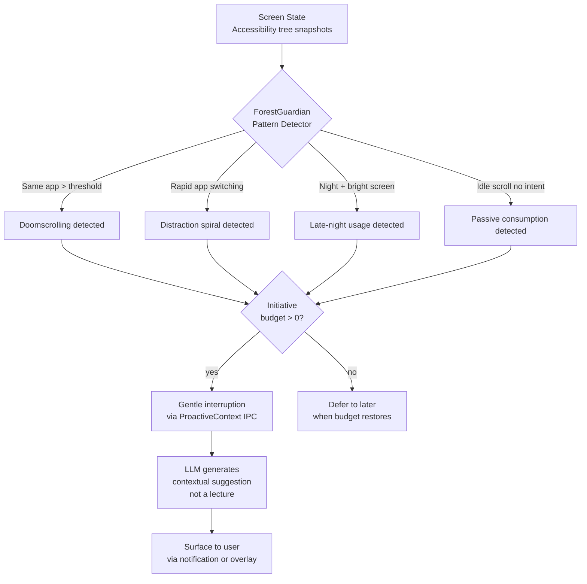

ForestGuardian never lectures — it offers, gently. The LLM generates the suggestion; Rust only detects the structural pattern (time on app, scroll velocity, frequency).

### 10.5 Routines

ARC learns the user's daily patterns over time:
- Patterns are confidence-weighted (higher confidence = more reliable trigger)
- Routines can trigger proactive suggestions ("You usually exercise now — want me to start your workout playlist?")
- Routine detection is statistical — it observes timestamps and app usage patterns
- Routine suggestions are soft: always dismissible, never blocking

---

## 11. Fast-Path Structural Parsers

The SystemApi bridge (`bridge/system_api.rs`) includes a small set of fast-path structural parsers. These are the ONLY Rust-side "parsing" of user input that is permitted under Iron Law IL-3.

### 11.1 What Makes a Parser Structural (Not Semantic)

A structural parser:
- Matches a **fixed, unambiguous command syntax** known at compile time
- Does **not** infer meaning from freetext
- Does **not** handle synonyms, paraphrases, or variations in phrasing
- Returns **failure** for anything that doesn't exactly match the pattern

A semantic parser (banned):
- Tries to understand "what the user means" from varied phrasings
- Uses keyword lists to infer intent categories
- Handles "open YouTube", "launch YouTube", "start YouTube", "go to YouTube" all the same way
- This is Theater AGI — Rust pretending to understand language

### 11.2 Permitted Structural Parsers

| Pattern | Regex | Intent Type |
|---------|-------|------------|
| `open <app>` | `^open\s+(\w+)$` | App launch intent |
| `call <contact>` | `^call\s+(.+)$` | Phone call intent |
| `set timer <N> minutes` | `^set timer (\d+) minutes?$` | Timer intent |
| `set alarm <time>` | `^set alarm (.+)$` | Alarm intent |
| `set brightness <N>%` | `^set brightness (\d+)%$` | Brightness control |
| `toggle wifi` | exact match | WiFi toggle |

### 11.3 Why These Do Not Violate Iron Law IL-2

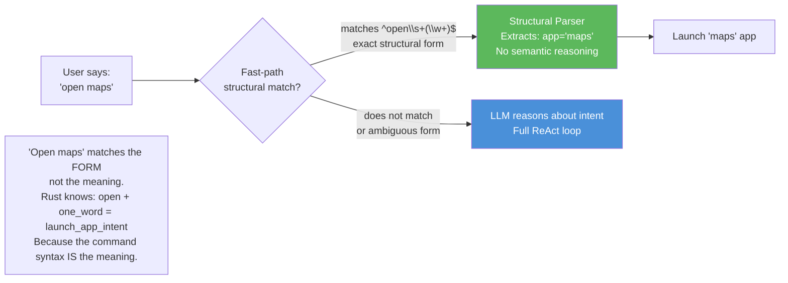

The distinction: `open maps` is a command, not a sentence. Its meaning is defined by its fixed syntax. There is no semantic ambiguity to resolve — the syntax itself encodes the intent. This is equivalent to parsing CLI flags, not NLU.

**Contrast with Theater AGI:**
```
# BANNED: Semantic keyword matching
if input.contains("open") || input.contains("launch") || input.contains("start") {
    // "inferred" launch intent — this is Theater AGI
}

# ALLOWED: Structural regex
if let Some(caps) = OPEN_REGEX.captures(input) {
    // matched the fixed form `open <word>` exactly
}
```

### 11.4 Fallthrough Behavior

If none of the structural parsers match, the input is passed directly to the LLM via the full ReAct pipeline. There is no fallback keyword matching, no fuzzy matching, no "close enough" logic. Unmatched input goes to the LLM — always.

---

## 12. End-to-End Request Flow

This section traces a complete request from user utterance through execution to response.

### 12.1 Full Sequence Diagram

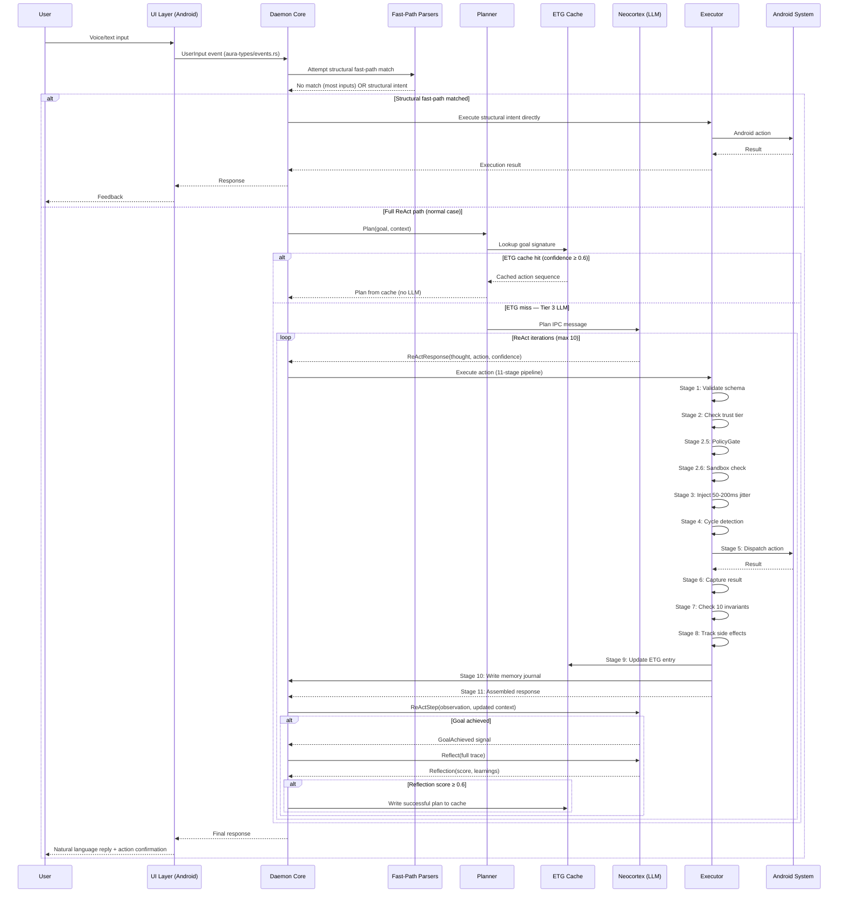

### 12.2 Key Invariants of the End-to-End Flow

1. **LLM is always in the reasoning path for non-structural inputs.** No Rust-side semantic shortcuts.
2. **Every action passes through all 11 executor stages.** There is no bypass, even for "simple" actions.
3. **PolicyGate (Stage 2.5) and Sandbox (Stage 2.6) run before anti-bot delays.** Security checks precede behavioral masking.
4. **ETG cache updates happen in Stage 9, inside the executor.** They are not a post-hoc background write — they are part of every successful action's execution.
5. **Memory journal write (Stage 10) is synchronous.** Every action is recorded before the response is assembled.
6. **Reflection only happens after the loop.** The LLM does not reflect mid-loop; reflection is a post-execution assessment.
7. **All communication with Neocortex is typed IPC.** No string-based messaging, no eval, no dynamic dispatch to the inference layer.

### 12.3 Error Recovery Path

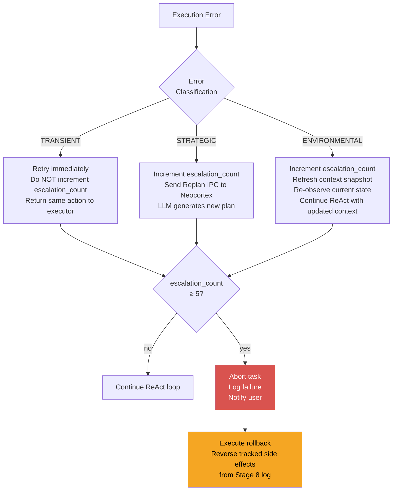

---

## Appendix A — Quick Reference Tables

### A.1 ReAct Constants

| Constant | Value | File |
|----------|-------|------|
| `MAX_ITERATIONS` | 10 | `daemon_core/react.rs` |
| `MAX_CONSECUTIVE_FAILURES` | 5 | `daemon_core/react.rs` |
| `DEFAULT_TOKEN_BUDGET` | 2048 | `daemon_core/react.rs` |
| `REFLECTION_SUCCESS_THRESHOLD` | 0.6 | `daemon_core/react.rs` |

### A.2 Inference Constants

| Constant | Value | File |
|----------|-------|------|
| `CASCADE_CONFIDENCE_THRESHOLD` | 0.5 | `aura-neocortex/src/inference.rs` |
| `BON_SAMPLES` | 3 | `aura-neocortex/src/inference.rs` |

### A.3 Context Constants

| Constant | Value | File |
|----------|-------|------|
| `DEFAULT_CONTEXT_BUDGET` | 2048 tokens | `aura-neocortex/src/context.rs` |
| `RESPONSE_RESERVE` | 512 tokens | `aura-neocortex/src/context.rs` |
| Available context | 1536 tokens | derived |

### A.4 Planner Constants

| Constant | Value | File |
|----------|-------|------|
| ETG confidence threshold | 0.6 | `execution/planner.rs` |
| Builtin template score | 0.0 (never selected) | `execution/planner.rs` |

### A.5 ARC Constants

| Constant | Value | File |
|----------|-------|------|
| Initiative budget max | 1.0 | `arc/mod.rs` |
| Initiative regen rate | 0.001/sec | `arc/mod.rs` |
| LQI update interval | 5 minutes | `arc/mod.rs` |

---

## Appendix B — Iron Law Compliance Checklist

Use this checklist when reviewing any Rust code that touches user input or intent:

- [ ] Does this code make a semantic judgment about what the user means? → **VIOLATION of IL-2**
- [ ] Does this code match a fixed, unambiguous structural command syntax? → **Permitted under IL-3**
- [ ] Is this code changing production behavior to make a test pass? → **VIOLATION of IL-4**
- [ ] Does this code make any outbound network call? → **VIOLATION of IL-5**
- [ ] Does this code store user data outside the device? → **VIOLATION of IL-6**
- [ ] Is the LLM in the reasoning path for all non-structural decisions? → **Required by IL-1**
- [ ] Does this policy gate use `allow_all_builder()` or any allow-by-default pattern? → **VIOLATION of IL-7**

---

*Document generated for AURA v4 architecture review. All line counts, constants, and behavioral descriptions reflect the state of the codebase at time of writing.*
