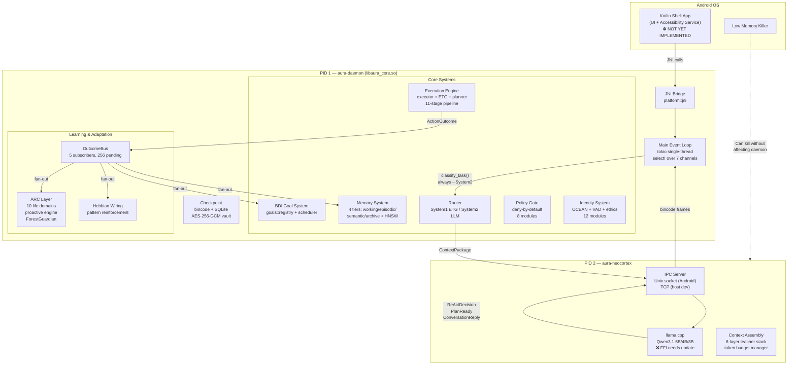

# AURA v4 Architecture — Documentation Index

> **Entry point for all engineers.** Read this first. Then follow the path for your role.
>
> **Version:** 4.0.0-alpha.8 | **Status:** Active Development — pre-release validation in progress  
> **Last updated:** 2026-03-13

---

## What Is AURA v4?

AURA (Autonomous User-Reactive Agent) is a **privacy-first, on-device Android AI assistant written
in Rust**. It runs entirely on the user's phone: no cloud fallback, no telemetry, no remote
inference. The LLM (Qwen3 family via llama.cpp) runs locally. All user data — conversations, memory,
goals, personality state — lives exclusively on-device in SQLite and bincode checkpoints. AURA uses a
**bicameral two-process architecture**: a persistent Rust daemon (the body) and a separate LLM
inference process (the brain), communicating over a typed Unix socket IPC. A bio-inspired ARC layer
monitors life domains, learns routines, and triggers proactive assistance — all without a single
cloud call.

---

## The Seven Iron Laws

These are structural constraints, not guidelines. Every architectural decision in this codebase flows
from them. Violations are defects, not style disagreements.

| # | Iron Law | Category | Violation Consequence |
|---|----------|----------|-----------------------|
| **IL-1** | **LLM = brain, Rust = body. Rust reasons NOTHING. LLM reasons everything.** | Architectural | Theater AGI — brittle heuristics masquerading as intelligence |
| **IL-2** | **Theater AGI is BANNED.** No keyword matching for intent/NLU in Rust. | Anti-Theater | Brittle, deceptive behavior that fails at edge cases |
| **IL-3** | **Fast-path structural parsers for open/call/timer/alarm/brightness/wifi ARE acceptable.** | Architectural carve-out | N/A — explicitly permitted |
| **IL-4** | **NEVER change production logic to make tests pass.** | Engineering integrity | Tests become meaningless; system reality corrupted |
| **IL-5** | **Anti-cloud absolute.** No telemetry, no cloud fallback, everything on-device. | Privacy | Privacy violation, architectural betrayal |
| **IL-6** | **Privacy-first.** All data on-device. GDPR export/delete must work. | Privacy/Legal | Trust destruction, legal exposure |
| **IL-7** | **No sycophancy.** Never prioritize user approval over truth. | Ethics | User harm through false validation |

> **Quick litmus test:** Before adding any Rust logic that touches language or user intent, ask: "Am I reasoning about meaning here?" If yes, that logic belongs in the LLM prompt, not Rust code.

---

## Component Hierarchy



---

## Document Map

### Core Architecture Documents (`docs/architecture/`)

| Document | Description | Read When |
|----------|-------------|-----------|
| **[AURA-V4-SYSTEM-ARCHITECTURE.md](AURA-V4-SYSTEM-ARCHITECTURE.md)** | Complete system reference: crate map, BDI model, data flow, subsystem inventory, design decisions | Understanding the full system |
| **[AURA-V4-OPERATIONAL-FLOW.md](AURA-V4-OPERATIONAL-FLOW.md)** | Runtime behavior: ReAct loop, 11-stage executor pipeline, 3-tier planning cascade, IPC protocol, request tracing | Understanding how a request flows |
| **[AURA-V4-NEOCORTEX-AND-TOKEN-ECONOMICS.md](AURA-V4-NEOCORTEX-AND-TOKEN-ECONOMICS.md)** | LLM integration: Qwen3 model tiers, 6-layer teacher stack, GBNF grammar, token budget, context assembly, confidence cascade | Understanding LLM integration |
| **[AURA-V4-MEMORY-AND-DATA-ARCHITECTURE.md](AURA-V4-MEMORY-AND-DATA-ARCHITECTURE.md)** | 4-tier memory, HNSW vector index, Hebbian learning, consolidation pipeline, AES-256-GCM vault, GDPR erasure | Understanding memory and persistence |
| **[AURA-V4-IDENTITY-ETHICS-AND-PHILOSOPHY.md](AURA-V4-IDENTITY-ETHICS-AND-PHILOSOPHY.md)** | The 7 Iron Laws, OCEAN personality, VAD mood, anti-sycophancy, TRUTH framework, GDPR compliance | Understanding ethics and identity |
| **[AURA-V4-PRODUCTION-READINESS-AND-ANDROID-DEPLOYMENT.md](AURA-V4-PRODUCTION-READINESS-AND-ANDROID-DEPLOYMENT.md)** | Honest production scorecard (34/100), Android deployment gaps, cross-compilation, roadmap | Assessing deployment readiness |
| **[AURA-V4-INSTALLATION-AND-DEPLOYMENT.md](AURA-V4-INSTALLATION-AND-DEPLOYMENT.md)** | Termux-based install via `install.sh`, service setup, model download, config | Deploying or installing AURA |
| **[AURA-V4-CONTRIBUTING-AND-DEV-SETUP.md](AURA-V4-CONTRIBUTING-AND-DEV-SETUP.md)** | Dev environment, Rust toolchain, test commands, how to add features, PR checklist | Contributing code |
| **[AURA-V4-ARC-BEHAVIORAL-INTELLIGENCE.md](AURA-V4-ARC-BEHAVIORAL-INTELLIGENCE.md)** | ARC layer deep-dive: 10 life domains, initiative budget, ForestGuardian, routine learning, proactive engine | Understanding the ARC/behavior layer |
| **[AURA-V4-SECURITY-MODEL.md](AURA-V4-SECURITY-MODEL.md)** | Threat model, two-layer safety system, policy gate, vault encryption, permission tiers, attack surfaces | Security review or adding sensitive features |
| **[AURA-V4-PRODUCTION-STATUS.md](AURA-V4-PRODUCTION-STATUS.md)** | Live status table, P0 blockers, P1 work, contribution guide per item | Current build status |

### Root Docs (`docs/`)

| Document | Description |
|----------|-------------|
| **[AURA-V4-GROUND-TRUTH-ARCHITECTURE.md](../AURA-V4-GROUND-TRUTH-ARCHITECTURE.md)** | Canonical module-level spec. When code contradicts this, code is wrong. |
| **[AURA-V4-MASTER-SYSTEM-ARCHITECTURE.md](../AURA-V4-MASTER-SYSTEM-ARCHITECTURE.md)** | Concise master reference; IPC typed variants; complete crate list |

### Architecture Decision Records (`docs/adr/`)

| ADR | Title | Status |
|-----|-------|--------|
| [ADR-001](../adr/ADR-001-bicameral-architecture.md) | Bicameral Architecture (System1 Daemon + System2 Neocortex) | Accepted |
| [ADR-002](../adr/ADR-002-etg-caching.md) | Execution Trace Graph (ETG) for Action Caching | Accepted |
| [ADR-003](../adr/ADR-003-memory-tiers.md) | 4-Tier Memory with HNSW Vector Index | Accepted |
| [ADR-004](../adr/ADR-004-safety-borders.md) | Two-Layer Safety Borders | Accepted |
| [ADR-005](../adr/ADR-005-accessibility-first.md) | Accessibility-First UI with L0-L7 Selector Cascade | Accepted |
| [ADR-006](../adr/ADR-006-bio-inspired-learning.md) | Bio-Inspired Learning (Hebbian + Consolidation) | Accepted |
| [ADR-007](../adr/ADR-007-deny-by-default-policy-gate.md) | Deny-by-Default Policy Gate | Accepted |

---

## Quick-Start Reading Paths

### "I want to understand the overall system"
1. This README (you're here)
2. [AURA-V4-SYSTEM-ARCHITECTURE.md](AURA-V4-SYSTEM-ARCHITECTURE.md) — start with §1-3
3. [AURA-V4-GROUND-TRUTH-ARCHITECTURE.md](../AURA-V4-GROUND-TRUTH-ARCHITECTURE.md) — module-level canonical ref

### "I want to understand how a request flows end-to-end"
1. [AURA-V4-OPERATIONAL-FLOW.md](AURA-V4-OPERATIONAL-FLOW.md) — §12 End-to-End Request Flow
2. [AURA-V4-SYSTEM-ARCHITECTURE.md](AURA-V4-SYSTEM-ARCHITECTURE.md) — §6 Data Flow
3. [ADR-001](../adr/ADR-001-bicameral-architecture.md) — why this split exists

### "I want to understand the LLM integration"
1. [AURA-V4-NEOCORTEX-AND-TOKEN-ECONOMICS.md](AURA-V4-NEOCORTEX-AND-TOKEN-ECONOMICS.md) — full doc
2. [AURA-V4-OPERATIONAL-FLOW.md](AURA-V4-OPERATIONAL-FLOW.md) — §6 Teacher Stack, §7 Token Budget

### "I want to deploy AURA"
1. [AURA-V4-PRODUCTION-STATUS.md](AURA-V4-PRODUCTION-STATUS.md) — read the P0 blockers first
2. [AURA-V4-INSTALLATION-AND-DEPLOYMENT.md](AURA-V4-INSTALLATION-AND-DEPLOYMENT.md)
3. [AURA-V4-PRODUCTION-READINESS-AND-ANDROID-DEPLOYMENT.md](AURA-V4-PRODUCTION-READINESS-AND-ANDROID-DEPLOYMENT.md) — honest gaps

### "I want to understand memory and data"
1. [AURA-V4-MEMORY-AND-DATA-ARCHITECTURE.md](AURA-V4-MEMORY-AND-DATA-ARCHITECTURE.md) — full doc
2. [ADR-003](../adr/ADR-003-memory-tiers.md) — why 4-tier
3. [ADR-006](../adr/ADR-006-bio-inspired-learning.md) — Hebbian learning rationale

### "I want to understand ethics and identity"
1. [AURA-V4-IDENTITY-ETHICS-AND-PHILOSOPHY.md](AURA-V4-IDENTITY-ETHICS-AND-PHILOSOPHY.md) — full doc
2. [AURA-V4-SECURITY-MODEL.md](AURA-V4-SECURITY-MODEL.md) — §3 Policy gate, §4 Threat model
3. [ADR-004](../adr/ADR-004-safety-borders.md) — two-layer safety rationale

### "I want to contribute code"
1. [AURA-V4-CONTRIBUTING-AND-DEV-SETUP.md](AURA-V4-CONTRIBUTING-AND-DEV-SETUP.md) — dev setup + PR process
2. [AURA-V4-GROUND-TRUTH-ARCHITECTURE.md](../AURA-V4-GROUND-TRUTH-ARCHITECTURE.md) — canonical module map
3. All seven ADRs — understand the _why_ before changing anything
4. [AURA-V4-PRODUCTION-STATUS.md](AURA-V4-PRODUCTION-STATUS.md) — see what needs work

---

## Known Gaps and Production Status

**AURA v4 is not production-ready.** The Rust platform layer is architecturally mature but several
critical subsystems are stubs or work-in-progress. Key blockers:

| Status | Item |
|--------|------|
| ❌ P0 | `llama.cpp` not vendored as git submodule — cannot run LLM |
| ❌ P0 | Kotlin shell app missing (no `AndroidManifest.xml`, no `AuraDaemonBridge.kt`) |
| ❌ P0 | `aura-llama-sys` FFI declarations outdated (pre-batch API) |
| ⚠️ P1 | `ping_neocortex` / `score_plan` being fixed |
| 🚧 P1 | Token budget manager being implemented |
| 🚧 P1 | Android foreground service being written |
| ✅ OK | 2362 tests passing |
| ✅ OK | Policy gate: deny-by-default (fixed 2026-03-13) |
| ✅ OK | Qwen3 as default model (fixed 2026-03-13) |

See [AURA-V4-PRODUCTION-STATUS.md](AURA-V4-PRODUCTION-STATUS.md) for the full status table and
contribution guide.

---

## Crate Map (Quick Reference)

```
aura-v4/crates/
├── aura-types/          # Shared types: ContextPackage, IPC messages, plan types
├── aura-daemon/         # Main daemon: all subsystems (memory, goals, identity, ARC, policy...)
│   └── src/
│       ├── daemon_core/ # Event loop, routing, channels
│       ├── memory/      # 14 modules: episodic, semantic, working, HNSW, embeddings...
│       ├── goals/       # BDI goal system, HTN decomposition
│       ├── identity/    # OCEAN, VAD, ethics, relationship model
│       ├── policy/      # Policy gate, sandbox, audit
│       ├── execution/   # Executor, ETG, planner, monitor, retry
│       ├── arc/         # ARC: health, life_arc, social, proactive, routines
│       ├── screen/      # Accessibility layer, selector cascade L0-L7
│       └── platform/    # JNI bridge, power, thermal, notifications, sensors
├── aura-neocortex/      # LLM process: inference, context, grammar, prompts
├── aura-llama-sys/      # llama.cpp FFI bindings + GGUF metadata parser (❌ FFI needs update)
```

---

*This README is a living document. When you add a new architecture doc, add it to the Document Map table and the relevant Quick-Start path.*
