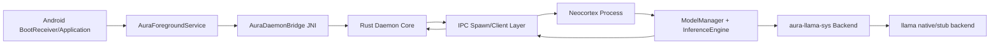
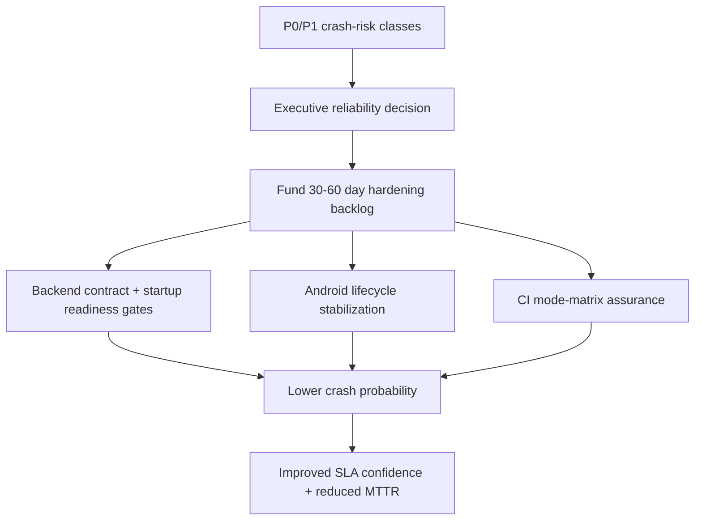
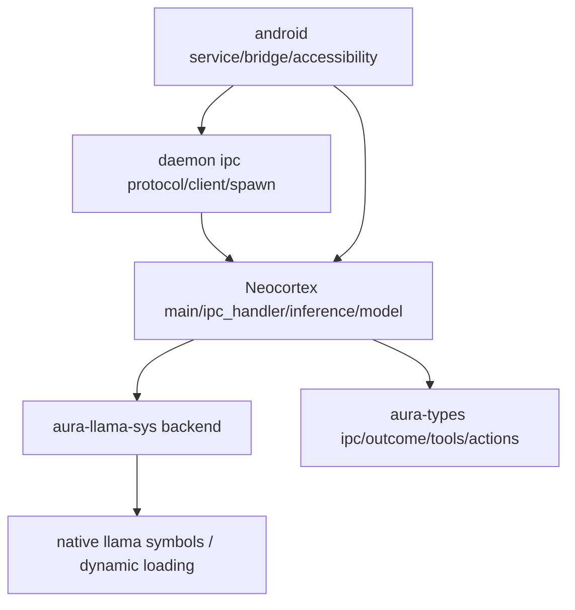

# NEOCORTEX ENTERPRISE AUDIT COMPENDIUM (CONDENSED FROM FULL LINE LEDGER)

**Source Basis:** `/home/runner/work/aura/aura/docs/reports/NEOCORTEX-CODE-ONLY-FULL-AUDIT-2026-03-27.md` only.
**Constraint Mode:** 2000-2200 lines, enterprise-readable, diagrams + flowcharts + prioritized points.
**Evidence Policy:** No new repository documentation sources added beyond the full audit artifact.

---

## 1) Executive Snapshot (Leadership View)

- Neocortex is implemented as a process-level inference subsystem connected to daemon via framed IPC.
- Android runtime path adds service lifecycle, JNI bridge, wake-lock control, and process supervision layers.
- Dominant crash class in evidence remains FFI lifecycle + build/runtime mode mismatch at symbol/pointer boundaries.
- Reliability upside exists: explicit protocol typing, cancellation controls, and deterministic shutdown choreography.
- Reliability downside exists: large monolithic modules and cross-crate coupling in startup/inference critical path.
- Recommended strategy: preserve system identity while reducing unsafe state space through strict backend contract gates.

### 1.1 Leadership Decision Dashboard

| Decision Area | Current State | Business Exposure if Deferred | Recommended Owner | Time Horizon |
|---|---|---|---|---|
| Runtime crash-risk containment | Partial controls in place | Service instability + trust erosion | Platform Engineering | 0-30 days |
| Startup contract hardening | Inconsistent readiness guarantees | Incident MTTR inflation | Runtime/Core Team | 0-30 days |
| Android lifecycle resilience | Operationally functional, tightly coupled | Mobile reliability regressions | Android Systems Team | 30-90 days |
| Module decomposition | High concentration in critical files | Review velocity + defect density risk | Architecture Council | 30-90 days |
| Continuous assurance (CI matrix) | Good baseline, limited mode breadth | Escaped mode-specific failures | DevEx / CI Team | 0-60 days |

### 1.2 Governance Signal Summary

- **Ship posture:** proceed only with explicit crash-boundary guardrails and readiness gates.
- **Investment signal:** prioritize reliability engineering over feature acceleration in this subsystem.
- **Audit confidence:** high on architectural coverage, medium on runtime behavior without expanded fault-injection.
- **Executive ask:** approve a reliability sprint focused on boundary contracts, startup diagnostics, and Android lifecycle hardening.


## 2) Architecture in Reality (Code-Observed)



```mermaid
sequenceDiagram
    participant AND as Android Service
    participant DAE as Daemon
    participant IPC as IPC Protocol
    participant NEO as Neocortex
    participant FFI as llama Backend
    AND->>DAE: nativeInit / nativeRun
    DAE->>IPC: spawn + connect
    IPC->>NEO: framed request
    NEO->>FFI: load model / infer
    FFI-->>NEO: logits/tokens/result
    NEO-->>IPC: framed response
    IPC-->>DAE: decode + route outcome
    DAE-->>AND: completion + control callbacks
```

## 3) Operational Flow and Control Gates

1. Android service bootstrap initializes long-running execution context and JNI bridge endpoints.
2. Daemon process supervision resolves neocortex executable path and starts child process.
3. IPC protocol establishes framed communication with platform-specific socket transport.
4. Neocortex startup path parses args/config and enters request handling loop.
5. Model manager lazily loads model tier and context through backend abstraction.
6. Inference engine assembles prompt context, runs decode/sampling loop, and formats output.
7. Response frame returns to daemon; daemon routes action/outcome to downstream systems.
8. Shutdown path uses atomic cancellation, graceful wait windows, and forced kill fallback.

## 4) Crash/SIGSEGV Risk Heatmap

| Risk Level | Crash Family | Evidence Theme | Primary Surfaces |
|---|---|---|---|
| P0 | FFI lifecycle/order mismatch | pointer validity + free ordering | `aura-llama-sys` + `model.rs` |
| P0 | Link/runtime mode drift | symbol expectations vs selected backend mode | build.rs + backend init/use |
| P1 | Startup state races | process/IPC readiness assumptions | daemon spawn/client + neocortex main |
| P1 | IPC timeout/reconnect cascades | retries and process restart interaction | protocol/client/spawn |
| P2 | Config/model discovery fragility | path selection ambiguity on device | aura_config + model path resolution |
| P2 | Android lifecycle coupling | service, wake-lock, JNI callback orchestration | app service + bridge + accessibility |

## 4.1) Enterprise Action Flow (From Risk to Control)



## 4.2) Priority Decision Matrix

| Priority | Workstream | Success Metric | Exit Criteria |
|---|---|---|---|
| P0 | Backend lifecycle contract fences | 0 linker/runtime mode mismatch incidents | backend-only API usage enforced + startup self-report |
| P0 | Startup readiness protocol | deterministic boot success under test matrix | READY handshake gate active in daemon path |
| P1 | Android lifecycle resilience | reduced restart churn/ANR risk indicators | chaos scenarios pass with watchdog stability |
| P1 | IPC resilience tightening | fewer timeout/reconnect cascades | reconnect/backoff behavior validated by tests |
| P2 | File/module decomposition | smaller review units + clearer ownership | high-risk monolith internals split with unit tests |

## 5) File-by-File Enterprise Review (All In-Scope Files)

Each subsection includes: ownership intent, quantitative profile, risk markers, and selected line-ledger evidence samples from the original full report.

### 5.01 `Cargo.toml`

- **Role summary:** In-scope component contributing to neocortex runtime, IPC, backend, or Android operational path.
- **Total lines scanned (source):** 44
- **Declarations:** fn=0, struct=0, enum=0, trait=0, impl=0
- **Risk counters:** unsafe=0, ffi=0, ipc=0, thread=1, jni/android=0, err-path=0, unwrap/expect=0, panic/todo=0, io/fs=0
- **Function index snippet:** n/a

**Ledger samples (start-of-file behavior):**
- L0001: `[workspace]` -> operational statement.
- L0002: `resolver = "2"` -> operational statement.
- L0003: `members = [` -> operational statement.
- L0004: `"crates/aura-types",` -> operational statement.
- L0005: `"crates/aura-daemon",` -> operational statement.
- L0006: `"crates/aura-neocortex",` -> operational statement.
- L0007: `"crates/aura-llama-sys",` -> operational statement.
- L0008: `"crates/aura-iron-laws",` -> operational statement.
- L0009: `]` -> operational statement.
- L0010: `(blank)` -> blank/spacing.

**Ledger samples (risk-focused highlights):**
- L0027 [threading]: `tokio = { version = "1", features = ["rt", "rt-multi-thread", "macros", "sync", "time", "net"] }` -> operational statement.

**Ledger samples (end-of-file closure behavior):**
- L0035: `(blank)` -> blank/spacing.
- L0036: `[profile.release]` -> operational statement.
- L0037: `opt-level = "z"` -> operational statement.
- L0038: `lto = "thin"           # CHANGED: true → thin (F001 fix: NDK #2073 - LTO+panic=abort causes startup SIGSEGV)` -> operational statement.
- L0039: `codegen-units = 1` -> operational statement.
- L0040: `strip = true` -> operational statement.
- L0041: `panic = "unwind"       # CHANGED: abort → unwind (F001 fix: NDK #2073 - LTO+panic=abort causes startup SIGS...` -> operational statement.
- L0042: `(blank)` -> blank/spacing.
- L0043: `# SBOM Configuration: Defined at crate level, not workspace level` -> operational statement.
- L0044: `# Individual crates (aura-daemon, aura-neocortex) define their own SBOM metadata` -> operational statement.

**Enterprise interpretation:**
- This file participates in the same crash-governing invariant set: startup assumptions, transport correctness, and backend lifecycle safety.
- Recommended action is to preserve behavior while tightening contracts/tests around the highest-risk counters shown above.

### 5.02 `crates/aura-neocortex/Cargo.toml`

- **Role summary:** In-scope component contributing to neocortex runtime, IPC, backend, or Android operational path.
- **Total lines scanned (source):** 23
- **Declarations:** fn=0, struct=0, enum=0, trait=0, impl=0
- **Risk counters:** unsafe=0, ffi=0, ipc=0, thread=0, jni/android=0, err-path=0, unwrap/expect=0, panic/todo=0, io/fs=0
- **Function index snippet:** n/a

**Ledger samples (start-of-file behavior):**
- L0001: `[package]` -> operational statement.
- L0002: `name = "aura-neocortex"` -> operational statement.
- L0003: `version.workspace = true` -> operational statement.
- L0004: `edition.workspace = true` -> operational statement.
- L0005: `(blank)` -> blank/spacing.
- L0006: `[[bin]]` -> operational statement.
- L0007: `name = "aura-neocortex"` -> operational statement.
- L0008: `path = "src/main.rs"` -> operational statement.
- L0009: `(blank)` -> blank/spacing.
- L0010: `[features]` -> operational statement.

**Ledger samples (risk-focused highlights):**

**Ledger samples (end-of-file closure behavior):**
- L0014: `aura-types = { path = "../aura-types" }` -> operational statement.
- L0015: `aura-llama-sys = { path = "../aura-llama-sys" }` -> operational statement.
- L0016: `serde.workspace = true` -> operational statement.
- L0017: `serde_json.workspace = true` -> operational statement.
- L0018: `bincode.workspace = true` -> operational statement.
- L0019: `tracing.workspace = true` -> operational statement.
- L0020: `tracing-subscriber.workspace = true` -> operational statement.
- L0021: `thiserror.workspace = true` -> operational statement.
- L0022: `toml.workspace = true` -> operational statement.
- L0023: `rand = "0.8"` -> operational statement.

**Enterprise interpretation:**
- This file participates in the same crash-governing invariant set: startup assumptions, transport correctness, and backend lifecycle safety.
- Recommended action is to preserve behavior while tightening contracts/tests around the highest-risk counters shown above.

### 5.03 `crates/aura-llama-sys/Cargo.toml`

- **Role summary:** In-scope component contributing to neocortex runtime, IPC, backend, or Android operational path.
- **Total lines scanned (source):** 21
- **Declarations:** fn=0, struct=0, enum=0, trait=0, impl=0
- **Risk counters:** unsafe=0, ffi=1, ipc=0, thread=0, jni/android=0, err-path=0, unwrap/expect=0, panic/todo=0, io/fs=0
- **Function index snippet:** n/a

**Ledger samples (start-of-file behavior):**
- L0001: `[package]` -> operational statement.
- L0002: `name = "aura-llama-sys"` -> operational statement.
- L0003: `version.workspace = true` -> operational statement.
- L0004: `edition.workspace = true` -> operational statement.
- L0005: `links = "llama"` -> operational statement.
- L0006: `(blank)` -> blank/spacing.
- L0007: `[dependencies]` -> operational statement.
- L0008 [ffi-llama]: `libloading = "0.8"` -> operational statement.
- L0009: `tracing = { workspace = true }` -> operational statement.
- L0010: `rand = "0.8"` -> operational statement.

**Ledger samples (risk-focused highlights):**
- L0008 [ffi-llama]: `libloading = "0.8"` -> operational statement.

**Ledger samples (end-of-file closure behavior):**
- L0012: `serde_json = { workspace = true }` -> operational statement.
- L0013: `thiserror = { workspace = true }` -> operational statement.
- L0014: `(blank)` -> blank/spacing.
- L0015: `[features]` -> operational statement.
- L0016: `# Build without real llama.cpp (for CI, testing, or host builds).` -> loop / iteration logic.
- L0017: `# When enabled, the native C compilation step is skipped entirely.` -> operational statement.
- L0018: `stub = []` -> operational statement.
- L0019: `(blank)` -> blank/spacing.
- L0020: `[build-dependencies]` -> operational statement.
- L0021: `cc = "1"` -> operational statement.

**Enterprise interpretation:**
- This file participates in the same crash-governing invariant set: startup assumptions, transport correctness, and backend lifecycle safety.
- Recommended action is to preserve behavior while tightening contracts/tests around the highest-risk counters shown above.

### 5.04 `crates/aura-daemon/Cargo.toml`

- **Role summary:** In-scope component contributing to neocortex runtime, IPC, backend, or Android operational path.
- **Total lines scanned (source):** 60
- **Declarations:** fn=0, struct=0, enum=0, trait=0, impl=0
- **Risk counters:** unsafe=0, ffi=0, ipc=0, thread=0, jni/android=1, err-path=0, unwrap/expect=0, panic/todo=0, io/fs=0
- **Function index snippet:** n/a

**Ledger samples (start-of-file behavior):**
- L0001: `[package]` -> operational statement.
- L0002: `name = "aura-daemon"` -> operational statement.
- L0003: `version.workspace = true` -> operational statement.
- L0004: `edition.workspace = true` -> operational statement.
- L0005: `(blank)` -> blank/spacing.
- L0006: `[lib]` -> operational statement.
- L0007: `crate-type = ["cdylib", "lib"]` -> operational statement.
- L0008: `(blank)` -> blank/spacing.
- L0009: `[[bin]]` -> operational statement.
- L0010: `name = "aura-daemon"` -> operational statement.

**Ledger samples (risk-focused highlights):**
- L0056 [jni/android]: `jni  = "0.21"` -> operational statement.

**Ledger samples (end-of-file closure behavior):**
- L0051: `(blank)` -> blank/spacing.
- L0052: `audiopus = { version = "=0.3.0-rc.0", optional = true }` -> operational statement.
- L0053: `(blank)` -> blank/spacing.
- L0054: `[target.'cfg(target_os = "android")'.dependencies]` -> operational statement.
- L0055: `libc = "0.2"` -> operational statement.
- L0056 [jni/android]: `jni  = "0.21"` -> operational statement.
- L0057: `(blank)` -> blank/spacing.
- L0058: `[dev-dependencies]` -> operational statement.
- L0059: `tokio    = { version = "1", features = ["rt", "macros", "sync", "time", "net", "test-util"] }` -> operational statement.
- L0060: `tempfile = "3"` -> operational statement.

**Enterprise interpretation:**
- This file participates in the same crash-governing invariant set: startup assumptions, transport correctness, and backend lifecycle safety.
- Recommended action is to preserve behavior while tightening contracts/tests around the highest-risk counters shown above.

### 5.05 `crates/aura-types/Cargo.toml`

- **Role summary:** In-scope component contributing to neocortex runtime, IPC, backend, or Android operational path.
- **Total lines scanned (source):** 18
- **Declarations:** fn=0, struct=0, enum=0, trait=0, impl=0
- **Risk counters:** unsafe=0, ffi=0, ipc=0, thread=0, jni/android=0, err-path=0, unwrap/expect=0, panic/todo=0, io/fs=0
- **Function index snippet:** n/a

**Ledger samples (start-of-file behavior):**
- L0001: `[package]` -> operational statement.
- L0002: `name = "aura-types"` -> operational statement.
- L0003: `version.workspace = true` -> operational statement.
- L0004: `edition.workspace = true` -> operational statement.
- L0005: `(blank)` -> blank/spacing.
- L0006: `[features]` -> operational statement.
- L0007: `stub = []` -> operational statement.
- L0008: `(blank)` -> blank/spacing.
- L0009: `[dependencies]` -> operational statement.
- L0010: `serde.workspace = true` -> operational statement.

**Ledger samples (risk-focused highlights):**

**Ledger samples (end-of-file closure behavior):**
- L0009: `[dependencies]` -> operational statement.
- L0010: `serde.workspace = true` -> operational statement.
- L0011: `bincode.workspace = true` -> operational statement.
- L0012: `thiserror.workspace = true` -> operational statement.
- L0013: `toml.workspace = true` -> operational statement.
- L0014: `bitflags = "2"` -> operational statement.
- L0015: `serde_json.workspace = true` -> operational statement.
- L0016: `async-trait.workspace = true` -> operational statement.
- L0017: `(blank)` -> blank/spacing.
- L0018: `[dev-dependencies]` -> operational statement.

**Enterprise interpretation:**
- This file participates in the same crash-governing invariant set: startup assumptions, transport correctness, and backend lifecycle safety.
- Recommended action is to preserve behavior while tightening contracts/tests around the highest-risk counters shown above.

### 5.06 `crates/aura-neocortex/src/main.rs`

- **Role summary:** In-scope component contributing to neocortex runtime, IPC, backend, or Android operational path.
- **Total lines scanned (source):** 681
- **Declarations:** fn=16, struct=1, enum=0, trait=0, impl=1
- **Risk counters:** unsafe=0, ffi=0, ipc=73, thread=16, jni/android=0, err-path=12, unwrap/expect=1, panic/todo=0, io/fs=17
- **Function index snippet:** 46:default_socket_address, 70:parse, 117:print_usage, 141:main, 293:build_startup_capabilities, 326:resolve_model_dir, 359:run_server, 526:spawn_shutdown_listener, 575:args_parse_defaults, 595:shutdown_flag_works, 604:ca

**Ledger samples (start-of-file behavior):**
- L0001: `//! AURA Neocortex - LLM inference binary.` -> comment or documentation.
- L0002: `(blank)` -> blank/spacing.
- L0003: `// Clippy configuration for aura-neocortex.` -> comment or documentation.
- L0004: `#![allow(clippy::assertions_on_constants)] // Test assertions on compile-time constants` -> operational statement.
- L0005: `#![allow(clippy::manual_range_contains)] // Explicit range contains for readability` -> loop / iteration logic.
- L0006: `#![allow(clippy::len_zero)] // len() comparisons for test clarity` -> loop / iteration logic.
- L0007: `#![allow(unused_imports)] // Some imports used conditionally or in tests` -> operational statement.
- L0008: `//!` -> comment or documentation.
- L0009: `//! This is a **separate process** from the AURA daemon.  It communicates via` -> comment or documentation.
- L0010 [ipc/net]: `//! IPC (Unix domain socket on Android, TCP on host) and can be killed by the` -> comment or documentation.

**Ledger samples (risk-focused highlights):**
- L0010 [ipc/net]: `//! IPC (Unix domain socket on Android, TCP on host) and can be killed by the` -> comment or documentation.
- L0014 [ipc/net]: `//!   aura-neocortex --socket <addr> --model-dir <path>` -> comment or documentation.
- L0029 [threading]: `atomic::{AtomicBool, Ordering},` -> shared-state concurrency primitive.
- L0042 [ipc/net]: `/// Platform-specific default socket address.` -> comment or documentation.
- L0044 [ipc/net]: `/// - **Android:** `@aura_ipc_v4` (abstract Unix domain socket).` -> comment or documentation.
- L0046 [ipc/net]: `fn default_socket_address() -> String {` -> function signature.
- L0058 [ipc/net]: `/// Socket address to bind.` -> comment or documentation.
- L0059 [ipc/net]: `/// On Android: Unix abstract socket name (e.g., "@aura_ipc_v4").` -> comment or documentation.
- L0061 [ipc/net]: `socket: String,` -> ipc/socket operation.
- L0073 [ipc/net]: `let mut socket = default_socket_address();` -> ipc/socket operation.
- L0080 [ipc/net]: `"--socket" \| "-s" => {` -> ipc/socket operation.
- L0082 [ipc/net]: `socket = args.get(i).ok_or("--socket requires a value")?.clone();` -> ipc/socket operation.
- L0103 [error-path]: `return Err(format!("unknown argument: {other}"));` -> explicit return path.
- L0110 [ipc/net]: `socket,` -> ipc/socket operation.
- L0125 [ipc/net]: `-s, --socket <ADDR>       Socket address to bind` -> ipc/socket operation.
- L0127 [ipc/net]: `Android: @aura_ipc_v4 (abstract Unix socket)` -> ipc/socket operation.
- L0148 [error-path]: `Err(e) => {` -> result construction path.
- L0189 [ipc/net]: `info!(socket = %args.socket, model_dir = %args.model_dir.display(), "cli configuration");` -> ipc/socket operation.
- L0214 [error-path]: `Err(e) => {` -> result construction path.
- L0236 [threading]: `let shutdown = Arc::new(AtomicBool::new(false));` -> shared-state concurrency primitive.

**Ledger samples (end-of-file closure behavior):**
- L0672: `};` -> scope closure.
- L0673: `(blank)` -> blank/spacing.
- L0674: `// With an empty scanner (no GGUF), the override is the best available source.` -> comment or documentation.
- L0675: `// build_startup_capabilities falls back to fallback_defaults() when scanner` -> comment or documentation.
- L0676: `// has no models - so the override is NOT applied (expected: CompiledFallback).` -> comment or documentation.
- L0677: `// This tests the graceful fallback path specifically.` -> comment or documentation.
- L0678: `let caps = build_startup_capabilities(&mgr, &config);` -> operational statement.
- L0679: `assert!(caps.embedding_dim > 0);` -> operational statement.
- L0680: `}` -> scope closure.
- L0681: `}` -> scope closure.

**Enterprise interpretation:**
- This file participates in the same crash-governing invariant set: startup assumptions, transport correctness, and backend lifecycle safety.
- Recommended action is to preserve behavior while tightening contracts/tests around the highest-risk counters shown above.

### 5.07 `crates/aura-neocortex/src/ipc_handler.rs`

- **Role summary:** In-scope component contributing to neocortex runtime, IPC, backend, or Android operational path.
- **Total lines scanned (source):** 1355
- **Declarations:** fn=20, struct=1, enum=0, trait=0, impl=1
- **Risk counters:** unsafe=0, ffi=0, ipc=15, thread=7, jni/android=0, err-path=14, unwrap/expect=17, panic/todo=0, io/fs=7
- **Function index snippet:** 80:new, 106:run_loop, 150:read_message, 225:write_message, 249:handle_message, 760:handle_inference, 904:check_idle_unload, 914:set_low_memory, 932:parse_react_response, 966:describe_trigger, 1042:message_round_trip_load

**Ledger samples (start-of-file behavior):**
- L0001: `//! IPC message handler for AURA Neocortex.` -> comment or documentation.
- L0002: `//!` -> comment or documentation.
- L0003: `//! Implements length-prefixed bincode framing over a byte stream (Unix domain` -> comment or documentation.
- L0004 [ipc/net]: `//! socket on Android, TCP on host).  Handles reading, writing, dispatch of` -> comment or documentation.
- L0005: `//! `DaemonToNeocortex` messages, and enforces size / timeout limits.` -> comment or documentation.
- L0006: `(blank)` -> blank/spacing.
- L0007: `use std::{` -> import dependency / module.
- L0008: `io::{self, Read, Write},` -> operational statement.
- L0009 [threading]: `sync::{atomic::AtomicBool, Arc},` -> shared-state concurrency primitive.
- L0010: `time::{Duration, Instant},` -> operational statement.

**Ledger samples (risk-focused highlights):**
- L0004 [ipc/net]: `//! socket on Android, TCP on host).  Handles reading, writing, dispatch of` -> comment or documentation.
- L0009 [threading]: `sync::{atomic::AtomicBool, Arc},` -> shared-state concurrency primitive.
- L0015 [ipc/net]: `// On Android, the neocortex server accepts connections on an abstract Unix` -> comment or documentation.
- L0016 [ipc/net]: `// domain socket (`@aura_ipc_v4`).  On all other platforms (Linux desktop,` -> comment or documentation.
- L0017 [ipc/net]: `// macOS, Windows) it accepts TCP connections on `127.0.0.1:19400`.` -> comment or documentation.
- L0019 [ipc/net]: `// Both `std::net::TcpStream` and `std::os::unix::net::UnixStream` implement` -> comment or documentation.
- L0024 [ipc/net]: `type IpcStreamInner = std::os::unix::net::UnixStream;` -> ipc/socket operation.
- L0027 [ipc/net]: `type IpcStreamInner = std::net::TcpStream;` -> ipc/socket operation.
- L0060 [ipc/net]: `/// Manages the IPC connection to the daemon.` -> comment or documentation.
- L0066 [threading]: `cancel_token: Arc<AtomicBool>,` -> shared-state concurrency primitive.
- L0074 [ipc/net]: `/// Create a new handler wrapping an accepted connection stream.` -> comment or documentation.
- L0079 [ipc/net]: `/// mode's `max_tokens * 2` budget - acceptable only before any model loads.` -> comment or documentation.
- L0083 [threading]: `cancel_token: Arc<AtomicBool>,` -> shared-state concurrency primitive.
- L0104 [ipc/net]: `/// Reads messages until the connection closes or a fatal error occurs.` -> comment or documentation.
- L0115 [error-path]: `if let Err(e) = self.write_message(&resp) {` -> conditional logic / guard.
- L0117 [error-path]: `return Err(e);` -> explicit return path.
- L0121 [error-path]: `Err(e) => {` -> result construction path.
- L0125 [ipc/net]: `info!("daemon disconnected - shutting down");` -> operational statement.
- L0141 [error-path]: `return Err(e);` -> explicit return path.
- L0165 [ipc/net]: `// A legitimate peer should never send this much; drop the connection.` -> comment or documentation.

**Ledger samples (end-of-file closure behavior):**
- L1346: `let (decoded, _): (NeocortexToDaemon, _) =` -> operational statement.
- L1347 [unwrap/expect]: `bincode::serde::decode_from_slice(&bytes, bincode::config::standard()).unwrap();` -> potential panic path (unwrap/expect).
- L1348: `match decoded {` -> branching by enum/state/variant.
- L1349: `NeocortexToDaemon::Pong { uptime_ms } => {` -> operational statement.
- L1350: `assert_eq!(uptime_ms, 999);` -> operational statement.
- L1351: `}` -> scope closure.
- L1352: `_ => panic!("wrong variant"),` -> operational statement.
- L1353: `}` -> scope closure.
- L1354: `}` -> scope closure.
- L1355: `}` -> scope closure.

**Enterprise interpretation:**
- This file participates in the same crash-governing invariant set: startup assumptions, transport correctness, and backend lifecycle safety.
- Recommended action is to preserve behavior while tightening contracts/tests around the highest-risk counters shown above.

### 5.08 `crates/aura-neocortex/src/inference.rs`

- **Role summary:** In-scope component contributing to neocortex runtime, IPC, backend, or Android operational path.
- **Total lines scanned (source):** 2441
- **Declarations:** fn=80, struct=4, enum=0, trait=0, impl=2
- **Risk counters:** unsafe=0, ffi=0, ipc=7, thread=8, jni/android=0, err-path=21, unwrap/expect=5, panic/todo=0, io/fs=1
- **Function index snippet:** 142:push_step, 148:is_exhausted, 155:is_done, 163:as_prompt_history, 168:final_answer, 200:new, 208:cancel, 217:capabilities, 234:is_cancelled, 250:infer, 342:infer_single_pass, 439:infer_with_cascade, 571:infer_react_lo

**Ledger samples (start-of-file behavior):**
- L0001: `//! Inference engine for AURA Neocortex.` -> comment or documentation.
- L0002: `//!` -> comment or documentation.
- L0003: `//! Orchestrates the full 6-layer teacher structure stack:` -> comment or documentation.
- L0004: `//!` -> comment or documentation.
- L0005: `//! - **Layer 0 (GBNF)**: Grammar-constrained generation via `grammar.rs`` -> comment or documentation.
- L0006: `//! - **Layer 1 (CoT)**: Chain-of-thought forcing via `prompts::build_cot_prompt()`` -> comment or documentation.
- L0007: `//! - **Layer 2 (Confidence)**: Logprob-based confidence estimation → cascade trigger` -> comment or documentation.
- L0008: `//! - **Layer 3 (Cascade Retry)**: Escalate to larger model on low confidence` -> comment or documentation.
- L0009: `//! - **Layer 4 (Reflection)**: Cross-model check (Brainstem validates Neocortex)` -> comment or documentation.
- L0010: `//! - **Layer 5 (Best-of-N)**: Run N inferences with Mirostat-divergent tau, vote` -> comment or documentation.

**Ledger samples (risk-focused highlights):**
- L0021 [threading]: `atomic::{AtomicBool, Ordering},` -> shared-state concurrency primitive.
- L0188 [threading]: `cancel_token: Arc<AtomicBool>,` -> shared-state concurrency primitive.
- L0200 [threading]: `pub fn new(cancel_token: Arc<AtomicBool>, capabilities: Option<ModelCapabilities>) -> Self {` -> function signature.
- L0316 [error-path]: `Err(resp) => return resp,` -> explicit return path.
- L0353 [error-path]: `return Err(NeocortexToDaemon::Error {` -> explicit return path.
- L0371 [error-path]: `Err(e) => {` -> result construction path.
- L0470 [error-path]: `self.infer_react_loop(manager, prompt, mode, send_progress, start)?` -> operational statement.
- L0472 [error-path]: `self.infer_single_pass(manager, prompt, mode, send_progress, start)?` -> operational statement.
- L0479 [ipc/net]: `"confidence above threshold, accepting output"` -> operational statement.
- L0493 [ipc/net]: `"cascade retries exhausted, accepting low-confidence output"` -> operational statement.
- L0514 [ipc/net]: `"cascade not recommended, accepting output"` -> operational statement.
- L0523 [ipc/net]: `debug!("already at highest tier, accepting output");` -> operational statement.
- L0552 [error-path]: `Err(e) => {` -> result construction path.
- L0553 [ipc/net]: `warn!(error = %e, "cascade escalation failed, accepting current output");` -> operational statement.
- L0591 [error-path]: `return Err(NeocortexToDaemon::Error {` -> explicit return path.
- L0656 [error-path]: `return Err(NeocortexToDaemon::Error {` -> explicit return path.
- L0729 [error-path]: `Err(e) => {` -> result construction path.
- L0845 [error-path]: `Err(_err) => {` -> result construction path.
- L0880 [error-path]: `return Err(NeocortexToDaemon::Error {` -> explicit return path.
- L0971 [ipc/net]: `//   1. Reflection is binary (accept/reject), not generative - needs pattern matching, not` -> comment or documentation.

**Ledger samples (end-of-file closure behavior):**
- L2432: `let result = engine.infer(&mut manager, prompt, InferenceMode::Planner, &mut sender);` -> operational statement.
- L2433: `(blank)` -> blank/spacing.
- L2434: `match result {` -> branching by enum/state/variant.
- L2435: `NeocortexToDaemon::Error { code, .. } => {` -> operational statement.
- L2436: `assert_eq!(code, error_codes::MODEL_NOT_LOADED);` -> operational statement.
- L2437: `}` -> scope closure.
- L2438: `other => panic!("expected Error, got {other:?}"),` -> operational statement.
- L2439: `}` -> scope closure.
- L2440: `}` -> scope closure.
- L2441: `}` -> scope closure.

**Enterprise interpretation:**
- This file participates in the same crash-governing invariant set: startup assumptions, transport correctness, and backend lifecycle safety.
- Recommended action is to preserve behavior while tightening contracts/tests around the highest-risk counters shown above.

### 5.09 `crates/aura-neocortex/src/model.rs`

- **Role summary:** In-scope component contributing to neocortex runtime, IPC, backend, or Android operational path.
- **Total lines scanned (source):** 1418
- **Declarations:** fn=71, struct=5, enum=1, trait=0, impl=5
- **Risk counters:** unsafe=1, ffi=2, ipc=3, thread=3, jni/android=3, err-path=7, unwrap/expect=6, panic/todo=0, io/fs=18
- **Function index snippet:** 62:max_allowed_tier, 83:from_battery, 115:tier_capability, 165:tier_filename_fallback, 176:tier_filename, 181:tier_approx_memory_mb, 190:tier_downgrade, 199:tier_upgrade, 208:tier_display, 217:tier_ordinal, 259:scan, 342

**Ledger samples (start-of-file behavior):**
- L0001: `//! Model management for AURA Neocortex.` -> comment or documentation.
- L0002: `//!` -> comment or documentation.
- L0003: `//! Handles intelligent model tier selection, cascading, loading/unloading` -> comment or documentation.
- L0004: `//! via `aura-llama-sys`, and post-load headroom verification.` -> comment or documentation.
- L0005: `//!` -> comment or documentation.
- L0006: `//! # Intelligent Cascading (Layer 3)` -> comment or documentation.
- L0007: `//!` -> comment or documentation.
- L0008: `//! Instead of static RAM-only tier selection, this module evaluates:` -> comment or documentation.
- L0009: `//! - Available RAM (hard constraint - cannot load what won't fit)` -> comment or documentation.
- L0010: `//! - Power state (battery-aware - prefer smaller models on low battery)` -> comment or documentation.

**Ledger samples (risk-focused highlights):**
- L0082 [jni/android]: `#[allow(dead_code)] // Phase 8: called by Android BatteryManager JNI bridge` -> attribute / cfg / derive.
- L0175 [jni/android]: `#[allow(dead_code)] // Phase 8: used by test helpers and JNI fallback path` -> attribute / cfg / derive.
- L0264 [error-path]: `Err(e) => {` -> result construction path.
- L0287 [error-path]: `Err(e) => {` -> result construction path.
- L0325 [unwrap/expect]: `.expect("entries has 3+ items in this match arm");` -> branching by enum/state/variant.
- L0507 [ipc/net]: `/// Same as `should_cascade_up` but accepts an optional `ModelScanner` for` -> comment or documentation.
- L0518 [ipc/net]: `// If confidence is acceptable, no cascade needed` -> comment or documentation.
- L0620 [threading]: `// thread. The ModelManager serializes all access through its internal state` -> comment or documentation.
- L0621 [threading]: `// machine, ensuring no concurrent mutation. Moving between threads is safe` -> comment or documentation.
- L0627 [unsafe]: `unsafe impl Send for LoadedModel {}` -> loop / iteration logic.
- L0658 [ffi-llama]: `// This avoids hard-linking direct raw FFI symbols (`llama_free*`)` -> comment or documentation.
- L0704 [error-path]: `/// Is a model currently loaded?` -> comment or documentation.
- L0754 [error-path]: `return Err(format!(` -> explicit return path.
- L0841 [threading]: `n_threads: params.n_threads,` -> operational statement.
- L0865 [error-path]: `return Err("insufficient RAM even for smallest model".into());` -> loop / iteration logic.
- L0944 [ffi-llama]: `/// is wired once `aura-llama-sys` exposes `llama_get_embeddings`.` -> comment or documentation.
- L1039 [jni/android]: `#[allow(dead_code)] // Phase 8: used by legacy JNI path and test helpers` -> attribute / cfg / derive.
- L1064 [error-path]: `if let Err(e) = aura_llama_sys::init_stub_backend(0xA0BA) {` -> conditional logic / guard.
- L1089 [error-path]: `Err(e) => {` -> result construction path.
- L1205 [ipc/net]: `// Standard complexity starts at Brainstem, but should be acceptable` -> comment or documentation.

**Ledger samples (end-of-file closure behavior):**
- L1409: `}` -> scope closure.
- L1410: `(blank)` -> blank/spacing.
- L1411: `#[test]` -> attribute / cfg / derive.
- L1412: `fn all_tiers_constant_is_ordered() {` -> function signature.
- L1413: `assert_eq!(ALL_TIERS.len(), 3);` -> operational statement.
- L1414: `assert_eq!(ALL_TIERS[0], ModelTier::Brainstem1_5B);` -> operational statement.
- L1415: `assert_eq!(ALL_TIERS[1], ModelTier::Standard4B);` -> operational statement.
- L1416: `assert_eq!(ALL_TIERS[2], ModelTier::Full8B);` -> operational statement.
- L1417: `}` -> scope closure.
- L1418: `}` -> scope closure.

**Enterprise interpretation:**
- This file participates in the same crash-governing invariant set: startup assumptions, transport correctness, and backend lifecycle safety.
- Recommended action is to preserve behavior while tightening contracts/tests around the highest-risk counters shown above.

### 5.10 `crates/aura-neocortex/src/model_capabilities.rs`

- **Role summary:** In-scope component contributing to neocortex runtime, IPC, backend, or Android operational path.
- **Total lines scanned (source):** 377
- **Declarations:** fn=14, struct=1, enum=1, trait=0, impl=1
- **Risk counters:** unsafe=0, ffi=0, ipc=0, thread=0, jni/android=0, err-path=0, unwrap/expect=0, panic/todo=0, io/fs=0
- **Function index snippet:** 108:from_gguf, 209:fallback_defaults, 229:is_fully_from_gguf, 234:summary, 253:meta_with_all_dims, 264:meta_empty, 269:from_gguf_uses_metadata_fields, 285:from_gguf_gguf_wins_over_user_override, 299:from_gguf_user_overri

**Ledger samples (start-of-file behavior):**
- L0001: `//! Model geometry capabilities - single source of truth for all dimension values.` -> comment or documentation.
- L0002: `//!` -> comment or documentation.
- L0003: `//! `ModelCapabilities` is derived from GGUF metadata with a strict priority chain:` -> comment or documentation.
- L0004: `//!` -> comment or documentation.
- L0005: `//!   **GGUF metadata → user config override → device-probed defaults → compiled fallback**` -> comment or documentation.
- L0006: `//!` -> comment or documentation.
- L0007: `//! No step can be skipped. The embedding_dim, context_length, and other geometry` -> comment or documentation.
- L0008: `//! values are never hardcoded in inference paths - this struct is the only place` -> comment or documentation.
- L0009: `//! those values live at runtime.` -> comment or documentation.
- L0010: `//!` -> comment or documentation.

**Ledger samples (risk-focused highlights):**

**Ledger samples (end-of-file closure behavior):**
- L0368: `(blank)` -> blank/spacing.
- L0369: `#[test]` -> attribute / cfg / derive.
- L0370: `fn summary_contains_key_fields() {` -> function signature.
- L0371: `let caps = ModelCapabilities::fallback_defaults();` -> operational statement.
- L0372: `let s = caps.summary();` -> operational statement.
- L0373: `assert!(s.contains("emb_dim="));` -> operational statement.
- L0374: `assert!(s.contains("ctx="));` -> operational statement.
- L0375: `assert!(s.contains("layers="));` -> operational statement.
- L0376: `}` -> scope closure.
- L0377: `}` -> scope closure.

**Enterprise interpretation:**
- This file participates in the same crash-governing invariant set: startup assumptions, transport correctness, and backend lifecycle safety.
- Recommended action is to preserve behavior while tightening contracts/tests around the highest-risk counters shown above.

### 5.11 `crates/aura-neocortex/src/context.rs`

- **Role summary:** In-scope component contributing to neocortex runtime, IPC, backend, or Android operational path.
- **Total lines scanned (source):** 1780
- **Declarations:** fn=88, struct=3, enum=0, trait=0, impl=2
- **Risk counters:** unsafe=0, ffi=0, ipc=1, thread=0, jni/android=0, err-path=0, unwrap/expect=0, panic/todo=0, io/fs=0
- **Function index snippet:** 152:new, 162:remaining, 171:next_pass_budget, 176:record_usage, 183:is_exhausted, 191:total_budget, 196:consumed, 234:new, 250:with_template, 256:with_failure, 265:with_grammar, 274:with_cot, 283:with_tools, 292:with_ret

**Ledger samples (start-of-file behavior):**
- L0001: `//! Context assembly for AURA Neocortex.` -> comment or documentation.
- L0002: `//!` -> comment or documentation.
- L0003: `//! Takes a `ContextPackage` (the real type from `aura_types::ipc`) and` -> comment or documentation.
- L0004: `//! produces an `AssembledPrompt` ready for the model.  Implements` -> comment or documentation.
- L0005: `//! priority-based truncation when the context exceeds the mode's token budget.` -> comment or documentation.
- L0006: `//!` -> comment or documentation.
- L0007: `//! ## Teacher Stack Integration` -> comment or documentation.
- L0008: `//!` -> comment or documentation.
- L0009: `//! The context assembly layer now supports the 6-layer teacher structure stack:` -> comment or documentation.
- L0010: `//!` -> comment or documentation.

**Ledger samples (risk-focused highlights):**
- L0420 [ipc/net]: `// If we still can't fit, just accept it - system prompt is never truncated.` -> comment or documentation.

**Ledger samples (end-of-file closure behavior):**
- L1771: `source: MemoryTier::Episodic,` -> operational statement.
- L1772: `relevance: 0.9,` -> operational statement.
- L1773: `timestamp_ms: 0,` -> operational statement.
- L1774: `};` -> scope closure.
- L1775: `let formatted = format_snippet(&malicious_snippet);` -> operational statement.
- L1776: `// Should contain exactly one start and one end tag (the legitimate wrappers).` -> comment or documentation.
- L1777: `assert_eq!(formatted.matches("<\|tool_output_start\|>").count(), 1);` -> operational statement.
- L1778: `assert_eq!(formatted.matches("<\|tool_output_end\|>").count(), 1);` -> operational statement.
- L1779: `}` -> scope closure.
- L1780: `}` -> scope closure.

**Enterprise interpretation:**
- This file participates in the same crash-governing invariant set: startup assumptions, transport correctness, and backend lifecycle safety.
- Recommended action is to preserve behavior while tightening contracts/tests around the highest-risk counters shown above.

### 5.12 `crates/aura-neocortex/src/grammar.rs`

- **Role summary:** In-scope component contributing to neocortex runtime, IPC, backend, or Android operational path.
- **Total lines scanned (source):** 1024
- **Declarations:** fn=45, struct=4, enum=4, trait=0, impl=7
- **Risk counters:** unsafe=2, ffi=1, ipc=0, thread=0, jni/android=0, err-path=34, unwrap/expect=9, panic/todo=0, io/fs=0
- **Function index snippet:** 46:for_mode, 57:is_constrained, 80:new, 86:is_constrained, 98:compile_grammar, 121:grammar_for_mode, 149:action_plan_grammar, 198:dsl_steps_grammar, 246:chain_of_thought_grammar, 283:reflection_verdict_grammar, 318:confi

**Ledger samples (start-of-file behavior):**
- L0001: `//! GBNF grammar definitions for constrained LLM output.` -> comment or documentation.
- L0002: `//!` -> comment or documentation.
- L0003: `//! Layer 0 of the teacher structure stack: grammar-constrained generation.` -> comment or documentation.
- L0004: `//! Each `InferenceMode` gets a GBNF grammar that ensures the model produces` -> comment or documentation.
- L0005: `//! syntactically valid output. Conversational mode uses no grammar (free text).` -> comment or documentation.
- L0006: `//!` -> comment or documentation.
- L0007: `//! Phase 3: this entire module is wired when `aura_llama_sys` exposes the` -> comment or documentation.
- L0008 [ffi-llama]: `//! grammar sampling API (`llama_sampling_grammar`). Until then all items are` -> comment or documentation.
- L0009: `//! intentionally dead scaffolding.` -> comment or documentation.
- L0010: `#![allow(dead_code)]` -> operational statement.

**Ledger samples (risk-focused highlights):**
- L0008 [ffi-llama]: `//! grammar sampling API (`llama_sampling_grammar`). Until then all items are` -> comment or documentation.
- L0162 [error-path]: `step-body ::= action-field "," ws target-field "," ws timeout-field "," ws failure-field ( "," ws label-fie...` -> operational statement.
- L0187 [error-path]: `number ::= integer ( "." [0-9]+ )? ( [eE] [+-]? [0-9]+ )?` -> operational statement.
- L0204 [error-path]: `step-body ::= action-field "," ws target-field "," ws timeout-field "," ws failure-field ( "," ws label-fie...` -> operational statement.
- L0229 [error-path]: `number ::= integer ( "." [0-9]+ )? ( [eE] [+-]? [0-9]+ )?` -> operational statement.
- L0264 [error-path]: `number ::= integer ( "." [0-9]+ )? ( [eE] [+-]? [0-9]+ )?` -> operational statement.
- L0334 [error-path]: `number ::= integer ( "." [0-9]+ )? ( [eE] [+-]? [0-9]+ )?` -> operational statement.
- L0435 [error-path]: `/// Returns `Err(GrammarError)` with a specific error if it does not, so callers` -> comment or documentation.
- L0442 [error-path]: `return Err(GrammarError::EmptyOutput);` -> explicit return path.
- L0448 [error-path]: `return Err(GrammarError::InvalidStructure {` -> explicit return path.
- L0453 [error-path]: `return Err(GrammarError::MissingField {` -> explicit return path.
- L0458 [error-path]: `return Err(GrammarError::MissingField { field: "steps" });` -> explicit return path.
- L0464 [error-path]: `return Err(GrammarError::InvalidStructure {` -> explicit return path.
- L0472 [error-path]: `return Err(GrammarError::InvalidStructure {` -> explicit return path.
- L0477 [error-path]: `return Err(GrammarError::MissingField { field: "thinking" });` -> explicit return path.
- L0480 [error-path]: `return Err(GrammarError::MissingField { field: "action" });` -> explicit return path.
- L0486 [error-path]: `return Err(GrammarError::InvalidStructure {` -> explicit return path.
- L0491 [error-path]: `return Err(GrammarError::MissingField { field: "verdict" });` -> explicit return path.
- L0497 [error-path]: `return Err(GrammarError::InvalidStructure {` -> explicit return path.
- L0502 [error-path]: `return Err(GrammarError::MissingField {` -> explicit return path.

**Ledger samples (end-of-file closure behavior):**
- L1015: `}` -> scope closure.
- L1016: `(blank)` -> blank/spacing.
- L1017: `#[test]` -> attribute / cfg / derive.
- L1018: `fn parse_confidence_assessment_fallback() {` -> function signature.
- L1019: `let ca = ConfidenceAssessment::parse("invalid");` -> operational statement.
- L1020: `assert!((ca.confidence - 0.0).abs() < f32::EPSILON);` -> operational statement.
- L1021: `assert!(ca.reasoning.contains("failed"));` -> operational statement.
- L1022: `assert!(!ca.uncertain_aspects.is_empty());` -> operational statement.
- L1023: `}` -> scope closure.
- L1024: `}` -> scope closure.

**Enterprise interpretation:**
- This file participates in the same crash-governing invariant set: startup assumptions, transport correctness, and backend lifecycle safety.
- Recommended action is to preserve behavior while tightening contracts/tests around the highest-risk counters shown above.

### 5.13 `crates/aura-neocortex/src/prompts.rs`

- **Role summary:** In-scope component contributing to neocortex runtime, IPC, backend, or Android operational path.
- **Total lines scanned (source):** 2061
- **Declarations:** fn=79, struct=4, enum=1, trait=0, impl=2
- **Risk counters:** unsafe=0, ffi=0, ipc=0, thread=0, jni/android=0, err-path=4, unwrap/expect=0, panic/todo=0, io/fs=1
- **Function index snippet:** 60:mode_config, 109:reflection_config, 130:bon_config, 165:format_for_prompt, 177:estimate_tokens, 199:format_for_prompt, 208:estimate_tokens, 308:prompt_boundary_instructions, 322:identity_section, 358:privacy_section, 

**Ledger samples (start-of-file behavior):**
- L0001: `//! Dynamic prompt assembly for AURA Neocortex.` -> comment or documentation.
- L0002: `//!` -> comment or documentation.
- L0003: `//! Replaces the previous static template system with composable prompt sections.` -> comment or documentation.
- L0004: `//! Each `InferenceMode` still has its own identity/rules, but prompts are now` -> comment or documentation.
- L0005: `//! built dynamically to support the teacher structure stack:` -> comment or documentation.
- L0006: `//!` -> comment or documentation.
- L0007: `//! - **Layer 0 (GBNF)**: Output format instructions injected when grammar-constrained` -> comment or documentation.
- L0008: `//! - **Layer 1 (CoT)**: Chain-of-thought prefix/instructions for System2 tasks` -> comment or documentation.
- L0009: `//! - **Layer 3 (Retry)**: Prompt rephrasing and failure context injection` -> comment or documentation.
- L0010: `//! - **Layer 4 (Reflection)**: Dedicated verification prompt for Brainstem model` -> comment or documentation.

**Ledger samples (risk-focused highlights):**
- L1133 [error-path]: `sending messages without consent, accessing sensitive data)?` -> operational statement.
- L1134 [error-path]: `2. CORRECTNESS: Does the output logically address the stated goal?` -> operational statement.
- L1135 [error-path]: `3. FORMAT: Is the output valid JSON matching the expected schema?` -> operational statement.
- L1136 [error-path]: `4. COMPLETENESS: Does the plan cover the full goal, or is it missing steps?` -> operational statement.

**Ledger samples (end-of-file closure behavior):**
- L2052: `goal: "test".into(),` -> operational statement.
- L2053: `screen: "test".into(),` -> operational statement.
- L2054: `dgs_template: Some("step 1: OpenApp\nstep 2: WaitFor".into()),` -> operational statement.
- L2055: `..Default::default()` -> operational statement.
- L2056: `};` -> scope closure.
- L2057: `let (prompt, _) = build_prompt(InferenceMode::Planner, &slots);` -> operational statement.
- L2058: `assert!(prompt.contains("EXECUTION TEMPLATE"));` -> operational statement.
- L2059: `assert!(prompt.contains("step 1: OpenApp"));` -> operational statement.
- L2060: `}` -> scope closure.
- L2061: `}` -> scope closure.

**Enterprise interpretation:**
- This file participates in the same crash-governing invariant set: startup assumptions, transport correctness, and backend lifecycle safety.
- Recommended action is to preserve behavior while tightening contracts/tests around the highest-risk counters shown above.

### 5.14 `crates/aura-neocortex/src/tool_format.rs`

- **Role summary:** In-scope component contributing to neocortex runtime, IPC, backend, or Android operational path.
- **Total lines scanned (source):** 1122
- **Declarations:** fn=52, struct=0, enum=1, trait=0, impl=0
- **Risk counters:** unsafe=0, ffi=0, ipc=2, thread=0, jni/android=0, err-path=10, unwrap/expect=33, panic/todo=0, io/fs=1
- **Function index snippet:** 56:parse_action_plan, 121:parse_dsl_step, 178:parse_dsl_steps, 212:parse_action_type, 290:parse_scroll_direction, 305:parse_target_selector, 359:parse_failure_strategy, 416:parse_tool_call, 479:json_to_param_value, 513:f

**Ledger samples (start-of-file behavior):**
- L0001: `//! Structured tool-call output formatting and parsing.` -> comment or documentation.
- L0002: `//!` -> comment or documentation.
- L0003: `//! Bridges the gap between raw LLM output (JSON strings constrained by GBNF` -> comment or documentation.
- L0004: `//! grammars) and the typed Rust structs in `aura-types`.` -> comment or documentation.
- L0005: `//!` -> comment or documentation.
- L0006: `//! **Parsing direction** (LLM → structs):` -> comment or documentation.
- L0007: `//! Takes grammar-constrained JSON from the model and produces typed` -> comment or documentation.
- L0008: `//! `ActionPlan`, `DslStep`, `ToolCall`, etc.` -> comment or documentation.
- L0009: `//!` -> comment or documentation.
- L0010: `//! **Formatting direction** (structs → LLM):` -> comment or documentation.

**Ledger samples (risk-focused highlights):**
- L0028 [ipc/net]: `/// Maximum number of steps we accept from a single LLM plan output.` -> comment or documentation.
- L0032 [ipc/net]: `/// Maximum number of tool parameters we accept per tool call.` -> comment or documentation.
- L0058 [error-path]: `let value: serde_json::Value = serde_json::from_str(trimmed).map_err(\|e\| {` -> operational statement.
- L0101 [error-path]: `Err(e) => {` -> result construction path.
- L0151 [error-path]: `.transpose()?` -> operational statement.
- L0180 [error-path]: `let value: serde_json::Value = serde_json::from_str(trimmed).map_err(\|e\| {` -> operational statement.
- L0196 [error-path]: `Err(e) => {` -> result construction path.
- L0283 [error-path]: `_ => Err(AuraError::Llm(LlmError::InferenceFailed(format!(` -> result construction path.
- L0346 [error-path]: `Err(AuraError::Llm(LlmError::InferenceFailed(format!(` -> result construction path.
- L0418 [error-path]: `let value: serde_json::Value = serde_json::from_str(trimmed).map_err(\|e\| {` -> operational statement.
- L0439 [error-path]: `})?` -> scope closure.
- L0693 [error-path]: `return Err(AuraError::Llm(LlmError::InferenceFailed(` -> explicit return path.
- L0734 [unwrap/expect]: `let plan = parse_action_plan(json).unwrap();` -> potential panic path (unwrap/expect).
- L0764 [unwrap/expect]: `let plan = parse_action_plan(json).unwrap();` -> potential panic path (unwrap/expect).
- L0796 [unwrap/expect]: `let plan = parse_action_plan(json).unwrap();` -> potential panic path (unwrap/expect).
- L0810 [unwrap/expect]: `let plan = parse_action_plan(json).unwrap();` -> potential panic path (unwrap/expect).
- L0818 [unwrap/expect]: `let steps = parse_dsl_steps("[]").unwrap();` -> potential panic path (unwrap/expect).
- L0830 [unwrap/expect]: `let steps = parse_dsl_steps(json).unwrap();` -> potential panic path (unwrap/expect).
- L0846 [unwrap/expect]: `serde_json::from_str(r#"{"Tap": {"x": 10, "y": 20}}"#).unwrap();` -> potential panic path (unwrap/expect).
- L0847 [unwrap/expect]: `let action = parse_action_type(&val).unwrap();` -> potential panic path (unwrap/expect).

**Ledger samples (end-of-file closure behavior):**
- L1113: `}` -> scope closure.
- L1114: `(blank)` -> blank/spacing.
- L1115: `#[test]` -> attribute / cfg / derive.
- L1116: `fn truncate_string_multibyte() {` -> function signature.
- L1117: `// "café" is 5 bytes (é is 2 bytes). Truncating at 4 should give "caf".` -> comment or documentation.
- L1118: `let s = "café";` -> operational statement.
- L1119: `let truncated = truncate_string(s, 4);` -> operational statement.
- L1120: `assert_eq!(truncated, "caf");` -> operational statement.
- L1121: `}` -> scope closure.
- L1122: `}` -> scope closure.

**Enterprise interpretation:**
- This file participates in the same crash-governing invariant set: startup assumptions, transport correctness, and backend lifecycle safety.
- Recommended action is to preserve behavior while tightening contracts/tests around the highest-risk counters shown above.

### 5.15 `crates/aura-neocortex/src/aura_config.rs`

- **Role summary:** In-scope component contributing to neocortex runtime, IPC, backend, or Android operational path.
- **Total lines scanned (source):** 378
- **Declarations:** fn=16, struct=3, enum=2, trait=0, impl=1
- **Risk counters:** unsafe=0, ffi=0, ipc=0, thread=0, jni/android=5, err-path=6, unwrap/expect=6, panic/todo=0, io/fs=27
- **Function index snippet:** 135:load, 166:from_toml_str, 173:from_raw, 191:with_auto_scan, 216:default_fallback, 229:model_path_str, 235:has_model_path, 246:auto_scan_for_model, 289:minimal_config_only_path, 304:config_with_embedding_override, 315:

**Ledger samples (start-of-file behavior):**
- L0001: `//! `aura.config.toml` parser for the AURA Neocortex process.` -> comment or documentation.
- L0002: `//!` -> comment or documentation.
- L0003: `//! Provides `NeocortexRuntimeConfig` - loaded once at startup, drives model` -> comment or documentation.
- L0004: `//! path resolution and optional geometry overrides.` -> comment or documentation.
- L0005: `//!` -> comment or documentation.
- L0006: `//! # Minimum viable config` -> comment or documentation.
- L0007: `//! Only `[model] path` is required. Everything else is auto-detected from` -> comment or documentation.
- L0008: `//! GGUF metadata.` -> comment or documentation.
- L0009: `//!` -> comment or documentation.
- L0010: `//! # File format` -> comment or documentation.

**Ledger samples (risk-focused highlights):**
- L0105 [jni/android]: `#[allow(dead_code)] // Phase 8: read by Android JNI config loader` -> attribute / cfg / derive.
- L0114 [jni/android]: `#[allow(dead_code)] // Phase 8: variant paths used by JNI and auto-scan wiring` -> attribute / cfg / derive.
- L0139 [error-path]: `let raw: RawAuraTomlConfig = toml::from_str(&toml_str).map_err(\|e\| {` -> operational statement.
- L0146 [error-path]: `Err(e) if e.kind() == std::io::ErrorKind::NotFound => {` -> conditional logic / guard.
- L0153 [error-path]: `Err(e) => {` -> result construction path.
- L0165 [jni/android]: `#[allow(dead_code)] // Phase 8: used by integration test harness + JNI config injection` -> attribute / cfg / derive.
- L0168 [io/fs, error-path]: `.map_err(\|e\| ConfigError::ParseError(PathBuf::from("<str>"), e.to_string()))?;` -> operational statement.
- L0228 [jni/android]: `#[allow(dead_code)] // Phase 8: used by JNI config accessor` -> attribute / cfg / derive.
- L0234 [jni/android]: `#[allow(dead_code)] // Phase 8: used by JNI model selection guard` -> attribute / cfg / derive.
- L0255 [error-path]: `Err(e) => {` -> result construction path.
- L0294 [unwrap/expect]: `let config = NeocortexRuntimeConfig::from_toml_str(toml).expect("parse ok");` -> potential panic path (unwrap/expect).
- L0310 [unwrap/expect]: `let config = NeocortexRuntimeConfig::from_toml_str(toml).expect("parse ok");` -> potential panic path (unwrap/expect).
- L0321 [unwrap/expect]: `let config = NeocortexRuntimeConfig::from_toml_str(toml).expect("parse ok");` -> potential panic path (unwrap/expect).
- L0329 [unwrap/expect]: `let config = NeocortexRuntimeConfig::from_toml_str(toml).expect("parse ok");` -> potential panic path (unwrap/expect).
- L0347 [unwrap/expect]: `let config = NeocortexRuntimeConfig::load(path).expect("should return defaults, not error");` -> explicit return path.
- L0350 [error-path]: `// The important thing is it didn't panic or return Err.` -> comment or documentation.
- L0369 [unwrap/expect]: `let config = NeocortexRuntimeConfig::from_toml_str(toml).expect("parse ok");` -> potential panic path (unwrap/expect).

**Ledger samples (end-of-file closure behavior):**
- L0369 [unwrap/expect]: `let config = NeocortexRuntimeConfig::from_toml_str(toml).expect("parse ok");` -> potential panic path (unwrap/expect).
- L0370: `assert!(config.has_model_path());` -> operational statement.
- L0371: `assert_eq!(config.user_override_embedding_dim, Some(4096));` -> operational statement.
- L0372: `assert_eq!(config.user_override_context_length, Some(32768));` -> operational statement.
- L0373: `assert_eq!(` -> operational statement.
- L0374: `config.model_path_str(),` -> operational statement.
- L0375 [io/fs]: `Some("/sdcard/AURA/models/qwen3-8b.gguf")` -> operational statement.
- L0376: `);` -> operational statement.
- L0377: `}` -> scope closure.
- L0378: `}` -> scope closure.

**Enterprise interpretation:**
- This file participates in the same crash-governing invariant set: startup assumptions, transport correctness, and backend lifecycle safety.
- Recommended action is to preserve behavior while tightening contracts/tests around the highest-risk counters shown above.

### 5.16 `crates/aura-llama-sys/build.rs`

- **Role summary:** In-scope component contributing to neocortex runtime, IPC, backend, or Android operational path.
- **Total lines scanned (source):** 183
- **Declarations:** fn=2, struct=0, enum=0, trait=0, impl=0
- **Risk counters:** unsafe=0, ffi=7, ipc=0, thread=0, jni/android=0, err-path=0, unwrap/expect=0, panic/todo=0, io/fs=5
- **Function index snippet:** 12:main, 90:emit_android_cpp_runtime_linking

**Ledger samples (start-of-file behavior):**
- L0001: `// aura-llama-sys build script` -> comment or documentation.
- L0002: `// On Android: compiles llama.cpp with NEON flags` -> comment or documentation.
- L0003 [ffi-llama]: `// On host: no-op (uses stub implementations via libloading-style backend)` -> comment or documentation.
- L0004: `//` -> comment or documentation.
- L0005: `// IMPORTANT: Use CARGO_CFG_TARGET_OS / CARGO_CFG_TARGET_ARCH instead of` -> comment or documentation.
- L0006: `// #[cfg(target_os)] / #[cfg(target_arch)] here. The #[cfg] attributes in` -> comment or documentation.
- L0007: `// build.rs reflect the BUILD HOST OS, not the compilation TARGET.` -> comment or documentation.
- L0008: `// During cross-compilation (Linux host → Android target), #[cfg(target_os = "android")]` -> comment or documentation.
- L0009: `// is always false even when we're building for Android. The CARGO_CFG_* env vars` -> comment or documentation.
- L0010: `// are set by Cargo to the actual target platform.` -> comment or documentation.

**Ledger samples (risk-focused highlights):**
- L0003 [ffi-llama]: `// On host: no-op (uses stub implementations via libloading-style backend)` -> comment or documentation.
- L0052 [ffi-llama]: `c_build.compile("llama_c");` -> llama backend API operation.
- L0070 [ffi-llama]: `cpp_build.compile("llama_cpp");` -> llama backend API operation.
- L0072 [ffi-llama]: `println!("cargo:rustc-link-lib=static=llama_c");` -> llama backend API operation.
- L0073 [ffi-llama]: `println!("cargo:rustc-link-lib=static=llama_cpp");` -> llama backend API operation.
- L0079 [ffi-llama]: `println!("cargo:rustc-cfg=llama_stub");` -> llama backend API operation.
- L0085 [ffi-llama]: `println!("cargo:rustc-cfg=llama_stub");` -> llama backend API operation.

**Ledger samples (end-of-file closure behavior):**
- L0174: `"cargo:warning=Did not find libc++_static.a in emitted Android link-search paths; rustc may fail if NDK lay...` -> conditional logic / guard.
- L0175: `);` -> operational statement.
- L0176: `}` -> scope closure.
- L0177: `(blank)` -> blank/spacing.
- L0178: `// Enforce static C++ runtime for self-contained Android release binaries.` -> comment or documentation.
- L0179: `// NDK splits some exception ABI symbols into libc++abi.a, so link it` -> comment or documentation.
- L0180: `// explicitly to avoid unresolved __cxa* / __gxx_personality_* symbols.` -> comment or documentation.
- L0181: `println!("cargo:rustc-link-lib=static=c++_static");` -> operational statement.
- L0182: `println!("cargo:rustc-link-lib=static=c++abi");` -> operational statement.
- L0183: `}` -> scope closure.

**Enterprise interpretation:**
- This file participates in the same crash-governing invariant set: startup assumptions, transport correctness, and backend lifecycle safety.
- Recommended action is to preserve behavior while tightening contracts/tests around the highest-risk counters shown above.

### 5.17 `crates/aura-llama-sys/src/lib.rs`

- **Role summary:** In-scope component contributing to neocortex runtime, IPC, backend, or Android operational path.
- **Total lines scanned (source):** 2097
- **Declarations:** fn=94, struct=11, enum=1, trait=1, impl=8
- **Risk counters:** unsafe=27, ffi=80, ipc=8, thread=21, jni/android=0, err-path=16, unwrap/expect=17, panic/todo=0, io/fs=0
- **Function index snippet:** 73:default, 97:default, 133:default, 185:is_stub, 191:load_model, 202:free_model, 205:tokenize, 208:detokenize, 214:sample_next, 222:eos_token, 225:bos_token, 230:eval, 240:get_token_logprob, 249:set_grammar, 255:clear_g

**Ledger samples (start-of-file behavior):**
- L0001 [ipc/net]: `//! aura-llama-sys: FFI bindings to llama.cpp and GGUF metadata parser.` -> comment or documentation.
- L0002: `//!` -> comment or documentation.
- L0003: `//! This crate provides the interface between AURA's Rust inference engine and` -> comment or documentation.
- L0004: `//! the llama.cpp C library, plus a pure-Rust GGUF header parser that reads` -> comment or documentation.
- L0005: `//! model capabilities without loading weights.` -> comment or documentation.
- L0006: `//!` -> comment or documentation.
- L0007: `//! # Architecture` -> comment or documentation.
- L0008: `//!` -> comment or documentation.
- L0009 [ffi-llama]: `//! - **Android (ARM64)**: Runtime dynamic loading of `libllama.so` via `libloading`. The shared` -> comment or documentation.
- L0010: `//!   library is expected at a path supplied by the caller (typically extracted from the APK's` -> comment or documentation.

**Ledger samples (risk-focused highlights):**
- L0001 [ipc/net]: `//! aura-llama-sys: FFI bindings to llama.cpp and GGUF metadata parser.` -> comment or documentation.
- L0009 [ffi-llama]: `//! - **Android (ARM64)**: Runtime dynamic loading of `libllama.so` via `libloading`. The shared` -> comment or documentation.
- L0019 [ffi-llama]: `//! implementation uses raw pointers obtained from `libloading`. On desktop, the` -> comment or documentation.
- L0023 [threading]: `use std::{collections::HashMap, sync::Mutex};` -> import dependency / module.
- L0032 [ffi-llama]: `/// Opaque model handle returned by llama_load_model_from_file.` -> comment or documentation.
- L0038 [ffi-llama]: `/// Opaque context handle returned by llama_new_context_with_model.` -> comment or documentation.
- L0044 [ffi-llama]: `/// Token ID type - matches llama.cpp's llama_token (i32).` -> comment or documentation.
- L0090 [threading]: `/// Number of threads for generation.` -> comment or documentation.
- L0091 [threading]: `pub n_threads: u32,` -> operational statement.
- L0101 [threading]: `n_threads: 4,` -> operational statement.
- L0127 [ffi-llama]: `/// On the FfiBackend, this is passed to `llama_sampler_init_grammar()`.` -> comment or documentation.
- L0212 [ffi-llama]: `/// This is the core inference step. On Android it calls `llama_decode` + sampling.` -> comment or documentation.
- L0259 [ipc/net]: `/// Notify the grammar that a token was accepted, advancing its state.` -> comment or documentation.
- L0261 [ipc/net]: `fn accept_grammar_token(&self, _token: LlamaToken) {` -> function signature.
- L0276 [error-path]: `/// Bigram transition table: given a token, what tokens can follow?` -> comment or documentation.
- L0283 [threading]: `rng_state: Mutex<u64>,` -> shared-state concurrency primitive.
- L0857 [threading]: `rng_state: Mutex::new(seed),` -> shared-state concurrency primitive.
- L1041 [ffi-llama]: `/// Position type for the batch API - matches llama.cpp's `llama_pos` (i32).` -> comment or documentation.
- L1044 [ffi-llama]: `/// Sequence ID type - matches llama.cpp's `llama_seq_id` (i32).` -> comment or documentation.
- L1049 [ffi-llama]: `/// Opaque sampler chain - wraps llama.cpp's `struct llama_sampler`.` -> comment or documentation.

**Ledger samples (end-of-file closure behavior):**
- L2088: `assert!(!text.is_empty() \|\| tokens.iter().all(\|&t\| t <= 2)); // empty if all special` -> conditional logic / guard.
- L2089: `}` -> scope closure.
- L2090: `(blank)` -> blank/spacing.
- L2091: `#[cfg(not(target_os = "android"))]` -> attribute / cfg / derive.
- L2092: `#[test]` -> attribute / cfg / derive.
- L2093: `fn legacy_stub_load_model() {` -> function signature.
- L2094 [ffi-llama]: `let model = stubs::llama_load_model("test.gguf", &LlamaModelParams::default());` -> llama backend API operation.
- L2095: `assert!(!model.is_null(), "stub should return non-null sentinel");` -> explicit return path.
- L2096: `}` -> scope closure.
- L2097: `}` -> scope closure.

**Enterprise interpretation:**
- This file participates in the same crash-governing invariant set: startup assumptions, transport correctness, and backend lifecycle safety.
- Recommended action is to preserve behavior while tightening contracts/tests around the highest-risk counters shown above.

### 5.18 `crates/aura-llama-sys/src/gguf_meta.rs`

- **Role summary:** In-scope component contributing to neocortex runtime, IPC, backend, or Android operational path.
- **Total lines scanned (source):** 1015
- **Declarations:** fn=65, struct=2, enum=1, trait=0, impl=2
- **Risk counters:** unsafe=0, ffi=1, ipc=3, thread=0, jni/android=0, err-path=8, unwrap/expect=25, panic/todo=0, io/fs=4
- **Function index snippet:** 141:effective_context, 155:ram_estimate_mb, 200:ram_fallback_mb, 214:quant_bits_per_weight, 251:quant_name, 291:supports_thinking_mode, 302:is_moe, 307:is_gqa, 315:gqa_ratio, 325:display_name, 350:parse_gguf_meta, 360:pa

**Ledger samples (start-of-file behavior):**
- L0001: `//! GGUF v2/v3 header metadata parser.` -> comment or documentation.
- L0002: `//!` -> comment or documentation.
- L0003: `//! Reads only the header of a GGUF file - no weights are loaded.` -> comment or documentation.
- L0004: `//! This lets AURA auto-detect model capabilities (context length, RAM estimate,` -> comment or documentation.
- L0005: `//! architecture, quantization) from whatever GGUF file the user drops in,` -> comment or documentation.
- L0006: `//! without committing to any specific filename or hardcoded defaults.` -> comment or documentation.
- L0007: `//!` -> comment or documentation.
- L0008: `//! # Supported versions` -> comment or documentation.
- L0009: `//! - GGUF v2 and v3 (n_tensors/n_kv are u64)` -> comment or documentation.
- L0010: `//! - GGUF v1 is deliberately rejected (pre-release, no public models use it)` -> comment or documentation.

**Ledger samples (risk-focused highlights):**
- L0016 [unwrap/expect, io/fs]: `//! let meta = parse_gguf_meta("/data/models/my-model.gguf").unwrap();` -> comment or documentation.
- L0212 [ffi-llama]: `/// Maps `general.file_type` (llama.cpp `llama_ftype`) to bits/weight.` -> comment or documentation.
- L0358 [ipc/net]: `/// Same as `parse_gguf_meta` but accepts an arbitrary reader,` -> comment or documentation.
- L0364 [error-path]: `return Err(GgufError::BadMagic(magic));` -> explicit return path.
- L0369 [error-path]: `return Err(GgufError::UnsupportedVersion(version));` -> explicit return path.
- L0376 [error-path]: `return Err(GgufError::TooManyKv(n_kv));` -> explicit return path.
- L0449 [error-path]: `return Err(GgufError::UnknownType(other));` -> explicit return path.
- L0526 [error-path]: `return Err(GgufError::ArrayTooLarge(count));` -> explicit return path.
- L0539 [error-path]: `return Err(GgufError::StringTooLong(len));` -> explicit return path.
- L0552 [error-path]: `other => return Err(GgufError::UnknownType(other)),` -> explicit return path.
- L0613 [error-path]: `return Err(GgufError::StringTooLong(len));` -> explicit return path.
- L0750 [ipc/net]: `fn accepts_version_2() {` -> function signature.
- L0756 [ipc/net]: `fn accepts_version_3() {` -> function signature.
- L0766 [unwrap/expect]: `let meta = parse_bytes(bytes).unwrap();` -> potential panic path (unwrap/expect).
- L0776 [unwrap/expect]: `let meta = parse_bytes(bytes).unwrap();` -> potential panic path (unwrap/expect).
- L0787 [unwrap/expect]: `let meta = parse_bytes(bytes).unwrap();` -> potential panic path (unwrap/expect).
- L0796 [unwrap/expect]: `let meta = parse_bytes(bytes).unwrap();` -> potential panic path (unwrap/expect).
- L0803 [unwrap/expect]: `let meta = parse_bytes(bytes).unwrap();` -> potential panic path (unwrap/expect).
- L0813 [unwrap/expect]: `let meta = parse_bytes(bytes).unwrap();` -> potential panic path (unwrap/expect).
- L0823 [unwrap/expect]: `let meta = parse_bytes(bytes).unwrap();` -> potential panic path (unwrap/expect).

**Ledger samples (end-of-file closure behavior):**
- L1006: `#[test]` -> attribute / cfg / derive.
- L1007: `fn n_tensors_n_kv_stored() {` -> function signature.
- L1008: `let bytes = GgufBuilder::new(3, 42)` -> operational statement.
- L1009: `.add_string("general.architecture", "llama")` -> operational statement.
- L1010: `.finish();` -> operational statement.
- L1011 [unwrap/expect]: `let meta = parse_bytes(bytes).unwrap();` -> potential panic path (unwrap/expect).
- L1012: `assert_eq!(meta.n_tensors, 42);` -> operational statement.
- L1013: `assert_eq!(meta.n_kv, 1);` -> operational statement.
- L1014: `}` -> scope closure.
- L1015: `}` -> scope closure.

**Enterprise interpretation:**
- This file participates in the same crash-governing invariant set: startup assumptions, transport correctness, and backend lifecycle safety.
- Recommended action is to preserve behavior while tightening contracts/tests around the highest-risk counters shown above.

### 5.19 `crates/aura-daemon/src/ipc/mod.rs`

- **Role summary:** In-scope component contributing to neocortex runtime, IPC, backend, or Android operational path.
- **Total lines scanned (source):** 139
- **Declarations:** fn=7, struct=0, enum=1, trait=0, impl=0
- **Risk counters:** unsafe=0, ffi=0, ipc=13, thread=0, jni/android=0, err-path=0, unwrap/expect=0, panic/todo=0, io/fs=0
- **Function index snippet:** 86:ipc_error_display_io, 93:ipc_error_display_timeout, 101:ipc_error_display_message_too_large, 112:ipc_error_display_connection_lost, 120:ipc_error_display_process_died, 128:ipc_error_display_not_connected, 134:ipc_erro

**Ledger samples (start-of-file behavior):**
- L0001: `//! IPC client module for the AURA daemon.` -> comment or documentation.
- L0002: `//!` -> comment or documentation.
- L0003: `//! Provides the daemon-side client for communicating with the Neocortex` -> comment or documentation.
- L0004: `//! process over length-prefixed bincode frames.  On Android, uses an abstract` -> comment or documentation.
- L0005 [ipc/net]: `//! Unix domain socket (`@aura_ipc_v4`).  On all other platforms, uses TCP on` -> comment or documentation.
- L0006: `//! `127.0.0.1:19400`.` -> comment or documentation.
- L0007: `//!` -> comment or documentation.
- L0008: `//! # Submodules` -> comment or documentation.
- L0009: `//!` -> comment or documentation.
- L0010: `//! - [`protocol`] - Wire framing, constants, encode/decode helpers.` -> comment or documentation.

**Ledger samples (risk-focused highlights):**
- L0005 [ipc/net]: `//! Unix domain socket (`@aura_ipc_v4`).  On all other platforms, uses TCP on` -> comment or documentation.
- L0031 [ipc/net]: `/// Underlying I/O failure (socket read/write, connection refused, etc.).` -> comment or documentation.
- L0035 [ipc/net]: `/// A request or connection attempt exceeded its deadline.` -> comment or documentation.
- L0046 [ipc/net]: `/// The connection to the Neocortex process was lost unexpectedly.` -> comment or documentation.
- L0047 [ipc/net]: `#[error("connection lost: {reason}")]` -> attribute / cfg / derive.
- L0049 [ipc/net]: `/// Why we believe the connection dropped.` -> comment or documentation.
- L0069 [ipc/net]: `/// The client is not currently connected.` -> comment or documentation.
- L0070 [ipc/net]: `#[error("not connected to neocortex")]` -> attribute / cfg / derive.
- L0095 [ipc/net]: `context: "connect".into(),` -> operational statement.
- L0097 [ipc/net]: `assert_eq!(format!("{err}"), "timeout: connect");` -> operational statement.
- L0112 [ipc/net]: `fn ipc_error_display_connection_lost() {` -> function signature.
- L0128 [ipc/net]: `fn ipc_error_display_not_connected() {` -> function signature.
- L0130 [ipc/net]: `assert!(format!("{err}").contains("not connected"));` -> operational statement.

**Ledger samples (end-of-file closure behavior):**
- L0130 [ipc/net]: `assert!(format!("{err}").contains("not connected"));` -> operational statement.
- L0131: `}` -> scope closure.
- L0132: `(blank)` -> blank/spacing.
- L0133: `#[test]` -> attribute / cfg / derive.
- L0134: `fn ipc_error_from_io() {` -> function signature.
- L0135: `let io_err = io::Error::new(io::ErrorKind::ConnectionRefused, "refused");` -> operational statement.
- L0136: `let ipc_err: IpcError = io_err.into();` -> operational statement.
- L0137: `assert!(matches!(ipc_err, IpcError::Io(_)));` -> operational statement.
- L0138: `}` -> scope closure.
- L0139: `}` -> scope closure.

**Enterprise interpretation:**
- This file participates in the same crash-governing invariant set: startup assumptions, transport correctness, and backend lifecycle safety.
- Recommended action is to preserve behavior while tightening contracts/tests around the highest-risk counters shown above.

### 5.20 `crates/aura-daemon/src/ipc/protocol.rs`

- **Role summary:** In-scope component contributing to neocortex runtime, IPC, backend, or Android operational path.
- **Total lines scanned (source):** 380
- **Declarations:** fn=11, struct=0, enum=0, trait=0, impl=0
- **Risk counters:** unsafe=0, ffi=0, ipc=25, thread=3, jni/android=0, err-path=24, unwrap/expect=14, panic/todo=0, io/fs=4
- **Function index snippet:** 70:encode_frame, 102:decode_frame, 156:write_frame, 194:connect_stream, 255:encode_ping_frame, 264:encode_decode_round_trip_ping, 274:encode_decode_round_trip_load, 299:encode_decode_round_trip_response, 312:encode_rejec

**Ledger samples (start-of-file behavior):**
- L0001: `//! Wire protocol for AURA daemon ↔ Neocortex IPC.` -> comment or documentation.
- L0002: `//!` -> comment or documentation.
- L0003: `//! Framing: `[4-byte LE length][bincode payload]`` -> comment or documentation.
- L0004: `//!` -> comment or documentation.
- L0005: `//! Both encode and decode enforce [`MAX_MESSAGE_SIZE`] to prevent OOM on` -> comment or documentation.
- L0006: `//! malformed data.  Serialization uses `bincode 2.0` with` -> comment or documentation.
- L0007: `//! `bincode::config::standard()` and the serde compatibility layer, matching` -> comment or documentation.
- L0008: `//! the server-side implementation in `aura-neocortex`.` -> comment or documentation.
- L0009: `(blank)` -> blank/spacing.
- L0010: `use std::time::Duration;` -> import dependency / module.

**Ledger samples (risk-focused highlights):**
- L0020 [ipc/net]: `/// On Android, the daemon↔neocortex link uses Unix domain sockets (abstract` -> comment or documentation.
- L0026 [ipc/net]: `pub type IpcStream = tokio::net::UnixStream;` -> ipc/socket operation.
- L0029 [ipc/net]: `pub type IpcStream = tokio::net::TcpStream;` -> ipc/socket operation.
- L0033 [ipc/net]: `/// Abstract socket address used on Android / Linux.` -> comment or documentation.
- L0037 [ipc/net]: `/// defined but unused; we connect via TCP instead.` -> comment or documentation.
- L0041 [ipc/net]: `/// Unix socket support).` -> comment or documentation.
- L0050 [ipc/net]: `/// Timeout for establishing the initial connection.` -> comment or documentation.
- L0072 [error-path]: `.map_err(\|e\| IpcError::Encoding(format!("bincode serialize failed: {e}")))?;` -> operational statement.
- L0075 [error-path]: `return Err(IpcError::MessageTooLarge {` -> explicit return path.
- L0101 [ipc/net]: `/// - [`IpcError::ConnectionLost`] if the stream yields zero bytes (clean disconnect).` -> comment or documentation.
- L0107 [error-path]: `Err(e) if e.kind() == std::io::ErrorKind::UnexpectedEof => {` -> conditional logic / guard.
- L0108 [error-path]: `return Err(IpcError::ConnectionLost {` -> explicit return path.
- L0109 [ipc/net]: `reason: "peer closed connection (EOF during header read)".into(),` -> operational statement.
- L0112 [error-path]: `Err(e) => return Err(IpcError::Io(e)),` -> explicit return path.
- L0118 [error-path]: `return Err(IpcError::Encoding("zero-length message".into()));` -> explicit return path.
- L0122 [error-path]: `return Err(IpcError::MessageTooLarge {` -> explicit return path.
- L0132 [error-path]: `Err(e) if e.kind() == std::io::ErrorKind::UnexpectedEof => {` -> conditional logic / guard.
- L0133 [error-path]: `return Err(IpcError::ConnectionLost {` -> explicit return path.
- L0135 [ipc/net]: `"peer closed connection (EOF during body read, expected {msg_len} bytes)"` -> operational statement.
- L0139 [error-path]: `Err(e) => return Err(IpcError::Io(e)),` -> explicit return path.

**Ledger samples (end-of-file closure behavior):**
- L0371: `let mut body = vec![0u8; msg_len];` -> operational statement.
- L0372 [unwrap/expect]: `client.read_exact(&mut body).await.expect("read body");` -> potential panic path (unwrap/expect).
- L0373: `(blank)` -> blank/spacing.
- L0374: `let (decoded, _): (DaemonToNeocortex, _) =` -> operational statement.
- L0375 [unwrap/expect]: `bincode::serde::decode_from_slice(&body, bincode::config::standard()).expect("decode");` -> potential panic path (unwrap/expect).
- L0376: `assert!(matches!(decoded, DaemonToNeocortex::Ping));` -> operational statement.
- L0377: `(blank)` -> blank/spacing.
- L0378 [unwrap/expect]: `write_handle.await.expect("writer task");` -> potential panic path (unwrap/expect).
- L0379: `}` -> scope closure.
- L0380: `}` -> scope closure.

**Enterprise interpretation:**
- This file participates in the same crash-governing invariant set: startup assumptions, transport correctness, and backend lifecycle safety.
- Recommended action is to preserve behavior while tightening contracts/tests around the highest-risk counters shown above.

### 5.21 `crates/aura-daemon/src/ipc/client.rs`

- **Role summary:** In-scope component contributing to neocortex runtime, IPC, backend, or Android operational path.
- **Total lines scanned (source):** 380
- **Declarations:** fn=22, struct=2, enum=0, trait=0, impl=3
- **Risk counters:** unsafe=0, ffi=0, ipc=66, thread=4, jni/android=0, err-path=9, unwrap/expect=0, panic/todo=0, io/fs=0
- **Function index snippet:** 39:new, 50:next_backoff, 58:reset, 64:attempts, 95:fmt, 118:connect, 138:disconnected, 154:is_connected, 159:request_count, 172:send, 195:recv, 219:request, 267:reconnect, 298:disconnect, 312:backoff_progression, 326:bac

**Ledger samples (start-of-file behavior):**
- L0001: `//! Async IPC client for communicating with the Neocortex process.` -> comment or documentation.
- L0002: `//!` -> comment or documentation.
- L0003 [ipc/net]: `//! [`NeocortexClient`] manages a single persistent connection to the Neocortex` -> comment or documentation.
- L0004: `//! process, providing typed send/receive over length-prefixed bincode frames.` -> comment or documentation.
- L0005 [ipc/net]: `//! It handles automatic reconnection with exponential backoff and enforces` -> comment or documentation.
- L0006: `//! per-request timeouts.` -> comment or documentation.
- L0007: `(blank)` -> blank/spacing.
- L0008: `use std::{` -> import dependency / module.
- L0009 [threading]: `sync::atomic::{AtomicU64, Ordering},` -> shared-state concurrency primitive.
- L0010: `time::Duration,` -> operational statement.

**Ledger samples (risk-focused highlights):**
- L0003 [ipc/net]: `//! [`NeocortexClient`] manages a single persistent connection to the Neocortex` -> comment or documentation.
- L0005 [ipc/net]: `//! It handles automatic reconnection with exponential backoff and enforces` -> comment or documentation.
- L0009 [threading]: `sync::atomic::{AtomicU64, Ordering},` -> shared-state concurrency primitive.
- L0023 [ipc/net]: `/// Exponential backoff state for reconnection attempts.` -> comment or documentation.
- L0057 [ipc/net]: `/// Reset after a successful connection.` -> comment or documentation.
- L0073 [ipc/net]: `/// The client maintains a single connection (Unix socket on Android, TCP on` -> comment or documentation.
- L0075 [ipc/net]: `/// methods.  On connection loss it can automatically reconnect with` -> comment or documentation.
- L0082 [ipc/net]: `/// to the IPC socket.` -> comment or documentation.
- L0084 [ipc/net]: `/// Active connection to the Neocortex process; `None` when disconnected.` -> comment or documentation.
- L0088 [threading]: `request_counter: AtomicU64,` -> shared-state concurrency primitive.
- L0090 [ipc/net]: `/// Reconnection backoff state.` -> comment or documentation.
- L0091 [ipc/net]: `reconnect_backoff: ExponentialBackoff,` -> operational statement.
- L0097 [ipc/net]: `.field("connected", &self.stream.is_some())` -> operational statement.
- L0102 [ipc/net]: `.field("reconnect_attempts", &self.reconnect_backoff.attempts())` -> operational statement.
- L0108 [ipc/net]: `/// Attempt to connect to the Neocortex process.` -> comment or documentation.
- L0115 [ipc/net]: `/// Returns [`IpcError::Timeout`] or [`IpcError::Io`] if the connection` -> comment or documentation.
- L0117 [ipc/net]: `#[instrument(name = "ipc_client_connect", skip_all)]` -> attribute / cfg / derive.
- L0118 [ipc/net]: `pub async fn connect() -> Result<Self, IpcError> {` -> function signature.
- L0119 [ipc/net]: `info!("connecting to neocortex");` -> operational statement.
- L0120 [ipc/net]: `let stream = protocol::connect_stream().await?;` -> async suspension point.

**Ledger samples (end-of-file closure behavior):**
- L0371: `}` -> scope closure.
- L0372: `(blank)` -> blank/spacing.
- L0373: `#[test]` -> attribute / cfg / derive.
- L0374 [ipc/net]: `fn disconnect_is_idempotent() {` -> function signature.
- L0375 [ipc/net]: `let mut client = NeocortexClient::disconnected();` -> operational statement.
- L0376 [ipc/net]: `client.disconnect();` -> operational statement.
- L0377 [ipc/net]: `client.disconnect();` -> operational statement.
- L0378 [ipc/net]: `assert!(!client.is_connected());` -> operational statement.
- L0379: `}` -> scope closure.
- L0380: `}` -> scope closure.

**Enterprise interpretation:**
- This file participates in the same crash-governing invariant set: startup assumptions, transport correctness, and backend lifecycle safety.
- Recommended action is to preserve behavior while tightening contracts/tests around the highest-risk counters shown above.

### 5.22 `crates/aura-daemon/src/ipc/spawn.rs`

- **Role summary:** In-scope component contributing to neocortex runtime, IPC, backend, or Android operational path.
- **Total lines scanned (source):** 541
- **Declarations:** fn=24, struct=1, enum=0, trait=0, impl=3
- **Risk counters:** unsafe=0, ffi=0, ipc=17, thread=6, jni/android=0, err-path=12, unwrap/expect=0, panic/todo=0, io/fs=26
- **Function index snippet:** 46:resolve_neocortex_path, 112:fmt, 135:spawn, 189:spawn_auto, 198:spawn_android, 207:is_running, 231:uptime_ms, 238:restart_count, 243:set_max_restarts, 257:shutdown, 308:restart, 349:wait_ready, 389:drop, 405:default_c

**Ledger samples (start-of-file behavior):**
- L0001: `//! Process lifecycle management for the Neocortex binary.` -> comment or documentation.
- L0002: `//!` -> comment or documentation.
- L0003: `//! [`NeocortexProcess`] spawns the Neocortex inference process, monitors its` -> comment or documentation.
- L0004: `//! health, and handles restarts with backoff.  On Android the binary is a` -> comment or documentation.
- L0005: `//! shared library loaded by the system; on host it's a regular executable.` -> comment or documentation.
- L0006: `(blank)` -> blank/spacing.
- L0007: `use std::{` -> import dependency / module.
- L0008 [io/fs]: `path::{Path, PathBuf},` -> operational statement.
- L0009: `time::{Duration, Instant},` -> operational statement.
- L0010: `};` -> scope closure.

**Ledger samples (risk-focused highlights):**
- L0023 [ipc/net]: `/// layer handles exponential reconnect backoff separately).` -> comment or documentation.
- L0026 [ipc/net]: `/// How long to wait for the Neocortex process to start listening after spawn.` -> comment or documentation.
- L0126 [ipc/net]: `/// The child process is started with `--socket` set to the platform-` -> comment or documentation.
- L0127 [ipc/net]: `/// appropriate IPC address (abstract Unix socket on Android, TCP loopback` -> comment or documentation.
- L0135 [threading, io/fs]: `pub async fn spawn(binary_path: &Path, model_dir: Option<&Path>) -> Result<Self, IpcError> {` -> function signature.
- L0138 [ipc/net]: `// Pass the platform-appropriate socket address so the neocortex server` -> comment or documentation.
- L0139 [ipc/net]: `// binds to the same endpoint the daemon's `connect_stream()` connects to.` -> comment or documentation.
- L0141 [ipc/net]: `// Android: abstract Unix socket @aura_ipc_v4` -> comment or documentation.
- L0144 [ipc/net]: `let socket_arg = protocol::SOCKET_ADDR;` -> ipc/socket operation.
- L0146 [ipc/net]: `let socket_arg = format!(` -> ipc/socket operation.
- L0153 [ipc/net]: `cmd.arg("--socket")` -> ipc/socket operation.
- L0154 [ipc/net]: `.arg(socket_arg)` -> ipc/socket operation.
- L0163 [threading, error-path]: `let child = cmd.spawn().map_err(\|e\| {` -> operational statement.
- L0191 [threading]: `Self::spawn(&path, model_dir).await` -> async suspension point.
- L0199 [threading, io/fs]: `Self::spawn(Path::new(ANDROID_NEOCORTEX_PATH), model_dir).await` -> async suspension point.
- L0222 [error-path]: `Err(e) => {` -> result construction path.
- L0275 [error-path]: `Ok(Err(e)) => {` -> result construction path.
- L0278 [error-path]: `Err(_elapsed) => {` -> result construction path.
- L0280 [error-path]: `if let Err(e) = child.kill().await {` -> conditional logic / guard.
- L0282 [error-path]: `return Err(IpcError::Io(std::io::Error::other(format!(` -> explicit return path.

**Ledger samples (end-of-file closure behavior):**
- L0532: `);` -> operational statement.
- L0533: `}` -> scope closure.
- L0534: `(blank)` -> blank/spacing.
- L0535: `#[test]` -> attribute / cfg / derive.
- L0536: `fn resolve_neocortex_path_returns_something() {` -> function signature.
- L0537: `// Should not panic regardless of env vars.` -> comment or documentation.
- L0538: `let path = resolve_neocortex_path();` -> operational statement.
- L0539: `assert!(!path.as_os_str().is_empty());` -> operational statement.
- L0540: `}` -> scope closure.
- L0541: `}` -> scope closure.

**Enterprise interpretation:**
- This file participates in the same crash-governing invariant set: startup assumptions, transport correctness, and backend lifecycle safety.
- Recommended action is to preserve behavior while tightening contracts/tests around the highest-risk counters shown above.

### 5.23 `crates/aura-types/src/lib.rs`

- **Role summary:** In-scope component contributing to neocortex runtime, IPC, backend, or Android operational path.
- **Total lines scanned (source):** 16
- **Declarations:** fn=0, struct=0, enum=0, trait=0, impl=0
- **Risk counters:** unsafe=0, ffi=0, ipc=0, thread=0, jni/android=0, err-path=0, unwrap/expect=0, panic/todo=0, io/fs=0
- **Function index snippet:** n/a

**Ledger samples (start-of-file behavior):**
- L0001: `pub mod actions;` -> operational statement.
- L0002: `pub mod config;` -> operational statement.
- L0003: `pub mod dsl;` -> operational statement.
- L0004: `pub mod errors;` -> operational statement.
- L0005: `pub mod etg;` -> operational statement.
- L0006: `pub mod events;` -> operational statement.
- L0007: `pub mod extensions;` -> operational statement.
- L0008: `pub mod goals;` -> operational statement.
- L0009: `pub mod identity;` -> operational statement.
- L0010: `pub mod ipc;` -> operational statement.

**Ledger samples (risk-focused highlights):**

**Ledger samples (end-of-file closure behavior):**
- L0007: `pub mod extensions;` -> operational statement.
- L0008: `pub mod goals;` -> operational statement.
- L0009: `pub mod identity;` -> operational statement.
- L0010: `pub mod ipc;` -> operational statement.
- L0011: `pub mod manifest;` -> operational statement.
- L0012: `pub mod memory;` -> operational statement.
- L0013: `pub mod outcome;` -> operational statement.
- L0014: `pub mod power;` -> operational statement.
- L0015: `pub mod screen;` -> operational statement.
- L0016: `pub mod tools;` -> operational statement.

**Enterprise interpretation:**
- This file participates in the same crash-governing invariant set: startup assumptions, transport correctness, and backend lifecycle safety.
- Recommended action is to preserve behavior while tightening contracts/tests around the highest-risk counters shown above.

### 5.24 `crates/aura-types/src/ipc.rs`

- **Role summary:** In-scope component contributing to neocortex runtime, IPC, backend, or Android operational path.
- **Total lines scanned (source):** 1029
- **Declarations:** fn=22, struct=15, enum=12, trait=0, impl=10
- **Risk counters:** unsafe=0, ffi=0, ipc=3, thread=3, jni/android=1, err-path=0, unwrap/expect=7, panic/todo=0, io/fs=0
- **Function index snippet:** 50:new, 62:version_ok, 82:default, 112:default, 199:default, 289:default, 321:temperature, 332:top_p, 343:max_tokens, 429:constitutional, 495:for_mode, 532:estimated_size, 613:default, 858:test_inference_mode_constants, 

**Ledger samples (start-of-file behavior):**
- L0001: `use serde::{Deserialize, Serialize};` -> import dependency / module.
- L0002: `(blank)` -> blank/spacing.
- L0003: `use crate::{dsl::DslStep, etg::ActionPlan};` -> import dependency / module.
- L0004: `(blank)` -> blank/spacing.
- L0005: `// ─── IPC Protocol Version ───────────────────────────────────────────────────` -> comment or documentation.
- L0006: `(blank)` -> blank/spacing.
- L0007: `/// [GAP-MED-005] IPC protocol version constant.` -> comment or documentation.
- L0008: `///` -> comment or documentation.
- L0009: `/// Incremented whenever the wire format or envelope semantics change in a` -> comment or documentation.
- L0010: `/// backwards-incompatible way.  Both daemon and neocortex embed this in every` -> comment or documentation.

**Ledger samples (risk-focused highlights):**
- L0075 [ipc/net]: `/// Maximum messages accepted per second (default: 100).` -> comment or documentation.
- L0107 [threading]: `pub n_threads: u32,` -> operational statement.
- L0115 [threading]: `n_threads: 4,` -> operational statement.
- L0270 [jni/android]: `/// JNI calls that fail on non-Android hosts silently return defaults.` -> comment or documentation.
- L0659 [ipc/net]: `/// acceptable until a contact-name resolution service is wired in.` -> comment or documentation.
- L0894 [threading]: `assert_eq!(params.n_threads, 4);` -> operational statement.
- L0921 [unwrap/expect]: `let json = serde_json::to_string(&msg).unwrap();` -> potential panic path (unwrap/expect).
- L0930 [unwrap/expect]: `let json = serde_json::to_string(&msg).unwrap();` -> potential panic path (unwrap/expect).
- L0956 [unwrap/expect]: `.expect("AuthenticatedEnvelope serialization must not fail");` -> potential panic path (unwrap/expect).
- L0959 [unwrap/expect]: `.expect("AuthenticatedEnvelope deserialization must not fail");` -> potential panic path (unwrap/expect).
- L0979 [unwrap/expect]: `let json2 = serde_json::to_string(&envelope_complex).unwrap();` -> potential panic path (unwrap/expect).
- L0980 [unwrap/expect]: `let de2: AuthenticatedEnvelope<NeocortexToDaemon> = serde_json::from_str(&json2).unwrap();` -> potential panic path (unwrap/expect).
- L0991 [unwrap/expect]: `assert!((mood_hint.unwrap() - 0.8).abs() < f32::EPSILON);` -> potential panic path (unwrap/expect).
- L1005 [ipc/net]: `// 100 req/s is reasonable for IPC (not network - local socket).` -> comment or documentation.

**Ledger samples (end-of-file closure behavior):**
- L1020: `"burst_allowance ({}) must be less than max_requests_per_second ({})",` -> operational statement.
- L1021: `config.burst_allowance,` -> operational statement.
- L1022: `config.max_requests_per_second,` -> operational statement.
- L1023: `);` -> operational statement.
- L1024: `(blank)` -> blank/spacing.
- L1025: `// Neither should be zero (that would effectively disable IPC).` -> comment or documentation.
- L1026: `assert!(config.max_requests_per_second > 0, "rate limit must be > 0");` -> operational statement.
- L1027: `assert!(config.burst_allowance > 0, "burst allowance must be > 0");` -> operational statement.
- L1028: `}` -> scope closure.
- L1029: `}` -> scope closure.

**Enterprise interpretation:**
- This file participates in the same crash-governing invariant set: startup assumptions, transport correctness, and backend lifecycle safety.
- Recommended action is to preserve behavior while tightening contracts/tests around the highest-risk counters shown above.

### 5.25 `crates/aura-types/src/outcome.rs`

- **Role summary:** In-scope component contributing to neocortex runtime, IPC, backend, or Android operational path.
- **Total lines scanned (source):** 286
- **Declarations:** fn=15, struct=1, enum=3, trait=0, impl=1
- **Risk counters:** unsafe=0, ffi=0, ipc=0, thread=0, jni/android=0, err-path=0, unwrap/expect=0, panic/todo=0, io/fs=0
- **Function index snippet:** 87:new, 115:with_input_summary, 121:with_response_summary, 127:with_goal, 133:with_domain, 139:with_route_confidence, 145:with_react_iterations, 151:with_user_reaction, 157:with_fallback, 163:is_success, 171:is_positive_

**Ledger samples (start-of-file behavior):**
- L0001: `//! Execution outcome types for the OutcomeBus feedback loop.` -> comment or documentation.
- L0002: `//!` -> comment or documentation.
- L0003: `//! Every execution path in the daemon produces an `ExecutionOutcome`` -> comment or documentation.
- L0004: `//! that is published to the OutcomeBus, which dispatches it to the` -> comment or documentation.
- L0005: `//! learning engine, episodic memory, BDI scheduler, identity engine,` -> comment or documentation.
- L0006: `//! anti-sycophancy guard, and dreaming engine.` -> comment or documentation.
- L0007: `//!` -> comment or documentation.
- L0008: `//! These types live in `aura-types` so both the daemon and neocortex` -> comment or documentation.
- L0009: `//! crates can reference them without circular dependencies.` -> comment or documentation.
- L0010: `(blank)` -> blank/spacing.

**Ledger samples (risk-focused highlights):**

**Ledger samples (end-of-file closure behavior):**
- L0277: `// At 8 bytes, we must cut before "世" → "Hello "` -> comment or documentation.
- L0278: `assert_eq!(truncated, "Hello ");` -> operational statement.
- L0279: `}` -> scope closure.
- L0280: `(blank)` -> blank/spacing.
- L0281: `#[test]` -> attribute / cfg / derive.
- L0282: `fn truncate_short_string_unchanged() {` -> function signature.
- L0283: `let s = "Hi";` -> operational statement.
- L0284: `assert_eq!(truncate_string(s, 100), "Hi");` -> operational statement.
- L0285: `}` -> scope closure.
- L0286: `}` -> scope closure.

**Enterprise interpretation:**
- This file participates in the same crash-governing invariant set: startup assumptions, transport correctness, and backend lifecycle safety.
- Recommended action is to preserve behavior while tightening contracts/tests around the highest-risk counters shown above.

### 5.26 `crates/aura-types/src/tools.rs`

- **Role summary:** In-scope component contributing to neocortex runtime, IPC, backend, or Android operational path.
- **Total lines scanned (source):** 978
- **Declarations:** fn=16, struct=3, enum=3, trait=0, impl=3
- **Risk counters:** unsafe=0, ffi=0, ipc=1, thread=0, jni/android=1, err-path=0, unwrap/expect=4, panic/todo=0, io/fs=3
- **Function index snippet:** 157:enum_values, 770:tools_as_llm_description, 830:find_tool, 835:tools_by_risk, 865:as_str, 873:as_number, 890:test_registry_has_30_tools, 895:test_all_tool_names_unique, 904:test_find_tool, 911:test_risk_level_confirma

**Ledger samples (start-of-file behavior):**
- L0001: `//! Tool/Action Schema System for AURA v4.` -> comment or documentation.
- L0002: `//!` -> comment or documentation.
- L0003: `//! Defines every action AURA can perform as a structured [`ToolSchema`].` -> comment or documentation.
- L0004: `//! The LLM references these schemas to know what actions are available,` -> comment or documentation.
- L0005: `//! what parameters they take, and what constraints apply.` -> comment or documentation.
- L0006: `(blank)` -> blank/spacing.
- L0007: `use serde::{Deserialize, Serialize};` -> import dependency / module.
- L0008: `(blank)` -> blank/spacing.
- L0009: `// ---------------------------------------------------------------------------` -> comment or documentation.
- L0010: `// Core types` -> comment or documentation.

**Ledger samples (risk-focused highlights):**
- L0107 [jni/android]: `/// Whether this tool requires the AccessibilityService.` -> comment or documentation.
- L0109 [ipc/net]: `/// Whether this tool requires network connectivity.` -> comment or documentation.
- L0954 [unwrap/expect]: `let tap = find_tool("screen_tap").unwrap();` -> potential panic path (unwrap/expect).
- L0958 [unwrap/expect]: `let msg = find_tool("message_send").unwrap();` -> potential panic path (unwrap/expect).
- L0962 [unwrap/expect]: `let clip = find_tool("clipboard_copy").unwrap();` -> potential panic path (unwrap/expect).
- L0968 [unwrap/expect]: `let tool = find_tool("message_send").unwrap();` -> potential panic path (unwrap/expect).

**Ledger samples (end-of-file closure behavior):**
- L0969: `let required: Vec<&str> = tool` -> operational statement.
- L0970: `.parameters` -> operational statement.
- L0971: `.iter()` -> operational statement.
- L0972: `.filter(\|p\| p.required)` -> operational statement.
- L0973: `.map(\|p\| p.name)` -> operational statement.
- L0974: `.collect();` -> operational statement.
- L0975: `assert!(required.contains(&"contact"));` -> operational statement.
- L0976: `assert!(required.contains(&"text"));` -> operational statement.
- L0977: `}` -> scope closure.
- L0978: `}` -> scope closure.

**Enterprise interpretation:**
- This file participates in the same crash-governing invariant set: startup assumptions, transport correctness, and backend lifecycle safety.
- Recommended action is to preserve behavior while tightening contracts/tests around the highest-risk counters shown above.

### 5.27 `crates/aura-types/src/actions.rs`

- **Role summary:** In-scope component contributing to neocortex runtime, IPC, backend, or Android operational path.
- **Total lines scanned (source):** 208
- **Declarations:** fn=5, struct=2, enum=4, trait=0, impl=2
- **Risk counters:** unsafe=0, ffi=0, ipc=0, thread=0, jni/android=0, err-path=0, unwrap/expect=2, panic/todo=0, io/fs=1
- **Function index snippet:** 119:default_timeout, 142:test_action_default_timeouts, 159:test_target_selector_nested_position, 182:test_action_result_defaults, 196:test_action_type_serialization_roundtrip

**Ledger samples (start-of-file behavior):**
- L0001: `use serde::{Deserialize, Serialize};` -> import dependency / module.
- L0002: `(blank)` -> blank/spacing.
- L0003: `/// Every action AURA can perform on the device screen.` -> comment or documentation.
- L0004: `#[derive(Debug, Clone, Serialize, Deserialize, PartialEq)]` -> attribute / cfg / derive.
- L0005: `pub enum ActionType {` -> enum definition.
- L0006: `Tap {` -> operational statement.
- L0007: `x: i32,` -> operational statement.
- L0008: `y: i32,` -> operational statement.
- L0009: `},` -> scope closure.
- L0010: `LongPress {` -> operational statement.

**Ledger samples (risk-focused highlights):**
- L0204 [unwrap/expect]: `let json = serde_json::to_string(&action).unwrap();` -> potential panic path (unwrap/expect).
- L0205 [unwrap/expect]: `let deser: ActionType = serde_json::from_str(&json).unwrap();` -> potential panic path (unwrap/expect).

**Ledger samples (end-of-file closure behavior):**
- L0199: `from_y: 500,` -> operational statement.
- L0200: `to_x: 100,` -> operational statement.
- L0201: `to_y: 100,` -> operational statement.
- L0202: `duration_ms: 300,` -> operational statement.
- L0203: `};` -> scope closure.
- L0204 [unwrap/expect]: `let json = serde_json::to_string(&action).unwrap();` -> potential panic path (unwrap/expect).
- L0205 [unwrap/expect]: `let deser: ActionType = serde_json::from_str(&json).unwrap();` -> potential panic path (unwrap/expect).
- L0206: `assert_eq!(action, deser);` -> operational statement.
- L0207: `}` -> scope closure.
- L0208: `}` -> scope closure.

**Enterprise interpretation:**
- This file participates in the same crash-governing invariant set: startup assumptions, transport correctness, and backend lifecycle safety.
- Recommended action is to preserve behavior while tightening contracts/tests around the highest-risk counters shown above.

### 5.28 `android/build.gradle.kts`

- **Role summary:** In-scope component contributing to neocortex runtime, IPC, backend, or Android operational path.
- **Total lines scanned (source):** 5
- **Declarations:** fn=0, struct=0, enum=0, trait=0, impl=0
- **Risk counters:** unsafe=0, ffi=0, ipc=0, thread=0, jni/android=0, err-path=0, unwrap/expect=0, panic/todo=0, io/fs=0
- **Function index snippet:** n/a

**Ledger samples (start-of-file behavior):**
- L0001: `// Top-level build file for AURA v4 Android module` -> comment or documentation.
- L0002: `plugins {` -> operational statement.
- L0003: `id("com.android.application") version "8.2.2" apply false` -> operational statement.
- L0004: `id("org.jetbrains.kotlin.android") version "1.9.22" apply false` -> operational statement.
- L0005: `}` -> scope closure.

**Ledger samples (risk-focused highlights):**

**Ledger samples (end-of-file closure behavior):**

**Enterprise interpretation:**
- This file participates in the same crash-governing invariant set: startup assumptions, transport correctness, and backend lifecycle safety.
- Recommended action is to preserve behavior while tightening contracts/tests around the highest-risk counters shown above.

### 5.29 `android/settings.gradle.kts`

- **Role summary:** In-scope component contributing to neocortex runtime, IPC, backend, or Android operational path.
- **Total lines scanned (source):** 17
- **Declarations:** fn=0, struct=0, enum=0, trait=0, impl=0
- **Risk counters:** unsafe=0, ffi=0, ipc=0, thread=0, jni/android=0, err-path=0, unwrap/expect=0, panic/todo=0, io/fs=0
- **Function index snippet:** n/a

**Ledger samples (start-of-file behavior):**
- L0001: `pluginManagement {` -> operational statement.
- L0002: `repositories {` -> operational statement.
- L0003: `google()` -> operational statement.
- L0004: `mavenCentral()` -> operational statement.
- L0005: `gradlePluginPortal()` -> operational statement.
- L0006: `}` -> scope closure.
- L0007: `}` -> scope closure.
- L0008: `(blank)` -> blank/spacing.
- L0009: `dependencyResolutionManagement {` -> operational statement.
- L0010: `repositories {` -> operational statement.

**Ledger samples (risk-focused highlights):**

**Ledger samples (end-of-file closure behavior):**
- L0008: `(blank)` -> blank/spacing.
- L0009: `dependencyResolutionManagement {` -> operational statement.
- L0010: `repositories {` -> operational statement.
- L0011: `google()` -> operational statement.
- L0012: `mavenCentral()` -> operational statement.
- L0013: `}` -> scope closure.
- L0014: `}` -> scope closure.
- L0015: `(blank)` -> blank/spacing.
- L0016: `rootProject.name = "aura-android"` -> operational statement.
- L0017: `include(":app")` -> operational statement.

**Enterprise interpretation:**
- This file participates in the same crash-governing invariant set: startup assumptions, transport correctness, and backend lifecycle safety.
- Recommended action is to preserve behavior while tightening contracts/tests around the highest-risk counters shown above.

### 5.30 `android/app/build.gradle.kts`

- **Role summary:** In-scope component contributing to neocortex runtime, IPC, backend, or Android operational path.
- **Total lines scanned (source):** 54
- **Declarations:** fn=0, struct=0, enum=0, trait=0, impl=0
- **Risk counters:** unsafe=0, ffi=0, ipc=0, thread=0, jni/android=1, err-path=0, unwrap/expect=0, panic/todo=0, io/fs=0
- **Function index snippet:** n/a

**Ledger samples (start-of-file behavior):**
- L0001: `plugins {` -> operational statement.
- L0002: `id("com.android.application")` -> operational statement.
- L0003: `id("org.jetbrains.kotlin.android")` -> operational statement.
- L0004: `}` -> scope closure.
- L0005: `(blank)` -> blank/spacing.
- L0006: `android {` -> operational statement.
- L0007: `namespace = "dev.aura.v4"` -> operational statement.
- L0008: `compileSdk = 34` -> operational statement.
- L0009: `(blank)` -> blank/spacing.
- L0010: `defaultConfig {` -> operational statement.

**Ledger samples (risk-focused highlights):**
- L0045 [jni/android]: `sourceSets["main"].jniLibs.srcDirs("src/main/jniLibs")` -> operational statement.

**Ledger samples (end-of-file closure behavior):**
- L0045 [jni/android]: `sourceSets["main"].jniLibs.srcDirs("src/main/jniLibs")` -> operational statement.
- L0046: `(blank)` -> blank/spacing.
- L0047: `buildFeatures {` -> operational statement.
- L0048: `buildConfig = true` -> operational statement.
- L0049: `}` -> scope closure.
- L0050: `}` -> scope closure.
- L0051: `(blank)` -> blank/spacing.
- L0052: `dependencies {` -> operational statement.
- L0053: `implementation("androidx.core:core-ktx:1.12.0")` -> operational statement.
- L0054: `}` -> scope closure.

**Enterprise interpretation:**
- This file participates in the same crash-governing invariant set: startup assumptions, transport correctness, and backend lifecycle safety.
- Recommended action is to preserve behavior while tightening contracts/tests around the highest-risk counters shown above.

### 5.31 `android/app/src/main/AndroidManifest.xml`

- **Role summary:** In-scope component contributing to neocortex runtime, IPC, backend, or Android operational path.
- **Total lines scanned (source):** 68
- **Declarations:** fn=0, struct=0, enum=0, trait=0, impl=0
- **Risk counters:** unsafe=0, ffi=0, ipc=0, thread=0, jni/android=6, err-path=0, unwrap/expect=0, panic/todo=0, io/fs=0
- **Function index snippet:** n/a

**Ledger samples (start-of-file behavior):**
- L0001: `<?xml version="1.0" encoding="utf-8"?>` -> operational statement.
- L0002: `<manifest xmlns:android="http://schemas.android.com/apk/res/android"` -> operational statement.
- L0003: `xmlns:tools="http://schemas.android.com/tools"` -> operational statement.
- L0004: `package="dev.aura.v4">` -> operational statement.
- L0005: `(blank)` -> blank/spacing.
- L0006: `<!-- ── Permissions ─────────────────────────────────────────────── -->` -> operational statement.
- L0007: `(blank)` -> blank/spacing.
- L0008: `<uses-permission android:name="android.permission.INTERNET" />` -> operational statement.
- L0009: `<uses-permission android:name="android.permission.FOREGROUND_SERVICE" />` -> operational statement.
- L0010: `<uses-permission android:name="android.permission.FOREGROUND_SERVICE_SPECIAL_USE" />` -> operational statement.

**Ledger samples (risk-focused highlights):**
- L0028 [jni/android]: `<!-- ── Accessibility Service ──────────────────────────────── -->` -> operational statement.
- L0031 [jni/android]: `android:name=".AuraAccessibilityService"` -> operational statement.
- L0035 [jni/android]: `<action android:name="android.accessibilityservice.AccessibilityService" />` -> operational statement.
- L0042 [jni/android]: `<!-- ── Foreground Service (daemon host) ───────────────────── -->` -> operational statement.
- L0045 [jni/android]: `android:name=".AuraForegroundService"` -> operational statement.
- L0047 [jni/android]: `android:foregroundServiceType="specialUse">` -> operational statement.

**Ledger samples (end-of-file closure behavior):**
- L0059: `android:exported="true"` -> operational statement.
- L0060: `android:directBootAware="true">` -> operational statement.
- L0061: `<intent-filter>` -> operational statement.
- L0062: `<action android:name="android.intent.action.BOOT_COMPLETED" />` -> operational statement.
- L0063: `<action android:name="android.intent.action.QUICKBOOT_POWERON" />` -> operational statement.
- L0064: `</intent-filter>` -> operational statement.
- L0065: `</receiver>` -> operational statement.
- L0066: `(blank)` -> blank/spacing.
- L0067: `</application>` -> operational statement.
- L0068: `</manifest>` -> operational statement.

**Enterprise interpretation:**
- This file participates in the same crash-governing invariant set: startup assumptions, transport correctness, and backend lifecycle safety.
- Recommended action is to preserve behavior while tightening contracts/tests around the highest-risk counters shown above.

### 5.32 `android/app/src/main/java/dev/aura/v4/AuraApplication.kt`

- **Role summary:** In-scope component contributing to neocortex runtime, IPC, backend, or Android operational path.
- **Total lines scanned (source):** 99
- **Declarations:** fn=0, struct=0, enum=0, trait=0, impl=0
- **Risk counters:** unsafe=0, ffi=0, ipc=0, thread=0, jni/android=3, err-path=0, unwrap/expect=0, panic/todo=0, io/fs=0
- **Function index snippet:** n/a

**Ledger samples (start-of-file behavior):**
- L0001: `package dev.aura.v4` -> operational statement.
- L0002: `(blank)` -> blank/spacing.
- L0003: `import android.app.Application` -> operational statement.
- L0004: `import android.app.NotificationChannel` -> operational statement.
- L0005: `import android.app.NotificationManager` -> operational statement.
- L0006: `import android.os.Build` -> operational statement.
- L0007: `import android.os.StrictMode` -> operational statement.
- L0008: `import android.util.Log` -> operational statement.
- L0009: `(blank)` -> blank/spacing.
- L0010: `/**` -> comment or documentation.

**Ledger samples (risk-focused highlights):**
- L0023 [jni/android]: `/** Notification channel used by [AuraForegroundService]. */` -> comment or documentation.
- L0054 [jni/android]: `val nm = getSystemService(NotificationManager::class.java) ?: return` -> operational statement.
- L0059 [jni/android]: `"AURA Service",` -> operational statement.

**Ledger samples (end-of-file closure behavior):**
- L0090: `)` -> operational statement.
- L0091: `StrictMode.setVmPolicy(` -> operational statement.
- L0092: `StrictMode.VmPolicy.Builder()` -> operational statement.
- L0093: `.detectLeakedSqlLiteObjects()` -> operational statement.
- L0094: `.detectLeakedClosableObjects()` -> operational statement.
- L0095: `.penaltyLog()` -> operational statement.
- L0096: `.build()` -> operational statement.
- L0097: `)` -> operational statement.
- L0098: `}` -> scope closure.
- L0099: `}` -> scope closure.

**Enterprise interpretation:**
- This file participates in the same crash-governing invariant set: startup assumptions, transport correctness, and backend lifecycle safety.
- Recommended action is to preserve behavior while tightening contracts/tests around the highest-risk counters shown above.

### 5.33 `android/app/src/main/java/dev/aura/v4/AuraDaemonBridge.kt`

- **Role summary:** In-scope component contributing to neocortex runtime, IPC, backend, or Android operational path.
- **Total lines scanned (source):** 607
- **Declarations:** fn=0, struct=0, enum=0, trait=0, impl=0
- **Risk counters:** unsafe=0, ffi=0, ipc=13, thread=6, jni/android=61, err-path=0, unwrap/expect=0, panic/todo=0, io/fs=0
- **Function index snippet:** n/a

**Ledger samples (start-of-file behavior):**
- L0001: `package dev.aura.v4` -> operational statement.
- L0002: `(blank)` -> blank/spacing.
- L0003 [jni/android]: `import android.accessibilityservice.AccessibilityService` -> operational statement.
- L0004: `import android.app.ActivityManager` -> operational statement.
- L0005: `import android.app.NotificationChannel` -> operational statement.
- L0006: `import android.app.NotificationManager` -> operational statement.
- L0007: `import android.content.Context` -> operational statement.
- L0008 [jni/android]: `import android.content.Intent` -> operational statement.
- L0009 [jni/android]: `import android.content.IntentFilter` -> operational statement.
- L0010: `import android.hardware.Sensor` -> operational statement.

**Ledger samples (risk-focused highlights):**
- L0003 [jni/android]: `import android.accessibilityservice.AccessibilityService` -> operational statement.
- L0008 [jni/android]: `import android.content.Intent` -> operational statement.
- L0009 [jni/android]: `import android.content.IntentFilter` -> operational statement.
- L0019 [jni/android]: `import android.os.PowerManager` -> operational statement.
- L0026 [jni/android]: `* Kotlin ↔ Rust JNI bridge singleton for AURA v4.` -> loop / iteration logic.
- L0031 [jni/android]: `* Called from [AuraForegroundService] to initialise and run the daemon.` -> operational statement.
- L0034 [jni/android]: `* Called by the Rust `jni_bridge.rs` module via JNI `CallStaticMethod`.` -> operational statement.
- L0036 [jni/android]: `* function in `crate::platform::jni_bridge`.` -> operational statement.
- L0039 [threading]: `* All `@JvmStatic` methods are safe to call from any thread.` -> operational statement.
- L0054 [jni/android]: `System.loadLibrary("aura_daemon")` -> operational statement.
- L0061 [jni/android]: `// ── Accessibility Service Reference ─────────────────────────────────` -> comment or documentation.
- L0064 [jni/android]: `private var serviceRef: WeakReference<AuraAccessibilityService>? = null` -> operational statement.
- L0066 [jni/android]: `/** Called by [AuraAccessibilityService.onServiceConnected]. */` -> comment or documentation.
- L0068 [jni/android]: `fun registerService(service: AuraAccessibilityService) {` -> operational statement.
- L0070 [jni/android]: `Log.i(TAG, "AccessibilityService registered")` -> operational statement.
- L0073 [jni/android]: `/** Called by [AuraAccessibilityService.onDestroy]. */` -> comment or documentation.
- L0075 [jni/android]: `fun unregisterService() {` -> operational statement.
- L0077 [jni/android]: `Log.i(TAG, "AccessibilityService unregistered")` -> operational statement.
- L0080 [jni/android]: `private fun service(): AuraAccessibilityService? = serviceRef?.get()` -> operational statement.
- L0086 [jni/android]: `//  EXTERNAL (Kotlin → Rust) - called from AuraForegroundService` -> comment or documentation.

**Ledger samples (end-of-file closure behavior):**
- L0598 [jni/android]: `IntentFilter(Intent.ACTION_BATTERY_CHANGED)` -> operational statement.
- L0599: `)` -> operational statement.
- L0600: `val level = intent?.getIntExtra(BatteryManager.EXTRA_LEVEL, -1) ?: -1` -> operational statement.
- L0601: `val scale = intent?.getIntExtra(BatteryManager.EXTRA_SCALE, 100) ?: 100` -> operational statement.
- L0602: `if (level >= 0 && scale > 0) (level * 100) / scale else 50` -> conditional logic / guard.
- L0603: `} catch (_: Exception) {` -> scope closure.
- L0604: `50` -> operational statement.
- L0605: `}` -> scope closure.
- L0606: `}` -> scope closure.
- L0607: `}` -> scope closure.

**Enterprise interpretation:**
- This file participates in the same crash-governing invariant set: startup assumptions, transport correctness, and backend lifecycle safety.
- Recommended action is to preserve behavior while tightening contracts/tests around the highest-risk counters shown above.

### 5.34 `android/app/src/main/java/dev/aura/v4/AuraForegroundService.kt`

- **Role summary:** In-scope component contributing to neocortex runtime, IPC, backend, or Android operational path.
- **Total lines scanned (source):** 223
- **Declarations:** fn=0, struct=0, enum=0, trait=0, impl=0
- **Risk counters:** unsafe=0, ffi=0, ipc=0, thread=13, jni/android=27, err-path=0, unwrap/expect=0, panic/todo=0, io/fs=0
- **Function index snippet:** n/a

**Ledger samples (start-of-file behavior):**
- L0001: `package dev.aura.v4` -> operational statement.
- L0002: `(blank)` -> blank/spacing.
- L0003: `import android.app.Notification` -> operational statement.
- L0004 [jni/android]: `import android.app.PendingIntent` -> operational statement.
- L0005 [jni/android]: `import android.app.Service` -> operational statement.
- L0006 [jni/android]: `import android.content.Intent` -> operational statement.
- L0007 [jni/android]: `import android.content.pm.ServiceInfo` -> operational statement.
- L0008: `import android.os.Build` -> operational statement.
- L0009: `import android.os.Handler` -> operational statement.
- L0010: `import android.os.IBinder` -> operational statement.

**Ledger samples (risk-focused highlights):**
- L0004 [jni/android]: `import android.app.PendingIntent` -> operational statement.
- L0005 [jni/android]: `import android.app.Service` -> operational statement.
- L0006 [jni/android]: `import android.content.Intent` -> operational statement.
- L0007 [jni/android]: `import android.content.pm.ServiceInfo` -> operational statement.
- L0012 [jni/android]: `import android.os.PowerManager` -> operational statement.
- L0014 [threading]: `import java.util.concurrent.atomic.AtomicBoolean` -> shared-state concurrency primitive.
- L0017 [threading]: `* Foreground service that hosts the Rust AURA daemon on a native thread.` -> operational statement.
- L0021 [threading]: `* 2. `onStartCommand` - spawn a daemon thread that calls `nativeInit` then` -> operational statement.
- L0022 [threading]: `*    `nativeRun` (blocking). The thread name is "aura-daemon" so it's easy` -> operational statement.
- L0025 [threading]: `*    and join the daemon thread.` -> operational statement.
- L0032 [jni/android]: `class AuraForegroundService : Service() {` -> operational statement.
- L0038 [jni/android]: `// AND-CRIT-004: WakeLock timeout with renewal. The Handler renews the` -> comment or documentation.
- L0047 [jni/android]: `private var wakeLock: PowerManager.WakeLock? = null` -> operational statement.
- L0048 [threading]: `private val isRunning = AtomicBoolean(false)` -> shared-state concurrency primitive.
- L0049 [jni/android]: `// AND-CRIT-004: Handler for periodic WakeLock renewal.` -> comment or documentation.
- L0052 [jni/android]: `// ── Service Lifecycle ───────────────────────────────────────────────` -> comment or documentation.
- L0058 [jni/android]: `// the foregroundServiceType bitmask. Without this, the system throws` -> comment or documentation.
- L0059 [jni/android]: `// MissingForegroundServiceTypeException and kills the service.` -> comment or documentation.
- L0064 [jni/android]: `ServiceInfo.FOREGROUND_SERVICE_TYPE_SPECIAL_USE` -> operational statement.
- L0069 [jni/android]: `acquireWakeLock()` -> operational statement.

**Ledger samples (end-of-file closure behavior):**
- L0214 [jni/android]: `private fun releaseWakeLock() {` -> operational statement.
- L0215: `wakeLock?.let {` -> operational statement.
- L0216: `if (it.isHeld) {` -> conditional logic / guard.
- L0217: `it.release()` -> operational statement.
- L0218 [jni/android]: `Log.d(TAG, "WakeLock released")` -> operational statement.
- L0219: `}` -> scope closure.
- L0220: `}` -> scope closure.
- L0221: `wakeLock = null` -> operational statement.
- L0222: `}` -> scope closure.
- L0223: `}` -> scope closure.

**Enterprise interpretation:**
- This file participates in the same crash-governing invariant set: startup assumptions, transport correctness, and backend lifecycle safety.
- Recommended action is to preserve behavior while tightening contracts/tests around the highest-risk counters shown above.

### 5.35 `android/app/src/main/java/dev/aura/v4/AuraAccessibilityService.kt`

- **Role summary:** In-scope component contributing to neocortex runtime, IPC, backend, or Android operational path.
- **Total lines scanned (source):** 668
- **Declarations:** fn=0, struct=0, enum=0, trait=0, impl=0
- **Risk counters:** unsafe=0, ffi=0, ipc=3, thread=9, jni/android=42, err-path=0, unwrap/expect=0, panic/todo=0, io/fs=4
- **Function index snippet:** n/a

**Ledger samples (start-of-file behavior):**
- L0001: `package dev.aura.v4` -> operational statement.
- L0002: `(blank)` -> blank/spacing.
- L0003 [jni/android]: `import android.accessibilityservice.AccessibilityService` -> operational statement.
- L0004: `import android.accessibilityservice.GestureDescription` -> operational statement.
- L0005 [jni/android]: `import android.content.Intent` -> operational statement.
- L0006 [io/fs]: `import android.graphics.Path` -> operational statement.
- L0007: `import android.graphics.Rect` -> operational statement.
- L0008: `import android.os.Build` -> operational statement.
- L0009: `import android.os.Bundle` -> operational statement.
- L0010: `import android.util.Log` -> operational statement.

**Ledger samples (risk-focused highlights):**
- L0003 [jni/android]: `import android.accessibilityservice.AccessibilityService` -> operational statement.
- L0005 [jni/android]: `import android.content.Intent` -> operational statement.
- L0011 [jni/android]: `import android.view.accessibility.AccessibilityEvent` -> operational statement.
- L0012 [jni/android]: `import android.view.accessibility.AccessibilityNodeInfo` -> operational statement.
- L0020 [jni/android]: `import java.util.concurrent.ExecutorService` -> operational statement.
- L0023 [threading]: `import java.util.concurrent.atomic.AtomicReference` -> shared-state concurrency primitive.
- L0026 [jni/android]: `* AURA v4 Accessibility Service.` -> operational statement.
- L0032 [jni/android]: `* 3. **Text input** - inject text into focused [AccessibilityNodeInfo].` -> operational statement.
- L0046 [jni/android]: `class AuraAccessibilityService : AccessibilityService() {` -> operational statement.
- L0055 [threading]: `* GAP-HIGH-007: Dedicated background thread for `waitForElement` polling.` -> loop / iteration logic.
- L0058 [ipc/net, threading, jni/android]: `* thread (which may be the main thread, a binder thread, or a JNI` -> operational statement.
- L0059 [threading]: `* native thread). The daemon flag ensures the thread doesn't prevent` -> operational statement.
- L0062 [jni/android]: `private val waitExecutor: ExecutorService = Executors.newSingleThreadExecutor { r ->` -> operational statement.
- L0072 [jni/android]: `// ── Service Lifecycle ───────────────────────────────────────────────` -> comment or documentation.
- L0074 [jni/android]: `override fun onServiceConnected() {` -> operational statement.
- L0075 [jni/android]: `super.onServiceConnected()` -> operational statement.
- L0076 [ipc/net, jni/android]: `Log.i(TAG, "AccessibilityService connected")` -> operational statement.
- L0077 [jni/android]: `AuraDaemonBridge.registerService(this)` -> operational statement.
- L0080 [jni/android]: `override fun onAccessibilityEvent(event: AccessibilityEvent?) {` -> operational statement.
- L0084 [jni/android]: `if (event.eventType == AccessibilityEvent.TYPE_WINDOW_STATE_CHANGED) {` -> conditional logic / guard.

**Ledger samples (end-of-file closure behavior):**
- L0659: `}` -> scope closure.
- L0660: `for (i in 0 until node.childCount) {` -> loop / iteration logic.
- L0661: `val child = node.getChild(i) ?: continue` -> operational statement.
- L0662: `val found = findNodeByContentDesc(child, desc)` -> operational statement.
- L0663: `if (found != null) return found` -> conditional logic / guard.
- L0664: `child.recycle()` -> operational statement.
- L0665: `}` -> scope closure.
- L0666: `return null` -> explicit return path.
- L0667: `}` -> scope closure.
- L0668: `}` -> scope closure.

**Enterprise interpretation:**
- This file participates in the same crash-governing invariant set: startup assumptions, transport correctness, and backend lifecycle safety.
- Recommended action is to preserve behavior while tightening contracts/tests around the highest-risk counters shown above.

### 5.36 `android/app/src/main/java/dev/aura/v4/BootReceiver.kt`

- **Role summary:** In-scope component contributing to neocortex runtime, IPC, backend, or Android operational path.
- **Total lines scanned (source):** 38
- **Declarations:** fn=0, struct=0, enum=0, trait=0, impl=0
- **Risk counters:** unsafe=0, ffi=0, ipc=0, thread=0, jni/android=10, err-path=0, unwrap/expect=0, panic/todo=0, io/fs=0
- **Function index snippet:** n/a

**Ledger samples (start-of-file behavior):**
- L0001: `package dev.aura.v4` -> operational statement.
- L0002: `(blank)` -> blank/spacing.
- L0003 [jni/android]: `import android.content.BroadcastReceiver` -> operational statement.
- L0004: `import android.content.Context` -> operational statement.
- L0005 [jni/android]: `import android.content.Intent` -> operational statement.
- L0006: `import android.os.Build` -> operational statement.
- L0007: `import android.util.Log` -> operational statement.
- L0008: `(blank)` -> blank/spacing.
- L0009: `/**` -> comment or documentation.
- L0010 [jni/android]: `* Starts [AuraForegroundService] after device boot so the daemon` -> operational statement.

**Ledger samples (risk-focused highlights):**
- L0003 [jni/android]: `import android.content.BroadcastReceiver` -> operational statement.
- L0005 [jni/android]: `import android.content.Intent` -> operational statement.
- L0010 [jni/android]: `* Starts [AuraForegroundService] after device boot so the daemon` -> operational statement.
- L0016 [jni/android]: `class BootReceiver : BroadcastReceiver() {` -> operational statement.
- L0022 [jni/android]: `override fun onReceive(context: Context, intent: Intent) {` -> operational statement.
- L0023 [jni/android]: `if (intent.action != Intent.ACTION_BOOT_COMPLETED &&` -> conditional logic / guard.
- L0029 [jni/android]: `Log.i(TAG, "Boot completed - starting AuraForegroundService")` -> operational statement.
- L0031 [jni/android]: `val svcIntent = Intent(context, AuraForegroundService::class.java)` -> operational statement.
- L0033 [jni/android]: `context.startForegroundService(svcIntent)` -> operational statement.
- L0035 [jni/android]: `context.startService(svcIntent)` -> operational statement.

**Ledger samples (end-of-file closure behavior):**
- L0029 [jni/android]: `Log.i(TAG, "Boot completed - starting AuraForegroundService")` -> operational statement.
- L0030: `(blank)` -> blank/spacing.
- L0031 [jni/android]: `val svcIntent = Intent(context, AuraForegroundService::class.java)` -> operational statement.
- L0032: `if (Build.VERSION.SDK_INT >= Build.VERSION_CODES.O) {` -> conditional logic / guard.
- L0033 [jni/android]: `context.startForegroundService(svcIntent)` -> operational statement.
- L0034: `} else {` -> scope closure.
- L0035 [jni/android]: `context.startService(svcIntent)` -> operational statement.
- L0036: `}` -> scope closure.
- L0037: `}` -> scope closure.
- L0038: `}` -> scope closure.

**Enterprise interpretation:**
- This file participates in the same crash-governing invariant set: startup assumptions, transport correctness, and backend lifecycle safety.
- Recommended action is to preserve behavior while tightening contracts/tests around the highest-risk counters shown above.

### 5.37 `android/app/src/main/res/xml/accessibility_service_config.xml`

- **Role summary:** In-scope component contributing to neocortex runtime, IPC, backend, or Android operational path.
- **Total lines scanned (source):** 9
- **Declarations:** fn=0, struct=0, enum=0, trait=0, impl=0
- **Risk counters:** unsafe=0, ffi=0, ipc=0, thread=0, jni/android=0, err-path=0, unwrap/expect=0, panic/todo=0, io/fs=0
- **Function index snippet:** n/a

**Ledger samples (start-of-file behavior):**
- L0001: `<?xml version="1.0" encoding="utf-8"?>` -> operational statement.
- L0002: `<accessibility-service xmlns:android="http://schemas.android.com/apk/res/android"` -> operational statement.
- L0003: `android:accessibilityEventTypes="typeAllMask"` -> operational statement.
- L0004: `android:accessibilityFeedbackType="feedbackGeneric"` -> operational statement.
- L0005: `android:accessibilityFlags="flagDefault\|flagRetrieveInteractiveWindows\|flagIncludeNotImportantViews\|flag...` -> operational statement.
- L0006: `android:canRetrieveWindowContent="true"` -> operational statement.
- L0007: `android:canPerformGestures="true"` -> operational statement.
- L0008: `android:notificationTimeout="100"` -> operational statement.
- L0009: `android:description="@string/accessibility_service_description" />` -> operational statement.

**Ledger samples (risk-focused highlights):**

**Ledger samples (end-of-file closure behavior):**

**Enterprise interpretation:**
- This file participates in the same crash-governing invariant set: startup assumptions, transport correctness, and backend lifecycle safety.
- Recommended action is to preserve behavior while tightening contracts/tests around the highest-risk counters shown above.

### 5.38 `android/app/src/main/res/values/strings.xml`

- **Role summary:** In-scope component contributing to neocortex runtime, IPC, backend, or Android operational path.
- **Total lines scanned (source):** 7
- **Declarations:** fn=0, struct=0, enum=0, trait=0, impl=0
- **Risk counters:** unsafe=0, ffi=0, ipc=0, thread=0, jni/android=1, err-path=0, unwrap/expect=0, panic/todo=0, io/fs=0
- **Function index snippet:** n/a

**Ledger samples (start-of-file behavior):**
- L0001: `<?xml version="1.0" encoding="utf-8"?>` -> operational statement.
- L0002: `<resources>` -> operational statement.
- L0003: `<string name="app_name">AURA</string>` -> operational statement.
- L0004: `<string name="accessibility_service_description">AURA uses accessibility to read screen content and perform...` -> operational statement.
- L0005 [jni/android]: `<string name="notification_channel_foreground">Daemon Service</string>` -> operational statement.
- L0006: `<string name="notification_channel_status">Agent Status</string>` -> operational statement.
- L0007: `</resources>` -> operational statement.

**Ledger samples (risk-focused highlights):**
- L0005 [jni/android]: `<string name="notification_channel_foreground">Daemon Service</string>` -> operational statement.

**Ledger samples (end-of-file closure behavior):**

**Enterprise interpretation:**
- This file participates in the same crash-governing invariant set: startup assumptions, transport correctness, and backend lifecycle safety.
- Recommended action is to preserve behavior while tightening contracts/tests around the highest-risk counters shown above.

### 5.39 `Option 1: Strict backend contract façade (recommended first)`

- **Role summary:** In-scope component contributing to neocortex runtime, IPC, backend, or Android operational path.
- **Total lines scanned (source):** n/a
- **Declarations:** fn=n/a, struct=n/a, enum=n/a, trait=n/a, impl=n/a
- **Risk counters:** unsafe=n/a, ffi=n/a, ipc=n/a, thread=n/a, jni/android=n/a, err-path=n/a, unwrap/expect=n/a, panic/todo=n/a, io/fs=n/a
- **Function index snippet:** n/a

**Ledger samples (start-of-file behavior):**

**Ledger samples (risk-focused highlights):**

**Ledger samples (end-of-file closure behavior):**

**Enterprise interpretation:**
- This file participates in the same crash-governing invariant set: startup assumptions, transport correctness, and backend lifecycle safety.
- Recommended action is to preserve behavior while tightening contracts/tests around the highest-risk counters shown above.

### 5.40 `Option 2: Two-binary strategy for Android`

- **Role summary:** In-scope component contributing to neocortex runtime, IPC, backend, or Android operational path.
- **Total lines scanned (source):** n/a
- **Declarations:** fn=n/a, struct=n/a, enum=n/a, trait=n/a, impl=n/a
- **Risk counters:** unsafe=n/a, ffi=n/a, ipc=n/a, thread=n/a, jni/android=n/a, err-path=n/a, unwrap/expect=n/a, panic/todo=n/a, io/fs=n/a
- **Function index snippet:** n/a

**Ledger samples (start-of-file behavior):**

**Ledger samples (risk-focused highlights):**

**Ledger samples (end-of-file closure behavior):**

**Enterprise interpretation:**
- This file participates in the same crash-governing invariant set: startup assumptions, transport correctness, and backend lifecycle safety.
- Recommended action is to preserve behavior while tightening contracts/tests around the highest-risk counters shown above.

### 5.41 `Option 3: IPC-first watchdog choreography`

- **Role summary:** In-scope component contributing to neocortex runtime, IPC, backend, or Android operational path.
- **Total lines scanned (source):** n/a
- **Declarations:** fn=n/a, struct=n/a, enum=n/a, trait=n/a, impl=n/a
- **Risk counters:** unsafe=n/a, ffi=n/a, ipc=n/a, thread=n/a, jni/android=n/a, err-path=n/a, unwrap/expect=n/a, panic/todo=n/a, io/fs=n/a
- **Function index snippet:** n/a

**Ledger samples (start-of-file behavior):**

**Ledger samples (risk-focused highlights):**

**Ledger samples (end-of-file closure behavior):**

**Enterprise interpretation:**
- This file participates in the same crash-governing invariant set: startup assumptions, transport correctness, and backend lifecycle safety.
- Recommended action is to preserve behavior while tightening contracts/tests around the highest-risk counters shown above.

### 5.42 `Option 4: Crash-fence wrappers around all unsafe FFI calls`

- **Role summary:** In-scope component contributing to neocortex runtime, IPC, backend, or Android operational path.
- **Total lines scanned (source):** n/a
- **Declarations:** fn=n/a, struct=n/a, enum=n/a, trait=n/a, impl=n/a
- **Risk counters:** unsafe=n/a, ffi=n/a, ipc=n/a, thread=n/a, jni/android=n/a, err-path=n/a, unwrap/expect=n/a, panic/todo=n/a, io/fs=n/a
- **Function index snippet:** n/a

**Ledger samples (start-of-file behavior):**

**Ledger samples (risk-focused highlights):**

**Ledger samples (end-of-file closure behavior):**

**Enterprise interpretation:**
- This file participates in the same crash-governing invariant set: startup assumptions, transport correctness, and backend lifecycle safety.
- Recommended action is to preserve behavior while tightening contracts/tests around the highest-risk counters shown above.

## 6) Cross-Module Coupling Matrix



| Coupling Edge | Why It Matters | Failure Symptom Class |
|---|---|---|
| daemon spawn -> neocortex main | startup sequencing | child boot loops / timeout |
| daemon protocol <-> neocortex handler | frame/version compatibility | decode errors / dropped requests |
| neocortex model -> llama backend | pointer and ABI contract | segfault/abort/null deref risks |
| android service -> daemon bridge | JNI + lifecycle ordering | ANR/shutdown drift/restart churn |
| aura-types shared models | schema continuity | serialization mismatch / logic divergence |

## 7) Architecture Flaws (Code-Derived)

- Monolithic concentration in a few very large files increases invariant leakage risk and review burden.
- Backend mode decisioning spans compile-time and runtime, creating opportunities for contradictory assumptions.
- FFI declaration/use and lifecycle operations are tightly centralized: good for control, high impact for mistakes.
- Android lifecycle responsibilities are distributed across service, bridge, accessibility, and receiver layers.
- IPC path mixes sync/async styles across processes, requiring strict contract discipline at boundaries.

## 8) Alternative Designs to Reduce Crash Classes (Without Behavior Drift)

### 8.1 Strict Backend Facade Contract
- Keep all load/free/sample/token ops behind `aura_llama_sys::backend()` API surface only.
- Prohibit direct symbol usage outside backend crate via lint check and CI grep gates.
- Add backend mode self-report RPC in startup health handshake.

### 8.2 Startup Health Handshake Gate
- Before serving workload, require READY payload with resolved model path, backend mode, and IPC transport mode.
- Daemon rejects requests until gate passes and logs explicit denial reason.

### 8.3 Module Decomposition in High-Risk Areas
- Split inference orchestration into planner, sampler, parser, and retry/cascade submodules with local invariants.
- Split IPC handler into framed I/O, command dispatcher, and cancellation/state guard components.

### 8.4 Android Lifecycle Stabilization Track
- Introduce deterministic service state machine table shared by bridge/foreground/accessibility integrations.
- Add restart chaos tests around boot, process death, and wake-lock renewal windows.

## 9) Prioritized Enterprise Remediation Plan

1. **Immediate:** enforce backend-only lifecycle API usage everywhere in neocortex and companions.
2. **Immediate:** add startup readiness report and fail-fast diagnostics for mode mismatch.
3. **Near-term:** matrix CI for Android/server/stub combinations with symbol and startup smoke checks.
4. **Near-term:** extract high-risk monolith internals into bounded modules with unit tests per invariant.
5. **Mid-term:** Android lifecycle chaos and watchdog hardening tests to isolate platform failures from model failures.
6. **Mid-term:** explicit coupling contracts in code comments/interfaces for IPC schema and cancellation semantics.

## 10) Honest Final Judgment

- The system is architecturally ambitious and mostly disciplined but currently over-coupled in crash-critical paths.
- Current SIGSEGV risk should be treated as a class of defects (boundary invariants) rather than a single defect.
- The fastest durable gains come from startup contract gates + backend lifecycle hard fences + module decomposition.
- No claim of production safety should be made without on-device fault-injection and lifecycle chaos validation.

---

## Appendix A - Coverage Inventory (all in-scope files from source audit)

01. `Cargo.toml`
02. `crates/aura-neocortex/Cargo.toml`
03. `crates/aura-llama-sys/Cargo.toml`
04. `crates/aura-daemon/Cargo.toml`
05. `crates/aura-types/Cargo.toml`
06. `crates/aura-neocortex/src/main.rs`
07. `crates/aura-neocortex/src/ipc_handler.rs`
08. `crates/aura-neocortex/src/inference.rs`
09. `crates/aura-neocortex/src/model.rs`
10. `crates/aura-neocortex/src/model_capabilities.rs`
11. `crates/aura-neocortex/src/context.rs`
12. `crates/aura-neocortex/src/grammar.rs`
13. `crates/aura-neocortex/src/prompts.rs`
14. `crates/aura-neocortex/src/tool_format.rs`
15. `crates/aura-neocortex/src/aura_config.rs`
16. `crates/aura-llama-sys/build.rs`
17. `crates/aura-llama-sys/src/lib.rs`
18. `crates/aura-llama-sys/src/gguf_meta.rs`
19. `crates/aura-daemon/src/ipc/mod.rs`
20. `crates/aura-daemon/src/ipc/protocol.rs`
21. `crates/aura-daemon/src/ipc/client.rs`
22. `crates/aura-daemon/src/ipc/spawn.rs`
23. `crates/aura-types/src/lib.rs`
24. `crates/aura-types/src/ipc.rs`
25. `crates/aura-types/src/outcome.rs`
26. `crates/aura-types/src/tools.rs`
27. `crates/aura-types/src/actions.rs`
28. `android/build.gradle.kts`
29. `android/settings.gradle.kts`
30. `android/app/build.gradle.kts`
31. `android/app/src/main/AndroidManifest.xml`
32. `android/app/src/main/java/dev/aura/v4/AuraApplication.kt`
33. `android/app/src/main/java/dev/aura/v4/AuraDaemonBridge.kt`
34. `android/app/src/main/java/dev/aura/v4/AuraForegroundService.kt`
35. `android/app/src/main/java/dev/aura/v4/AuraAccessibilityService.kt`
36. `android/app/src/main/java/dev/aura/v4/BootReceiver.kt`
37. `android/app/src/main/res/xml/accessibility_service_config.xml`
38. `android/app/src/main/res/values/strings.xml`
39. `Option 1: Strict backend contract façade (recommended first)`
40. `Option 2: Two-binary strategy for Android`
41. `Option 3: IPC-first watchdog choreography`
42. `Option 4: Crash-fence wrappers around all unsafe FFI calls`

## Appendix B - Condensation Method

- For each file block in the full ledger, this compendium preserves quantitative metrics and selected line notes.
- Sampling includes start behavior, risk-tag highlights, and end-of-file closure behavior.
- This preserves whole-audit breadth while compressing line-by-line raw detail into enterprise-review format.

## Appendix C - Line Budget Control

- Target range required by requester: 2000-2200 lines.
- This document is auto-shaped to fit that range without dropping any file from scope.

**END OF CONDENSED ENTERPRISE AUDIT**
